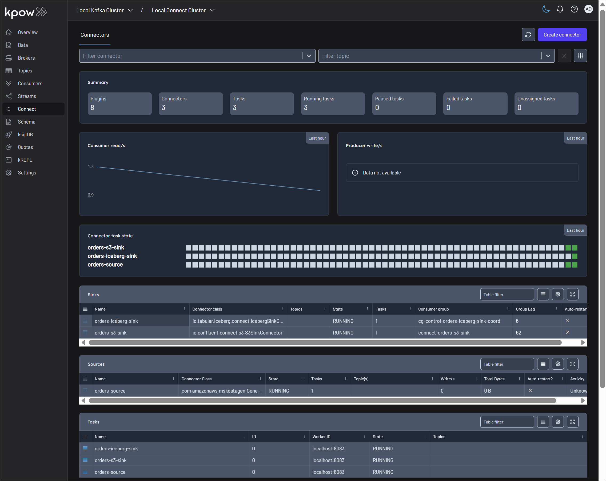

## Product Features

  
<a href="./features/offset-management/">Manage Kafka Consumer Offsets with Kpow</a>

- Python Kafka producer and consumer clients that are used to showcase consumer group offset management capabilities of Kpow.
- Also see the related [blog post](https://factorhouse.io/blog/how-to/manage-kafka-consumer-offsets-with-kpow/).

  
<a href="https://factorhouse.io/blog/how-to/integrate-confluent-compatible-registries-kpow/">Integrate Confluent-compatible Schema Registries with Kpow</a>

- In modern data architectures built on Apache Kafka, a Schema Registry is an essential component for enforcing data contracts and supporting strong data governance. While the Confluent Schema Registry set the original standard, the ecosystem has expanded to include powerful Confluent-compatible alternatives such as Red Hat’s Apicurio Registry and Aiven's Karapace.
- Whether driven by a gradual migration, the need to support autonomous teams, or simply technology evaluation, many organizations find themselves running multiple schema registries in parallel. This inevitably leads to operational complexity and a fragmented view of their data governance.
- This guide demonstrates how Kpow directly solves this challenge. We will integrate these popular schema registries into a single Kafka environment and show how to manage them all seamlessly through Kpow's single, unified interface.

  
<a href="https://www.youtube.com/watch?v=iCTrRg2cJao">Kpow access control demo with multi-tenancy and RBAC</a>

- Kpow access control demo with [multi-tenancy](https://docs.factorhouse.io/kpow/multi-tenancy) and [role based access control](https://docs.factorhouse.io/kpow/authorization/role-based-access-control).
- See the [demo project](./features/kpow-access-control/).

  
<a href="./features/rapid-kafka-diagnostics/">Rapid Kafka Diagnostics Demo</a>

- This demo simulates a **"Silent Stall"** production incident. In this scenario, a Kafka producer injects a "poison pill" (malformed) message into a specific topic partition.
- The environment runs three consumer instances. When one of the instances consumes the malicious message, it enters a "Zombie" state—it continuously crashes and retries the same message logic while successfully sending heartbeats to the Kafka cluster. This mimics a difficult-to-diagnose issue where infrastructure looks healthy, but data processing has halted on a specific partition.

## Integrations

  
<a href="https://factorhouse.io/blog/how-to/set-up-kpow-with-confluent-cloud/">Setting Up Kpow with Confluent Cloud</a>

- A step-by-step guide to configuring Kpow with Confluent Cloud resources including Kafka clusters, Schema Registry, Kafka Connect, and kSQLDB.

  
<a href="https://factorhouse.io/blog/how-to/set-up-kpow-with-aws/">Set Up Kpow with Amazon Managed Streaming for Apache Kafka</a>

- A comprehensive, step-by-step guide to provisioning AWS MSK infrastructure, configuring authentication with the OAUTHBEARER mechanism using AWS IAM, setting up a client EC2 instance within the same VPC, and deploying Kpow.

  
<a href="https://factorhouse.io/blog/how-to/set-up-kpow-with-gcp/">Set Up Kpow with Google Cloud Managed Service for Apache Kafka</a>

- A practical, step-by-step guide on setting up a Google Cloud Managed Service for Apache Kafka cluster and connecting it from Kpow using the OAUTHBEARER mechanism.

  
<a href="https://factorhouse.io/blog/how-to/integrate-kpow-with-google-schema-registry/">Integrate Kpow with Google Managed Schema Registry</a>

- Google Cloud has enhanced its platform with the launch of a managed [Schema Registry for Apache Kafka](https://cloud.google.com/managed-service-for-apache-kafka/docs/schema-registry/schema-registry-overview), a critical service for ensuring data quality and schema evolution in streaming architectures. Kpow 94.3 expands its support for Google Managed Service for Apache Kafka by integrating the managed schema registry. This allows users to manage Kafka clusters, topics, consumer groups, and schemas from a single interface.
- Building on our [earlier setup guide](https://factorhouse.io/blog/how-to/set-up-kpow-with-gcp/), this post details how to configure the new schema registry integration and demonstrates how to leverage the Kpow UI for working effectively with Avro schemas.

  
<a href="https://factorhouse.io/blog/how-to/integrate-kpow-with-bufstream/">Integrate Kpow with Bufstream</a>

- Kpow supports a wide range of Apache Kafka and Kafka API–compatible platforms, providing robust tools to manage, monitor, and secure data streaming workloads. In this guide, we'll walkthrough how to integrate Bufstream — a cloud-native, Kafka-compatible streaming solution — with Kpow, enabling seamless use of Bufstream's advanced schema management alongside Kpow's comprehensive Kafka management capabilities for an optimized streaming experience.

  
<a href="https://factorhouse.io/blog/how-to/integrate-kpow-with-redpanda/">Integrate Kpow with the Redpanda Streaming Platform</a>

- Redpanda offers a simple, powerful, and Kafka®-compatible streaming data platform. Kpow provides a rich, developer-focused UI to manage and monitor it. Together, they form a robust stack for building and operating real-time data pipelines.
- This guide will walk you through the process of setting up Kpow with a local Redpanda cluster using Docker. We will cover launching the environment, using Kpow to create and manage an Avro schema in Redpanda's built-in registry, producing schema-governed data to a topic, and finally, inspecting that data in a human-readable format.

  
<a href="https://factorhouse.io/blog/how-to/set-up-kpow-with-instaclustr/">Set Up Kpow with Instaclustr Platform</a>

- Instaclustr provides a robust, managed platform for Apache Kafka, handling the complex operational overhead of running a distributed streaming ecosystem. While the platform ensures reliability and scalability, developers and operators still need a powerful tool for monitoring, managing, and interacting with their Kafka resources. This is where Kpow, the all-in-one toolkit for Kafka, shines.
- In this guide, we will walk through the complete process of setting up Kpow to connect to and manage a Kafka environment hosted on Instaclustr. We will begin by provisioning a Kafka cluster with Karapace Schema registry and Kafka Connect cluster. Then, we will configure and launch a local Kpow instance, detailing how to gather the correct connection information from the Instaclustr console. To put this integration into practice, we will use Kpow's interface to deploy a full data pipeline, demonstrating how to manage custom connectors, inspect topic data, and view schemas in real-time. By the end of this tutorial, we will have a fully operational Kpow instance providing a comprehensive view and powerful control over our managed Instaclustr environment.

  
<a href="https://factorhouse.io/how-to/integrate-kpow-with-oci-streaming">Integrate Kpow with Oracle Compute Infrastructure (OCI) Streaming with Apache Kafka</a>

- Unlock the full potential of your dedicated OCI Streaming with Apache Kafka cluster. This guide shows you how to integrate Kpow with your OCI brokers and self-hosted Kafka Connect and Schema Registry, unifying them into a single, developer-ready toolkit for complete visibility and control over your entire Kafka ecosystem.

## Projects

  
<a href="./projects/mobile-game-top-k-analytics/">Mobile Game Top K Analytics</a>

 

This project walks through how to build a complete real-time analytics pipeline for a mobile game using a modern data stack. It simulates live gameplay data, processes it in real time to calculate performance metrics, and displays the results on an interactive dashboard.

 

  
<a href="./projects/thelook-ecomm-cdc/">CDC with Debezium on Real-Time theLook eCommerce Data</a>

 

This project unlocks the power of the popular [theLook eCommerce dataset](https://console.cloud.google.com/marketplace/product/bigquery-public-data/thelook-ecommerce) for modern event-driven applications. It uses a re-engineered [real-time data generator](./datagen/thelook-ecomm/) that transforms the original static dataset into a continuous stream of simulated user activity, writing directly to a PostgreSQL database.

 

  
<a href="./projects/data-lineage-labs/">Data Lineage Labs: A Practical Guide to OpenLineage with Kafka, Flink, and Spark</a>

 

[A Practical Guide to Data Lineage on Kafka Connect with OpenLineage](./projects/data-lineage-labs/lab1_kafka-connect.md)

- Demonstrates how to capture real-time data lineage from Kafka Connect using the `OpenLineageLifecycleSmt`. This lab builds a complete pipeline that tracks data from a source connector to S3 and Iceberg sinks, with the full lineage graph visualized in Marquez.

[End-to-End Data Lineage from Kafka to Flink and Spark](./projects/data-lineage-labs/lab2_end-to-end.md)

- An end-to-end tutorial for establishing data lineage across Kafka, Flink, Spark, and Iceberg. This lab begins by tracking data from a single Kafka topic through parallel pipelines: a Kafka S3 sink connector for raw data archival, a Flink job for real-time analytics, another Flink job for Iceberg ingestion, and a downstream Spark batch job that reads from the Iceberg table.

  
<a href="./projects/data-governance-lab/">(WIP) Governing Enterprise Data: A Unifying Framework with OpenMetadata</a>

- Work in progress

 

## Data Generators

  
<a href="./datagen/mobile-game/">Mobile Game User Score</a>

- A Python port of Apache Beam's [Mobile Gaming Example](https://beam.apache.org/get-started/mobile-gaming-example/) data generator. This script simulates game events such as user scores, designed to support real-time analytics pipelines for leaderboards, scoring engines, and fraud detection.

  
<a href="./datagen/thelook-ecomm/">theLook eCommerce Data Generator</a>

- Generates a continuous stream of synthetic data based on the [theLook eCommerce dataset](https://console.cloud.google.com/marketplace/product/bigquery-public-data/thelook-ecommerce), which represents a fictional online fashion retailer. The data simulates a live production database, making it ideal for demonstrating **Change Data Capture (CDC)** with Debezium and for real-time analytics using Apache Flink or Apache Spark.

## Factor House Local

Looking for local development environment? Check out [Factor House Local](https://github.com/factorhouse/factorhouse-local).

It provides a collection of pre-configured Docker Compose environments that demonstrate modern data platform architectures. Each setup is purpose-built around a specific use case and incorporates widely adopted technologies such as Kafka, Flink, Spark, Iceberg, and Pinot. These environments are further enhanced by enterprise-grade tools from Factor House: [**Kpow**](https://factorhouse.io/kpow), for Kafka management and control, and [**Flex**](https://factorhouse.io/flex/), for seamless integration with Flink.

### Factor House Local Labs

  

The **Factor House Local labs** provide a fast and practical entry point for developers building real-time data pipelines using **Kafka**, **Flink**, **Spark**, **Iceberg**, and **Pinot**. These hands-on labs highlight key capabilities such as Avro serialization with Schema Registry, stream processing with Kafka Streams and Flink (via SQL and DataStream APIs), connector deployment with Kpow, modern lakehouse integrations using Iceberg, and real-time analytics with Pinot. Each lab is designed to be modular, hands-on, and production-inspired - making it easy to learn, prototype, and extend.

Visit [**the Labs**](./fh-local-labs/) to explore detailed walkthroughs, configuration examples, and practical exercises that will help you get up and running quickly with each tool in a real-world context.

## Support

Any issues? Contact [support](https://factorhouse.io/support/) or view our [docs](https://docs.factorhouse.io/).

## License

This repository is released under the Apache 2.0 License.

Copyright © Factor House.
