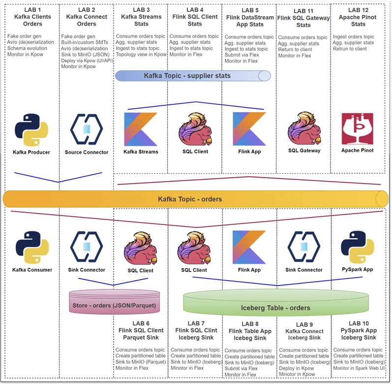

## Product Feature

- [Manage Kafka Consumer Offsets with Kpow](./offset-management/)
  - Python Kafka producer and consumer clients that are used to showcase consumer group offset management capabilities of Kpow.
  - [Manage Kafka Consumer Offsets with Kpow](https://factorhouse.io/blog/how-to/manage-kafka-consumer-offsets-with-kpow/) (blog post)

## Integration

- [Setting Up Kpow with Confluent Cloud](https://factorhouse.io/blog/how-to/set-up-kpow-with-confluent-cloud/)
  - A step-by-step guide to configuring Kpow with Confluent Cloud resources including Kafka clusters, Schema Registry, Kafka Connect, and kSQLDB.
- [Set Up Kpow with Amazon Managed Streaming for Apache Kafka](https://factorhouse.io/blog/how-to/set-up-kpow-with-aws/)
  - A comprehensive, step by step guide to provisioning AWS MSK infrastructure, configuring authentication with the OAUTHBEARER mechanism using AWS IAM, setting up a client EC2 instance within the same VPC, and deploying Kpow.
- [Set Up Kpow with Google Cloud Managed Service for Apache Kafka](https://factorhouse.io/blog/how-to/set-up-kpow-with-gcp/)
  - A practical, step-by-step guide on setting up a Google Cloud Managed Service for Apache Kafka cluster and connecting it from Kpow using the OAUTHBEARER mechanism.

## Factor House Local

Looking for local development environment? Check out [Factor House Local](https://github.com/factorhouse/factorhouse-local).

It provides a collection of pre-configured Docker Compose environments that demonstrate modern data platform architectures. Each setup is purpose-built around a specific use case and incorporates widely adopted technologies such as Kafka, Flink, Spark, Iceberg, and Pinot. These environments are further enhanced by enterprise-grade tools from Factor House: [**Kpow**](https://factorhouse.io/kpow), for Kafka management and control, and [**Flex**](https://factorhouse.io/flex/), for seamless integration with Flink.

### Factor House Local Labs

  

The **Factor House Local labs** provide a fast and practical entry point for developers building real-time data pipelines using **Kafka**, **Flink**, **Spark**, **Iceberg**, and **Pinot**. These hands-on labs highlight key capabilities such as Avro serialization with Schema Registry, stream processing with Kafka Streams and Flink (via SQL and DataStream APIs), connector deployment with Kpow, modern lakehouse integrations using Iceberg, and real-time analytics with Pinot. Each lab is designed to be modular, hands-on, and production-inspired - making it easy to learn, prototype, and extend.

- [Lab 1: Kafka Clients - Producing and Consuming Kafka Messages with Schema Registry](./fh-local-kafka-clients-orders/)
  - Learn how to produce and consume Avro-encoded Kafka messages using Python clients and the Confluent Schema Registry. This lab covers schema evolution, working with both generic and specific records, and validating end-to-end data flow.
- [Lab 2: Kafka Connect - Managing Kafka Source and Sink Connectors via Kpow UI and API](./fh-local-kafka-connect-orders/)
  - Explore how to deploy and manage Kafka Connect source and sink connectors using the Kpow UI and API. This lab walks through practical examples for configuring connectors that move data between Kafka and external systems.
- [Lab 3: Kafka Streams - Supplier Stats with Live Topology View via Kpow Streams Agent](./fh-local-kafka-streams-stats/)
  - Build a Kafka Streams application that processes `orders` from Kafka, computes supplier statistics in real time, and writes to a new topic. Use the [Kpow Streams Agent](https://github.com/factorhouse/kpow-streams-agent) to inspect the live processing topology.
- [Lab 4: Flink SQL - Aggregating Supplier Stats from Kafka Topic](./fh-local-flink-sql-client-stats/)
  - Use Flink SQL to read Avro-encoded orders from Kafka, perform tumbling window aggregations to compute supplier-level metrics, and write results back to Kafka. This lab demonstrates real-time analytics using declarative SQL and Kafka integration.
- [Lab 5: Flink DataStream API - Real-Time Analytics from Orders to Supplier Stats](./fh-local-flink-ds-stats/)
  - Implement a Flink DataStream job that reads orders from Kafka, performs event-time tumbling window aggregations, and publishes supplier statistics to a Kafka sink. Learn how to work with watermarks, Avro serialization, and event-time semantics in a production-style stream pipeline.
- [Lab 6: Flink SQL - Writing Kafka Order Records to MinIO as Parquet Files](./fh-local-flink-sql-orders-parquet/)
  - Ingest Kafka order records using Flink SQL and write them as Parquet files to MinIO object storage. This lab uses the Filesystem connector in a streaming context to produce batch-style output, demonstrating Flink's integration with streaming-compatible lakehouse sinks.
- [Lab 7: Flink SQL - Ingesting Kafka Order Records into Iceberg Table](./fh-local-flink-sql-orders-iceberg/)
  - Build a streaming pipeline that reads Kafka order records with Flink SQL and writes to an Iceberg table on MinIO. The Iceberg sink table is created via Spark SQL to enable hidden partitioning.
- [Lab 8: Flink Table API - Loading Order Events from Kafka into Iceberg](./fh-local-flink-table-iceberg/)
  - Deploy a Kafka-to-Iceberg pipeline using Flink's Table API. This lab demonstrates how to configure the job, compile it as a shadow JAR, and deploy via CLI and Flex. Sink table is defined via Spark SQL due to Flink's partitioning limitations.
- [Lab 9: Kafka Connect - Streaming Order Data from Kafka into Iceberg](./fh-local-kafka-connect-iceberg/)
  - Use Kafka Connect to stream Avro records from Kafka into an Iceberg table in MinIO. The lab covers connector deployment via Kpow and how to configure hidden partitioning using a Spark-defined table schema.
- [Lab 10: Spark Structured Streaming - Delivering Kafka Order Records into Iceberg Table](./fh-local-spark-orders-iceberg/)
  - Build a PySpark Structured Streaming job that ingests Kafka order data, deserializes Avro messages using [ABRiS](https://github.com/AbsaOSS/ABRiS), and writes the results to Iceberg. The job is packaged as a fat JAR and outputs partitioned Parquet files to MinIO.
- [Lab 11: Flink SQL Gateway - Serving Real-Time Supplier Stats via REST API](./fh-local-flink-sql-gateway-stats/)
  - Run a Flink SQL streaming pipeline via the Flink SQL Gateway and access real-time query results through its REST API. This lab illustrates how to fetch and display live supplier statistics from a Kafka source using a Python client.
- [Lab 12: Apache Pinot - Real-Time Analytics of Supplier Stats from Kafka](./fh-local-pinot-stats/)
  - Stream Kafka orders into Apache Pinot and run real-time analytics with its multi-stage query engine. This lab includes a simulated tumbling window aggregation and demonstrates querying supplier stats through a Python client.

## Support

Any issues? Contact [support](https://factorhouse.io/support/) or view our [docs](https://docs.factorhouse.io/).

## License

This repository is released under the Apache 2.0 License.

Copyright © Factor House.
