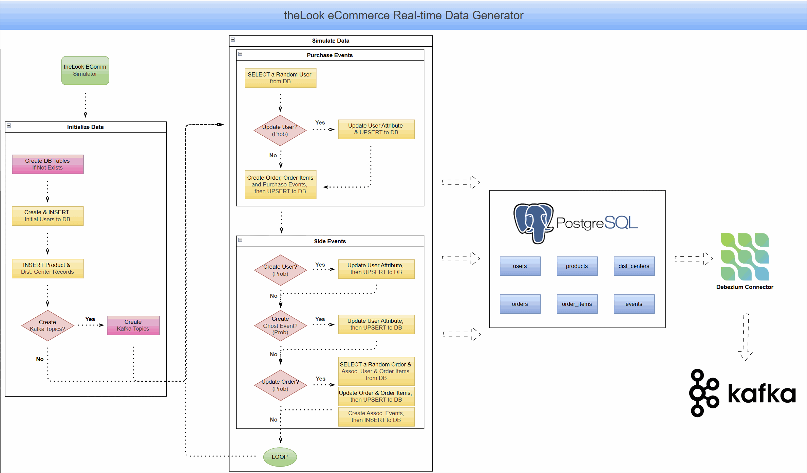

# TheLook E-Commerce Real-Time Data Generator

This project provides a real-time data generator that simulates user activity for an e-commerce platform. It is a significant update to the original [TheLook E-Commerce dataset](https://console.cloud.google.com/marketplace/product/bigquery-public-data/thelook-ecommerce), a popular public dataset from Looker available on the Google Cloud Marketplace.

While the original dataset is static and designed for batch analytics, this generator has been re-engineered to support a continuous, real-time stream of data. It inserts events directly into a PostgreSQL database, making it an ideal source for Change Data Capture (CDC) pipelines using tools like Debezium to stream database changes into Apache Kafka. This allows you to model and test modern, event-driven data architectures using a familiar and comprehensive e-commerce schema.



## Key Features

- **Real-Time Event Simulation:** Utilizes Python's `asyncio` to generate a continuous stream of e-commerce events with a configurable average frequency (QPS).
- **Comprehensive Data Models:** Creates realistic and interconnected data for Users, Orders, Order Items, and web-style Events, reflecting a true e-commerce environment.
- **Realistic User Behavior:** Simulates various user journeys, from initial purchase to order cancellations and returns, and even anonymous browsing ("ghost") sessions.
- **Direct PostgreSQL Integration:** Connects directly to a PostgreSQL database to insert data, managing tables within a specified schema.
- **Resilient & Robust:** Includes an automatic retry mechanism with exponential backoff to handle transient database connection errors gracefully.
- **Kafka-Ready:** Includes an optional feature to automatically create Kafka topics, preparing the environment for CDC with Debezium.
- **Highly Configurable:** Offers extensive command-line options to control every aspect of the simulation, from event rates and user geography to database credentials.

## Core Simulation Logic

The generator's logic is managed by the `TheLookECommSimulator` class, centered around two key methods: `initialize()` and `run()`.

### Initialize Data (`simulator.initialize()`)

This method performs the one-time setup required to prepare the environment before the simulation begins.

1.  **Database Connection:** It establishes a connection to the specified PostgreSQL database.
2.  **Schema and Table Creation:** It executes DDL statements to create all necessary tables (`users`, `orders`, `order_items`, `events`, `products`, `dist_centers`, `heartbeat`) within the specified schema if they don't already exist.
3.  **Initial Data Seeding:** To ensure the simulation can start with a realistic state, it populates the database with initial data:
    - **Users:** Creates and inserts an initial set of users based on the `--init-num-users` argument.
    - **Products:** Loads and inserts all product information from `products.csv`.
    - **Distribution Centers:** Loads and inserts data for distribution centers from `distribution_centers.csv`.
4.  **Kafka Topic Creation (Optional):** If the `--create-topic` flag is enabled, it connects to the Kafka cluster and creates a topic for each database table. Topic names are formatted as `{topic-prefix}.{schema}.{table_name}`.
5.  **Error Handling:** The entire initialization is wrapped in a try/except block. A failure at this stage is considered fatal and will prevent the simulation from starting.

### Simulate Data (`simulator.run()`)

This is the main event loop that continuously generates data.

1.  **Event Pacing:** The loop is paced using `random.expovariate(avg_qps)`, which creates a realistic, variable delay between events that averages out to the desired queries-per-second (`--avg-qps`).
2.  **Error Resilience:** The loop tracks consecutive database errors. If an operation fails, it logs a warning and retries after a short delay. If the number of consecutive errors exceeds a threshold (3), the simulation stops to prevent runaway failures. A successful operation resets the counter.
3.  **Core Task - `_simulate_purchases()`:** This task runs in every iteration of the loop and represents the primary activity of the simulation:
    - It begins by selecting a random user from the database.
    - There is a chance (`--user-update-prob`) that the selected user's address will be updated before the purchase, simulating a user moving or correcting their information.
    - A new `Order` is created for the user with a `Processing` status.
    - One or more `OrderItem` records are generated for the order, each linked to a random product.
    - A sequence of `Event` records is created to mimic the user's path to purchase (e.g., visiting the homepage, a department page, the product page, adding to the cart, and completing the purchase).
    - All new records (the order, its items, and the associated events) are written to the database concurrently.
4.  **Probabilistic Side Tasks - `_simulate_side_tasks()`:** After a purchase is simulated, a set of secondary, probabilistic tasks are run to add variety to the data:
    - **New User Creation:** Based on `--user-create-prob`, a completely new user may be created and inserted.
    - **Order Status Update:** Based on `--order-update-prob`, the generator will select a random historical order and advance its status (e.g., from `Processing` to `Shipped`, or `Delivered` to `Returned`). This also updates the associated order items and generates new `Event`s for cancellations or returns.
    - **Ghost Event Generation:** Based on `--ghost-create-prob`, the generator simulates an anonymous user browsing session by creating a series of `Event` records that are not associated with any `user_id`.

## Setup & Usage

### Prerequisites

- Python 3.8+
- A running PostgreSQL instance
- (Optional) A running Kafka cluster if you intend to use the Debezium/Kafka integration.

### Installation & Running

1.  Create and activate a virtual environment:

    ```bash
    python -m venv venv
    source venv/bin/activate
    ```

2.  Install dependencies:

    ```bash
    pip install -r datagen/look-ecomm/requirements.txt
    ```

3.  Run the generator and view all available options:

    ```bash
    python datagen/look-ecomm/data_generator.py --help
    ```

### Available CLI Options

```text
usage: data_generator.py [-h] [--avg-qps AVG_QPS] [--max-iter MAX_ITER] [--init-num-users INIT_NUM_USERS] [--country COUNTRY] [--state STATE]
                         [--postal-code POSTAL_CODE] [--user-create-prob USER_CREATE_PROB] [--user-update-prob USER_UPDATE_PROB]
                         [--order-update-prob ORDER_UPDATE_PROB] [--ghost-create-prob GHOST_CREATE_PROB] [--host HOST] [--user USER]
                         [--password PASSWORD] [--db-name DB_NAME] [--schema SCHEMA] [--batch-size BATCH_SIZE] [--echo | --no-echo]
                         [--bootstrap-servers BOOTSTRAP_SERVERS] [--topic-prefix TOPIC_PREFIX] [--create-topic | --no-create-topic]

Generate theLook eCommerce data

options:
  -h, --help            show this help message and exit
  --avg-qps AVG_QPS     Average events per second.
  --max-iter MAX_ITER   Max number of successful iterations. Default -1 for infinite.
  --init-num-users INIT_NUM_USERS
                        Initial number of users to create.
  --country COUNTRY     User country.
  --state STATE         User state.
  --postal-code POSTAL_CODE
                        User postal code.
  --user-create-prob USER_CREATE_PROB
                        Probability of generating a new user. Default is 0.05. Set to 0 to disable.
  --user-update-prob USER_UPDATE_PROB
                        Probability of updating a user address. Default is 0. Set to 0 to disable.
  --order-update-prob ORDER_UPDATE_PROB
                        Probability of updating an order status. Default is 0. Set to 0 to disable.
  --ghost-create-prob GHOST_CREATE_PROB
                        Probability of generating a ghost event. Default is 0.05. Set to 0 to disable.
  --host HOST           Database host.
  --user USER           Database user.
  --password PASSWORD   Database password.
  --db-name DB_NAME     Database name.
  --schema SCHEMA       Database schema.
  --batch-size BATCH_SIZE
  --echo, --no-echo
  --bootstrap-servers BOOTSTRAP_SERVERS
                        Bootstrap server addresses.
  --topic-prefix TOPIC_PREFIX
                        Kafka topic prefix.
  --create-topic, --no-create-topic
                        Enable or disable automatic topic creation.
```
