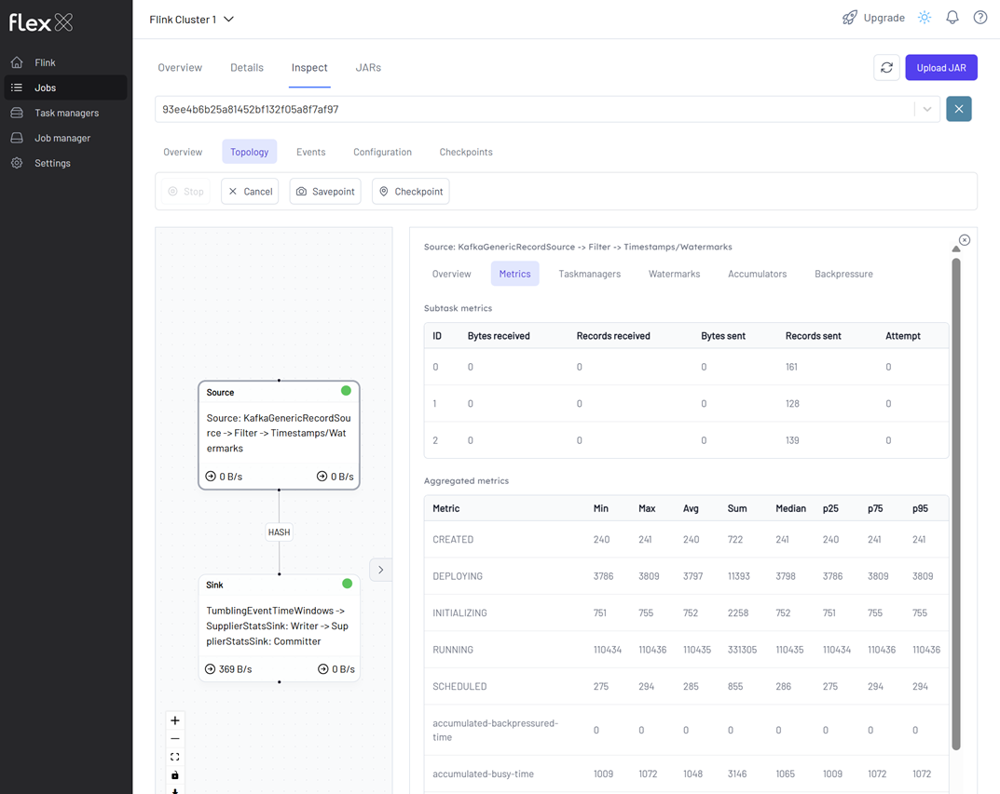
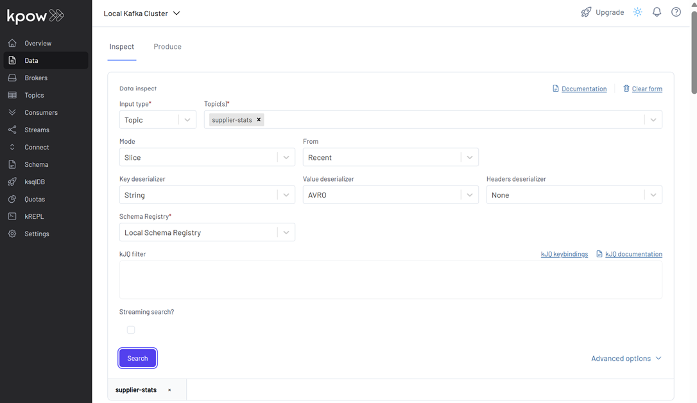
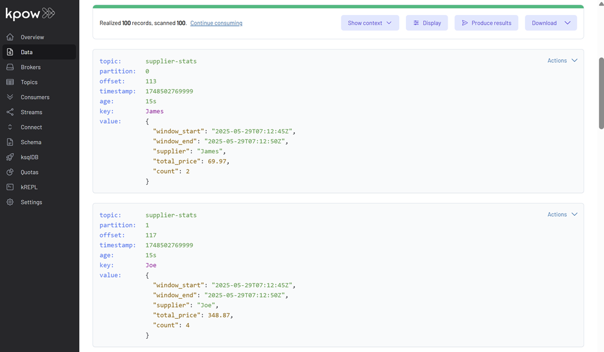

## Flink DataStream Application for Supplier Statistics

This lab showcases a Flink application that reads Avro-encoded order records from a Kafka topic, performs 5-second tumbling window aggregations by `supplier_id`, and writes the resulting supplier statistics to a new Kafka topic using Confluent Avro serialization. The application uses event time semantics with watermarks and demonstrates how to build a real-time analytics pipeline with Kafka, Avro, and Flink's DataStream API.

## How to start

### Clone project repository

```bash
git clone https://github.com/factorhouse/examples.git
cd examples
```

### Start Kafka and Flink environments

We'll use [Factor House Local](https://github.com/factorhouse/factorhouse-local) to quickly spin up Kafka and Flink environments that includes **Kpow** and **Flex**. We can use either the Community or Enterprise editions of Kpow/Flex. **To begin, ensure valid licenses are available.** For details on how to request and configure a license, refer to [this section](https://github.com/factorhouse/factorhouse-local?tab=readme-ov-file#update-kpow-and-flex-licenses) of the project _README_.

```bash
git clone https://github.com/factorhouse/factorhouse-local.git

docker compose -p kpow -f ./factorhouse-local/compose-kpow-community.yml up -d \
  && docker compose -p flex -f ./factorhouse-local/compose-flex-community.yml up -d
```

### Deploy source connector

We will create a source connector that generates fake order records to a Kafka topic (`orders`). See the [Kafka Connect via Kpow UI and API](../fh-local-kafka-connect-orders/) lab for details about how to create the connector.

Once deployed, we can check the connector and its tasks in Kpow.


### Running Flink application

To build and run this Flink application locally, make sure your environment has the following prerequisites:

- **JDK 17**
- **Gradle 7.0 or later**

The application supports two primary execution modes, each suited to different stages of development:

#### 1. Run via Gradle (Development Mode)

This mode is ideal for local development and quick testing. It enables fast iteration by launching the application directly from the Gradle build system - no need to package it into a JAR.

```bash
cd fh-local-flink-ds-stats
./gradlew run
```

We can see console output like the following:


#### 2. Deploy on a Flink Cluster (Deployment Mode)

For staging or production-like environments, we can package the application into a self-contained "fat" JAR that includes all dependencies.

##### Step 1: Build the Shadow JAR

```bash
./gradlew shadowJar
```

This creates the following deployable artifact:

```
build/libs/fh-local-flink-ds-stats-1.0.jar
```

##### Step 2: Deploy to Flink via Docker

We should copy the JAR into the container and submit the job:

```bash
cd ..
docker cp fh-local-flink-ds-stats/build/libs/fh-local-flink-ds-stats-1.0.jar \
  jobmanager:/tmp/fh-local-flink-ds-stats-1.0.jar

docker exec jobmanager /opt/flink/bin/flink run -d -p 3 \
  -c io.factorhouse.demo.MainKt /tmp/fh-local-flink-ds-stats-1.0.jar
```

### Monitoring the Job

We can monitor the Flink job via the Flink UI (`localhost:8081`) or Flex (`localhost:3001`). The screenshot below shows the job's logical plan as visualized in Flex.



### Verifying the Output in Kafka

To explore the supplier statistics, inspect the messages in the `supplier-stats` Kafka topic. For proper Avro decoding in Kpow, set the **Key Deserializer** to _String_, the **Value Deserializer** to _AVRO_, and select _Local Schema Registry_. Then, click the _Search_ button to view the records.




### Shutdown environment

Finally, stop and remove the Docker containers.

```bash
docker compose -p flex -f ./factorhouse-local/compose-flex-community.yml down \
  && docker compose -p kpow -f ./factorhouse-local/compose-kpow-community.yml down
```
