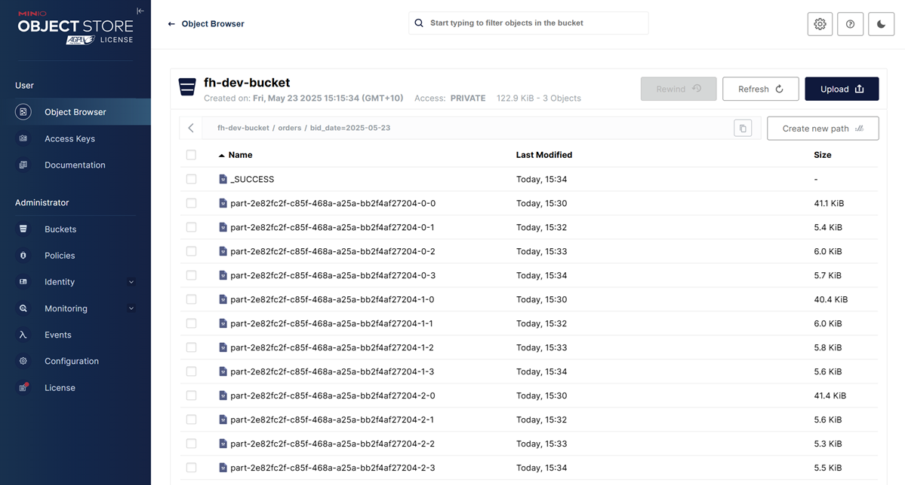

## Lab 6: Flink SQL - Writing Kafka Order Records to MinIO as Parquet Files

Ingest Kafka order records using Flink SQL and write them as Parquet files to MinIO object storage. This lab uses the Filesystem connector in a streaming context to produce batch-style output, demonstrating Flink's integration with streaming-compatible lakehouse sinks.

## How to start

### Clone project repository

```bash
git clone https://github.com/factorhouse/examples.git
cd examples
```

### Start Kafka, Flink and analytics environments

We'll use [Factor House Local](https://github.com/factorhouse/factorhouse-local) to quickly spin up Kafka and Flink environments that includes **Kpow** and **Flex** as well as an analytics environment for Iceberg. We can use either the Community or Enterprise editions of Kpow/Flex. **To begin, ensure valid licenses are available.** For details on how to request and configure a license, refer to [this section](https://github.com/factorhouse/factorhouse-local?tab=readme-ov-file#update-kpow-and-flex-licenses) of the project _README_.

```bash
git clone https://github.com/factorhouse/factorhouse-local.git

docker compose -p kpow -f ./factorhouse-local/compose-kpow-community.yml up -d \
  && docker compose -p flex -f ./factorhouse-local/compose-flex-community.yml up -d \
  && docker compose -p analytics -f ./factorhouse-local/compose-analytics.yml up -d
```

### Deploy source connector

We will create a source connector that generates fake order records to a Kafka topic (`orders`). See the [Kafka Connect via Kpow UI and API](../fh-local-kafka-connect-orders/) lab for details about how to create the connector.

Once deployed, we can check the connector and its tasks in Kpow.


### Create pipeline

This example runs in the Flink SQL client, which can be started as shown below.

```bash
docker exec -it jobmanager ./bin/sql-client.sh
```

#### Load dependent JARs

We begin by loading the necessary JAR files for the Apache Kafka SQL connector and Confluent Avro format support.

```sql
ADD JAR 'file:///tmp/connector/flink-sql-connector-kafka-3.3.0-1.20.jar';
ADD JAR 'file:///tmp/connector/flink-sql-avro-confluent-registry-1.20.1.jar';

show jars;
-- +-------------------------------------------------------------+
-- |                                                        jars |
-- +-------------------------------------------------------------+
-- |     /tmp/connector/flink-sql-connector-kafka-3.3.0-1.20.jar |
-- | /tmp/connector/flink-sql-avro-confluent-registry-1.20.1.jar |
-- +-------------------------------------------------------------+
-- 2 rows in set
```

#### Create source table

The source table is defined using the **Kafka SQL connector**, enabling Flink to consume **Avro-encoded messages** from the `orders` Kafka topic. To support time-based processing and potential windowed aggregations, an event-time watermark is introduced on `bid_time` using `WATERMARK FOR bid_time AS bid_time - INTERVAL '5' SECOND`. This watermark allows Flink to track event time progress and handle out-of-order events, which is required for time-based operations such as windowed aggregations or joins.

> 💡 The watermark definition can be omitted in this lab because the goal is simply to write Kafka records to an object storage (_MinIO_) without performing time-base transformations. However, including it prepares the pipeline for future event-time logic.

```sql
CREATE TABLE orders (
  order_id     STRING,
  item         STRING,
  price        STRING,
  supplier     STRING,
  bid_time     TIMESTAMP(3),
  WATERMARK FOR bid_time AS bid_time - INTERVAL '5' SECOND
) WITH (
  'connector' = 'kafka',
  'topic' = 'orders',
  'properties.bootstrap.servers' = 'kafka-1:19092',
  'format' = 'avro-confluent',
  'avro-confluent.schema-registry.url' = 'http://schema:8081',
  'avro-confluent.basic-auth.credentials-source' = 'USER_INFO',
  'avro-confluent.basic-auth.user-info' = 'admin:admin',
  'avro-confluent.schema-registry.subject' = 'orders-value',
  'scan.startup.mode' = 'earliest-offset'
);

-- select * from orders;
```

#### Create sink table

A sink table, `orders_sink`, is defined to write processed order records to **object storage** (e.g., **MinIO**) in **Parquet format**. The data is **partitioned by bid date, hour, and minute** to enable efficient querying and organization.

The table uses the **Filesystem connector** with the `s3a://` scheme for writing to S3-compatible storage. Partition commit policies and rolling options are configured to optimize file size and latency.

```sql
SET 'parallelism.default' = '3';
SET 'execution.checkpointing.interval' = '60000';

CREATE TABLE orders_sink(
    bid_date     STRING,
    order_id     STRING,
    item         STRING,
    price        DECIMAL(10, 2),
    supplier     STRING,
    bid_time     TIMESTAMP(3)
) PARTITIONED BY (bid_date) WITH (
    'connector' = 'filesystem',
    'path' = 's3a://fh-dev-bucket/orders/',
    'format' = 'parquet',
    'sink.parallelism' = '3',
    'sink.partition-commit.delay' = '1 min',
    'sink.partition-commit.policy.kind' = 'success-file',
    'sink.rolling-policy.file-size' = '128 MB',
    'sink.rolling-policy.rollover-interval' = '15 min',
    'sink.rolling-policy.check-interval' = '1 min'
);

INSERT INTO orders_sink
SELECT
    DATE_FORMAT(bid_time, 'yyyy-MM-dd'),
    order_id,
    item,
    CAST(price AS DECIMAL(10, 2)),
    supplier,
    bid_time
FROM orders;
```

| 🛠 Note: To enable MinIO access, the following settings are included in the [`flink-conf.yaml`](https://github.com/factorhouse/factorhouse-local/blob/main/resources/flex/flink/flink-conf.yaml):

```yaml
fs.s3a.access.key: admin
fs.s3a.secret.key: password
fs.s3a.endpoint: http://minio:9000
fs.s3a.path.style.access: true
```

We can monitor the Flink job via the Flink UI (`localhost:8081`) or Flex (`localhost:3001`). The screenshot below shows the job's logical plan as visualized in Flex.


In addition to monitoring the job, we can verify the output by inspecting the Parquet files written by the sink. These files are accessible via MinIO at `http://localhost:9001` using `admin` as the username and `password` as the password. As shown in the screenshot below, the records have been successfully written to the appropriate partitions in the `fh-dev-bucket` bucket.



### Shutdown environment

Finally, stop and remove the Docker containers.

```bash
docker compose -p analytics -f ./factorhouse-local/compose-analytics.yml down \
  && docker compose -p flex -f ./factorhouse-local/compose-flex-community.yml down \
  && docker compose -p kpow -f ./factorhouse-local/compose-kpow-community.yml down
```
