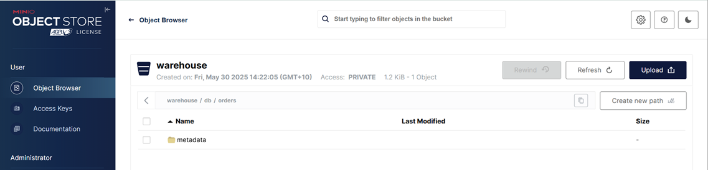
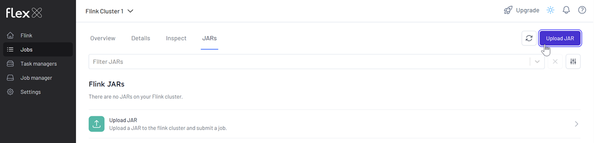
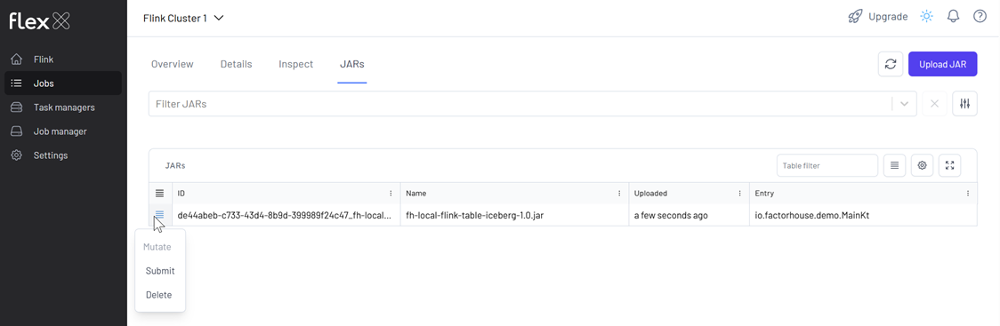
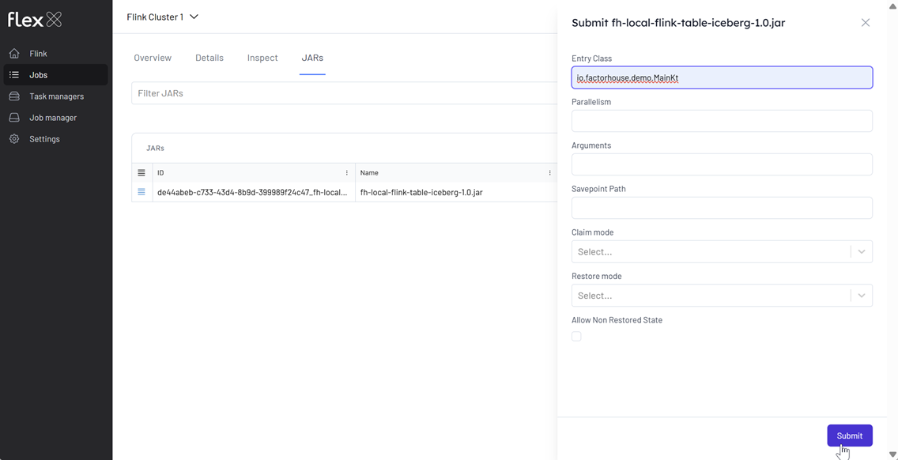
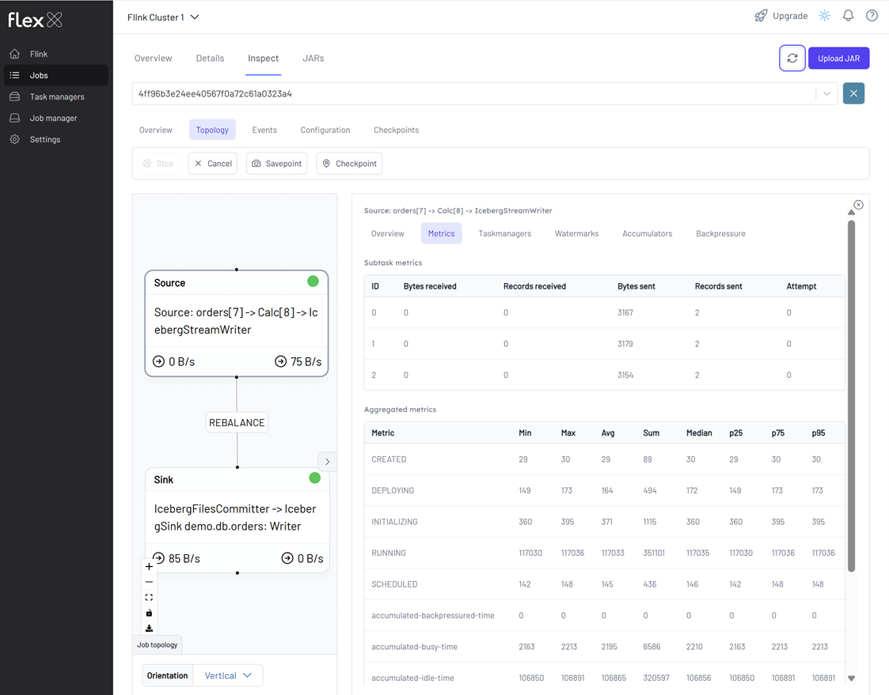
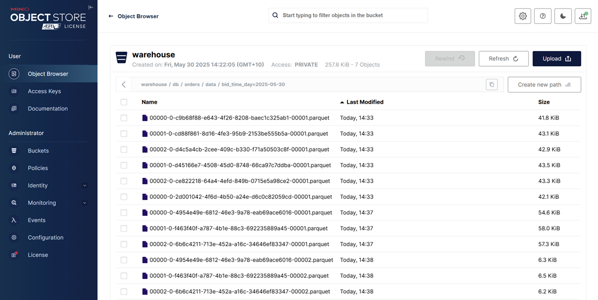

## Lab 8: Flink Table API - Loading Order Events from Kafka into Iceberg

Deploy a Kafka-to-Iceberg pipeline using Flink's Table API. This lab demonstrates how to configure the job, compile it as a shadow JAR, and deploy via CLI and Flex. Sink table is defined via Spark SQL due to Flink's partitioning limitations.

## How to start

### Clone project repository

```bash
git clone https://github.com/factorhouse/examples.git
cd examples
```

### Start Kafka, Flink and analytics environments

We'll use [Factor House Local](https://github.com/factorhouse/factorhouse-local) to quickly spin up Kafka and Flink environments that includes **Kpow** and **Flex** as well as an analytics environment for Iceberg. We can use either the Community or Enterprise editions of Kpow/Flex. **To begin, ensure valid licenses are available.** For details on how to request and configure a license, refer to [this section](https://github.com/factorhouse/factorhouse-local?tab=readme-ov-file#update-kpow-and-flex-licenses) of the project _README_.

```bash
git clone https://github.com/factorhouse/factorhouse-local.git

docker compose -p kpow -f ./factorhouse-local/compose-kpow-community.yml up -d \
  && docker compose -p flex -f ./factorhouse-local/compose-flex-community.yml up -d \
  && docker compose -p analytics -f ./factorhouse-local/compose-analytics.yml up -d
```

### Deploy source connector

We will create a source connector that generates fake order records to a Kafka topic (`orders`). See the [Kafka Connect via Kpow UI and API](../fh-local-kafka-connect-orders/) lab for details about how to create the connector.

Once deployed, we can check the connector and its tasks in Kpow.


### Create sink table

Flink SQL doesn't support [Iceberg's hidden partitioning](https://iceberg.apache.org/docs/nightly/partitioning/#icebergs-hidden-partitioning). Therefore, we will create the sink table using Spark SQL.

```bash
docker exec -it spark-iceberg /opt/spark/bin/spark-sql
```

```sql
--// demo is the default catalog
show catalogs;
-- demo
-- spark_catalog

CREATE TABLE demo.db.orders (
    order_id STRING,
    item STRING,
    price DECIMAL(10, 2),
    supplier STRING,
    bid_time TIMESTAMP
)
USING iceberg
PARTITIONED BY (DAY(bid_time))
TBLPROPERTIES (
    'format-version' = '2',
    'write.format.default' = 'parquet',
    'write.target-file-size-bytes' = '134217728',
    'write.parquet.compression-codec' = 'snappy',
    'write.metadata.delete-after-commit.enabled' = 'true',
    'write.metadata.previous-versions-max' = '3',
    'write.delete.mode' = 'copy-on-write',
    'write.update.mode' = 'copy-on-write'
);
```

Once created, the table will initially contain only metadata (no data). We can view it in the MinIO Console at http://localhost:9001.

- **Username:** `admin`
- **Password:** `password`



### Running Flink application

To build the Flink application, make sure your environment has the following prerequisites:

- **JDK 17**
- **Gradle 7.0 or later**

Our project uses the `factorhouse/flink` image, which includes the necessary dependencies for Hadoop and Iceberg. To avoid an excessively large fat JAR, the image is optimized for cluster deployment only.

#### Step 1: Build the Shadow JAR

From the project directory:

```bash
cd fh-local-flink-table-iceberg
./gradlew shadowJar
```

This creates the following deployable artifact:

```
build/libs/fh-local-flink-table-iceberg-1.0.jar
```

#### Step 2: Deploy to Flink via Docker

Copy the JAR into the Flink JobManager container and submit the job:

```bash
cd ..
docker cp fh-local-flink-table-iceberg/build/libs/fh-local-flink-table-iceberg-1.0.jar \
  jobmanager:/tmp/fh-local-flink-table-iceberg-1.0.jar

docker exec jobmanager /opt/flink/bin/flink run -d -p 3 \
  -c io.factorhouse.demo.MainKt /tmp/fh-local-flink-table-iceberg-1.0.jar
```

Or we can also submit the JAR using the Flex UI available at `http://localhost:3001`:

1. **Upload the JAR** from the **Jobs** sidebar.



2. **Click the submit menu** next to the uploaded JAR.



3. **Fill out the submission form**, including:

   - Entry Class: `io.factorhouse.demo.MainKt`
   - Parallelism: e.g. `3`
   - Optional: Savepoint path, job arguments, etc.



### Monitoring the Job

We can monitor the Flink job via the Flink UI (`localhost:8081`) or Flex (`localhost:3001`). The screenshot below shows the job's logical plan as visualized in Flex.



In addition to monitoring the job, we can verify the output by inspecting the Parquet files written by the sink. These files are accessible via MinIO at `http://localhost:9001` using `admin` as the username and `password` as the password. As shown in the screenshot below, the records have been successfully written to the appropriate partitions in the `warehouse` bucket.



### Shutdown environment

Finally, stop and remove the Docker containers.

```bash
docker compose -p analytics -f ./factorhouse-local/compose-analytics.yml down \
  && docker compose -p flex -f ./factorhouse-local/compose-flex-community.yml down \
  && docker compose -p kpow -f ./factorhouse-local/compose-kpow-community.yml down
```
