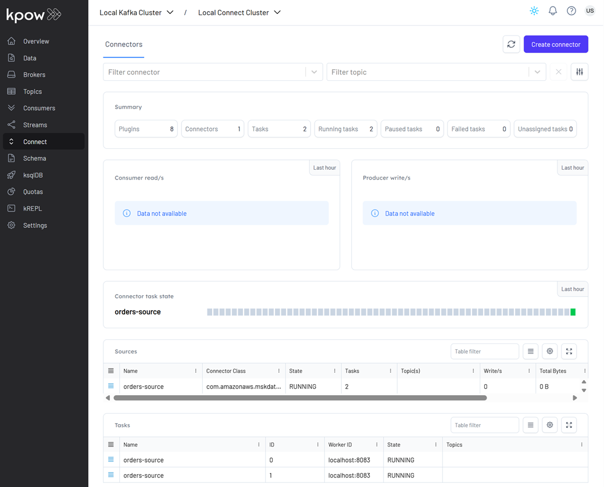

## Kafka Connect for Orders Sink in Iceberg

This lab demonstrates streaming Avro messages from Kafka into an Iceberg table using Kafka Connect. The target table is pre-defined via Spark SQL with custom partitions using Iceberg's hidden partitioning, and data is written to MinIO as partitioned Parquet files once deployed through Kpow.

## How to start

### Clone project repository

```bash
git clone https://github.com/factorhouse/examples.git
cd examples
```

### Start Kafka and analytics environments

We'll use [Factor House Local](https://github.com/factorhouse/factorhouse-local) to quickly spin up a Kafka environments that includes **Kpow** as well as an analytics environment for Iceberg. We can use either the Community or Enterprise editions of Kpow. **To begin, ensure valid licenses are available.** For details on how to request and configure a license, refer to [this section](https://github.com/factorhouse/factorhouse-local?tab=readme-ov-file#update-kpow-and-flex-licenses) of the project _README_.

```bash
git clone https://github.com/factorhouse/factorhouse-local.git

docker compose -p kpow -f ./factorhouse-local/compose-kpow-community.yml up -d \
  && docker compose -p analytics -f ./factorhouse-local/compose-analytics.yml up -d
```

### Deploy source connector

We will create a source connector that generates fake order records to a Kafka topic (`orders`). See the [Kafka Connect via Kpow UI and API](../fh-local-kafka-connect-orders/) lab for details about how to create the connector.

Once deployed, we can check the connector and its tasks in Kpow.



### Create sink table

The Iceberg sink connector requires that the target table already exists. We'll use Spark SQL to create the sink table.

```bash
docker exec -it spark-iceberg /opt/spark/bin/spark-sql
```

```sql
--// demo is the default catalog
show catalogs;
-- demo
-- spark_catalog

CREATE TABLE demo.db.orders (
    order_id STRING,
    item STRING,
    price DECIMAL(10, 2),
    supplier STRING,
    bid_time TIMESTAMP
)
USING iceberg
PARTITIONED BY (DAY(bid_time))
TBLPROPERTIES (
    'format-version' = '2',
    'write.format.default' = 'parquet',
    'write.target-file-size-bytes' = '134217728',
    'write.parquet.compression-codec' = 'snappy',
    'write.metadata.delete-after-commit.enabled' = 'true',
    'write.metadata.previous-versions-max' = '3',
    'write.delete.mode' = 'copy-on-write',
    'write.update.mode' = 'copy-on-write'
);
```

After creation, the table will initially contain only metadata (no data). We can view it in the MinIO Console at http://localhost:9001.

- **Username:** `admin`
- **Password:** `password`


### Create sink connector

1. Open to the Kpow UI (http://localhost:3030) and go to the _Connect_ section.
2. Click _Create connector_ to get started.


3. Select the _IcebergSinkConnector_ connector


4. Import the source connector configuration file (`./fh-local-kafka-connect-iceberg/orders-iceberg-sink.json`) and hit _Create_.


5. After creation, we can monitor the connector and its tasks directly in Kpow.


We can also track connector performance by filtering its consumer group (`connect-orders-iceberg-sink`) in the **Consumers** section. This displays key metrics like group state, assigned members, read throughput, and lag:


Finally, inspect the Parquet files written by the connector via MinIO at `http://localhost:9001` using `admin` as the username and `password` as the password. As shown below, records are correctly partitioned and stored in the configured MinIO bucket (`warehouse`).


### Shutdown environment

Finally, stop and remove the Docker containers.

```bash
docker compose -p analytics -f ./factorhouse-local/compose-analytics.yml down \
  && docker compose -p kpow -f ./factorhouse-local/compose-kpow-community.yml down
```
