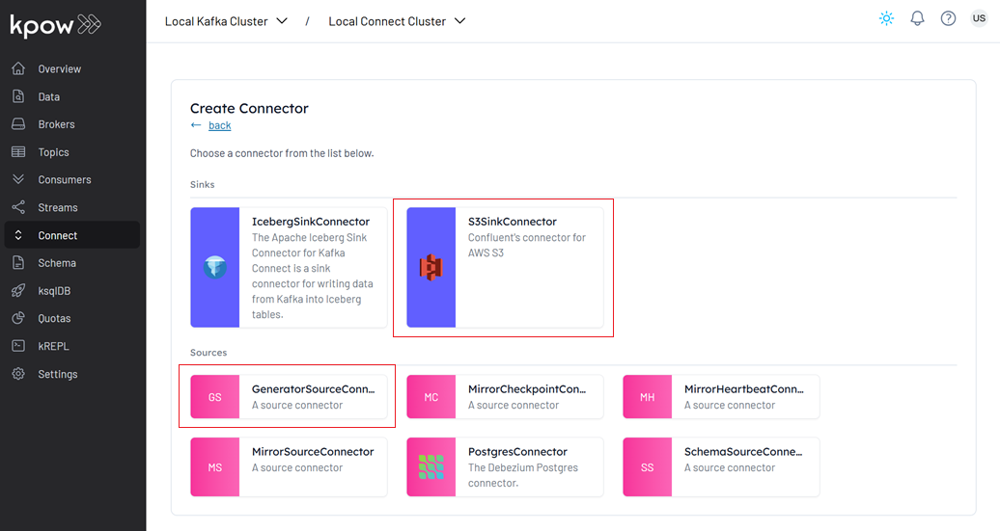
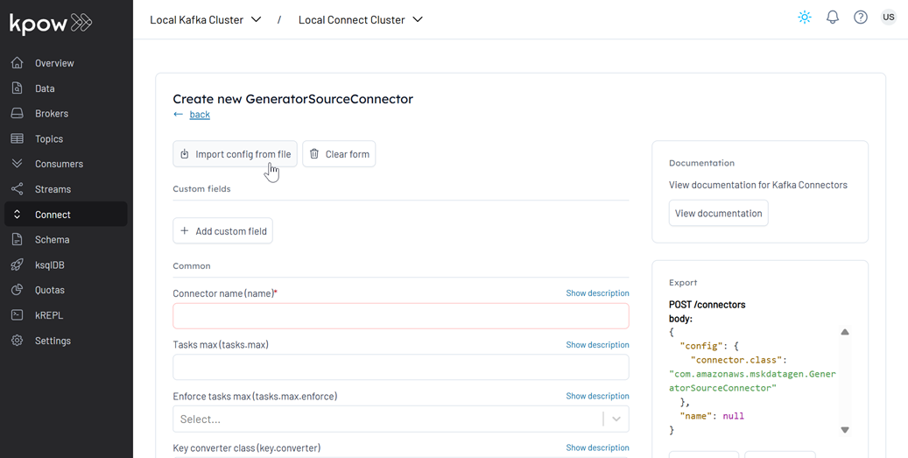
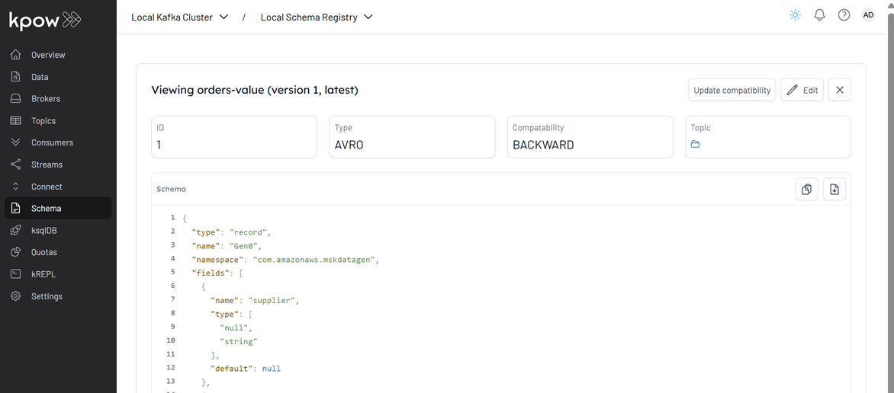
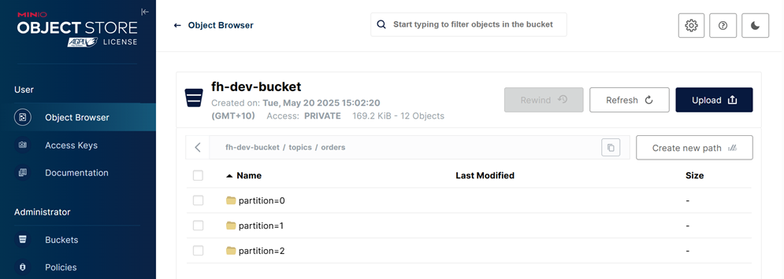
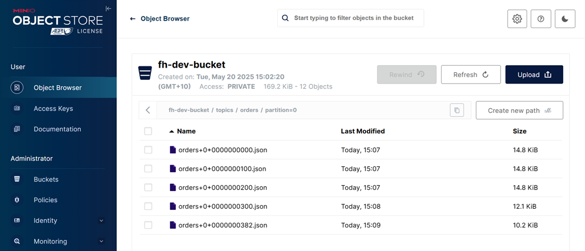
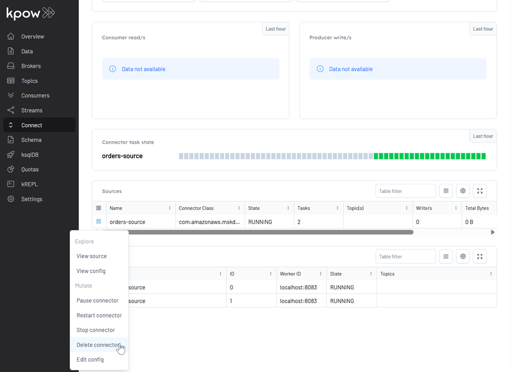

## Kafka Connect for Orders via the Kpow UI and API

This lab demonstrates how to deploy Kafka connectors via the Kpow UI and API. It walks through end-to-end examples for creating, monitoring, and managing source and sink connectors using both interfaces.

## How to start

### Clone project repository

```bash
git clone https://github.com/factorhouse/examples.git
cd examples
```

### Start Kafka and analtyics environment

We'll use [Factor House Local](https://github.com/factorhouse/factorhouse-local) to quickly spin up a Kafka environment that includes **Kpow** and MinIO. This setup uses the **Kpow Enterprise edition**, as we'll later rely on the Kpow API - an enterprise-only feature. **Before you begin, ensure you have a valid Kpow license.** For guidance on requesting and configuring a license, see [this section](https://github.com/factorhouse/factorhouse-local?tab=readme-ov-file#update-kpow-and-flex-licenses) of the project _README_.

```bash
git clone https://github.com/factorhouse/factorhouse-local.git

docker compose -p kpow -f ./factorhouse-local/compose-kpow-trial.yml up -d \
  && docker compose -p analytics -f ./factorhouse-local/compose-analytics.yml up -d
```

### Deploy source connector via UI

We will use the MSK Data Generator (source) and Confluent S3 (sink) connectors. Let's first create the source connector using the Kpow UI.

1. Navigate to the Kpow UI (http://localhost:3030) and go to the _Connect_ section.
2. Click _Create connector_ to get started.


3. Select the _GeneratorSourceConnector_ connector



4. Import the source connector configuration file (`./fh-local-kafka-connect-orders/orders-source.json`) and hit _Create_.



5. Once deployed, we can check the source connector and its tasks in the Kpow UI.


The value schema for the `orders` topic (`orders-value`) is registered as a **record** type. However, by default, the source connector generates a **union** schema (e.g., `["null", "record"]`) to allow for nullable records. The S3 Sink Connector, on the other hand, expects a value schema of type **record**, not a union. To resolve this mismatch, a custom [Single Message Transform (SMT)](https://kafka.apache.org/documentation/#connect_transforms) — `io.factorhouse.smt.UnwrapUnionTransform` - is used to unwrap the union and expose only the record type. **Note:** Do not configure [tombstone records](https://github.com/MichaelDrogalis/voluble?tab=readme-ov-file#tombstoning) when using this transform, as null values are incompatible with the unwrapped record schema.



This connector will start producing mock order data to a Kafka topic (`orders`).

### Deploy sink connector via API

Next, we'll create the Confluent S3 sink connector using the Kpow API.

1. Generate base64 encoded value of an API key.

_Factor House Local_ pre-configures several users. For this demo, we'll use the `admin:admin` credentials. Note that the user has the _kafka-users_ role, which includes the `CONNECT_CREATE` and `CONNECT_DELETE` permissions.

```bash
AUTH_HEADER=$(echo "Authorization: Basic $(echo -n 'admin:admin' | base64)")
```

2. Get Kafka Connect cluster ID

To manage connectors via the API, we first need the Connect cluster ID. We'll store it in a separate variable.

```bash
curl -s -H "$AUTH_HEADER" http://localhost:4000/connect/v1/clusters
# {
#   "clusters": [
#     {
#       "id": "<connect-cluster-id>",
#       "label": "Local Connect Cluster",
#       "type": "apache_connect"
#     }
#   ],
#   "metadata": {
#     "tenant_id": "__kpow_global"
#   }
# }

CONNECT_ID=<connect-cluster-id>
```

This `CONNECT_ID` will be used in subsequent API calls to manage connectors.

3. Create the Sink Connector

Now, make a POST request with the S3 sink connector configuration (`fh-local-kafka-connect-orders/orders-sink.json`).

```bash
curl -s -i -X POST -H "$AUTH_HEADER" -H "Accept:application/json" -H  "Content-Type:application/json" \
  http://localhost:4000/connect/v1/apache/$CONNECT_ID/connectors \
  -d @fh-local-kafka-connect-orders/orders-sink.json
# {
#     "name": "orders-sink",
#     "metadata": {
#         "response_id": "96a93504-6bd9-4ccc-bfbb-fd62d71ec88a",
#         "cluster_id": "<cluster-id>",
#         "is_staged": false,
#         "connect_id": "<connect-cluster-id>",
#         "tenant_id": "__kpow_global"
#     }
# }
```

We can check the status of the API as shown below.

```bash
curl -s -H "$AUTH_HEADER" http://localhost:4000/connect/v1/apache/$CONNECT_ID/connectors/orders-sink
# {
#   "name": "orders-sink",
#   "type": "sink",
#   "state": "RUNNING",
#   "worker_id": "localhost:8083",
#   "class": "io.confluent.connect.s3.S3SinkConnector",
#   "topics": [],
#   "tasks": [
#     {
#       "id": 0,
#       "state": "RUNNING",
#       "worker_id": "localhost:8083"
#     },
#     {
#       "id": 1,
#       "state": "RUNNING",
#       "worker_id": "localhost:8083"
#     }
#   ],
#   "metadata": {
#     "connect_id": "<connect-cluster-id>",
#     "tenant_id": "__kpow_global"
#   }
# }
```

### Verify data flow

1. Check Topic Data

Once the source connector is running, it begins producing messages. The sink connector, when started, consumes messages from the `orders` topic and writes them to the MinIO bucket (`fh-dev-bucket`). Records are stored in the path: `topics/orders/partition=<num>` within the bucket.



2. Inspect Records

Each file contains at most 100 records in [JSON Lines](https://jsonlines.org/) format, which you can verify by inspecting the contents.



### Delete connectors

Now, let's clean up by deleting the connectors.

1. Delete the sink connector via API

```bash
curl -X DELETE -H "$AUTH_HEADER" \
  http://localhost:4000/connect/v1/apache/$CONNECT_ID/connectors/orders-sink
# {
#   "metadata": {
#     "response_id": "55b12842-e9eb-4e51-993b-053c62726e81",
#     "cluster_id": "<cluster-id>",
#     "is_staged": false,
#     "connect_id": "<connect-cluster-id>",
#     "tenant_id": "__kpow_global"
#   }
# }
```

2. Delete the source connector via UI:

Navigate to the _Connect_ section, and click _Delete connector_ option.



### Shutdown environment

Finally, stop and remove the Docker containers.

```bash
docker compose -p analytics -f ./factorhouse-local/compose-analytics.yml down \
  && docker compose -p kpow -f ./factorhouse-local/compose-kpow-trial.yml down
```
