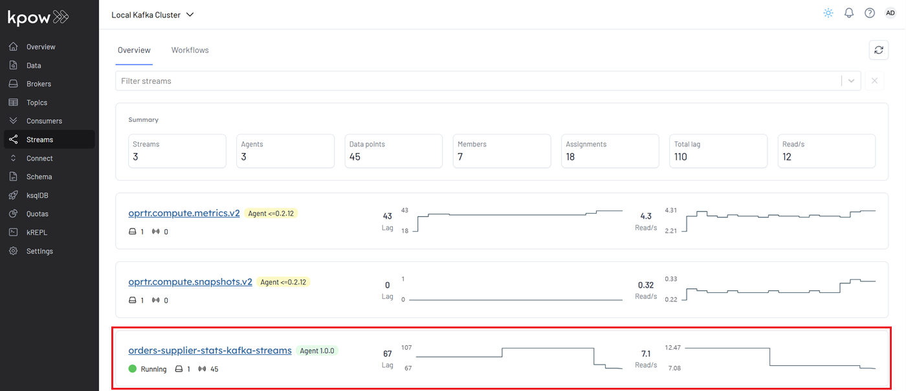
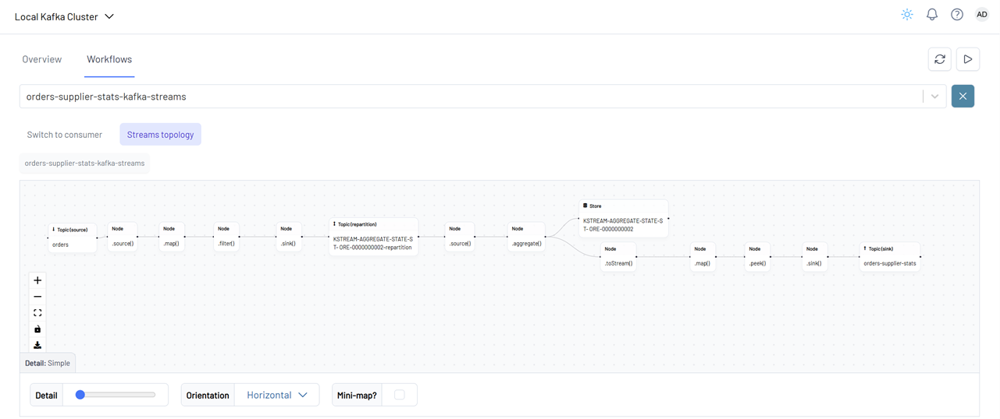
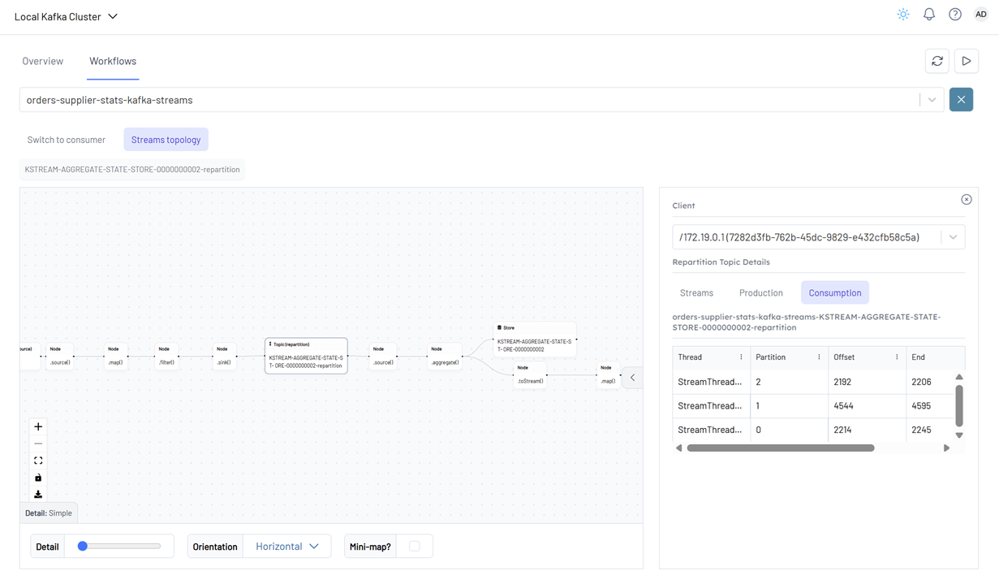
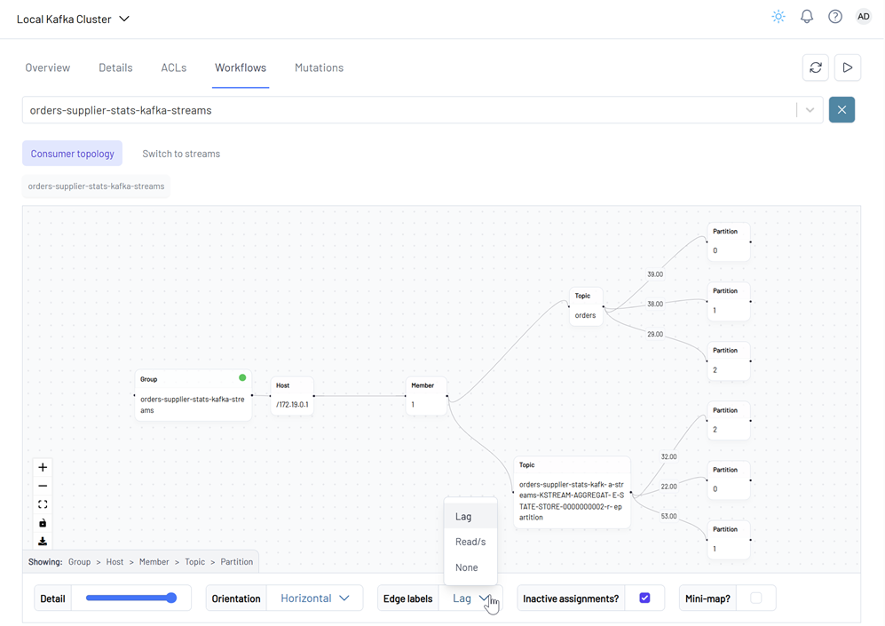

## Kafka Streams with Kpow Streams Agent

The Kafka Streams application reads records from the `orders` topic, calculates supplier statistics, and sends them to a new Kafka topic (`orders-supplier-stats`). It includes integration with the [Kpow Streams Agent](https://github.com/factorhouse/kpow-streams-agent) for live topology visualization.

## How to start

### Clone project repository

```bash
git clone https://github.com/factorhouse/examples.git
cd examples
```

### Start Kafka Environment

We can get our Kafka environment including **Kpow** up and running using [Factor House Local](https://github.com/factorhouse/factorhouse-local). This setup uses the **Kpow Enterprise edition**, as we'll use the [Kpow Streams Agent](https://github.com/factorhouse/kpow-streams-agent) - an enterprise-only feature. **Before you begin, ensure you have a valid Kpow license.** For guidance on requesting and configuring a license, see [this section](https://github.com/factorhouse/factorhouse-local?tab=readme-ov-file#update-kpow-and-flex-licenses) of the project _README_.

```bash
git clone https://github.com/factorhouse/factorhouse-local.git
docker compose -f ./factorhouse-local/compose-kpow-trial.yml up -d
```

### Start Source Connector via API

```bash
AUTH_HEADER=$(echo "Authorization: Basic $(echo -n 'admin:admin' | base64)")
CONNECT_ID=$(curl -s -H "$AUTH_HEADER" http://localhost:4000/connect/v1/clusters | jq ".clusters[0].id" | tr -d '"')

curl -s -i -X POST -H "$AUTH_HEADER" -H "Accept:application/json" -H  "Content-Type:application/json" \
  http://localhost:4000/connect/v1/apache/$CONNECT_ID/connectors \
  -d @fh-local-kafka-connect-orders/orders-source.json
```

### Start Kafka Streams Application

To build and run the application locally, ensure that **JDK 17** and **Gradle 7.0+** are installed.

We can launch the Kafka Streams application in two ways, catering to different stages of development and deployment:

1. **Using Gradle (Development Mode)**
   Ideal for local development and testing, this approach allows for rapid iterations without packaging the application into a full JAR.
2. **Using the Shadow JAR (Deployment Mode)**
   After building a "fat" JAR (also known as a shadow JAR) that bundles all dependencies, the application can be executed as a standalone binary. This method is typically used for staging or production deployments.

```
👉 With Gradle (Dev Mode)
./gradlew run

👉 Build Shadow (Fat) JAR:
./gradlew shadowJar

# Resulting JAR:
# build/libs/fh-local-kafka-streams-stats-1.0.jar

👉 Run the Fat JAR:
java -jar build/libs/fh-local-kafka-streams-stats-1.0.jar
```

We demonstrate how to start the applications in development mode using Gradle. Once the application is running, it appears in the **Streams** menu.



In the **Workflows** tab, both the **Kafka Streams topology** and the **consumer topology** are displayed.

A **Kafka Streams topology** is the logical plan that defines how a Kafka Streams application processes data. It represents the flow of data through various processing steps, including:

- Reading from input Kafka topics
- Transforming or enriching the data
- Grouping and aggregating records
- Branching or filtering
- Writing the results to output Kafka topics



Clicking on a node or topic reveals detailed information about that entity in a side panel on the right.



The **consumer topology** is also visualized. The edge labels in this view can show **Lag**, **Read/s**, or **None**, depending on the selected metric.



### Shutdown Environment

Stop and remove the Docker containers.

```bash
docker compose -f ./factorhouse-local/compose-kpow-trial.yml down
```
