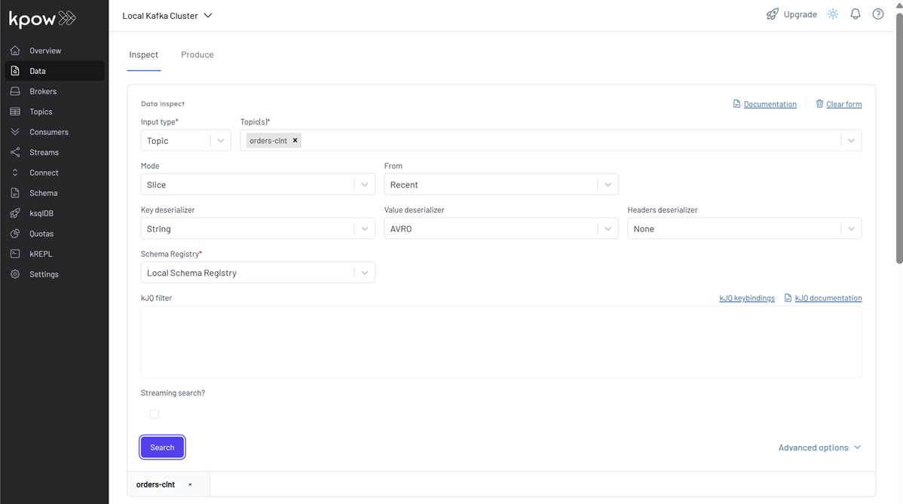

## Lab 1: Kafka Clients - Producing and Consuming Kafka Messages with Schema Registry

Learn how to produce and consume Avro-encoded Kafka messages using Python clients and the Confluent Schema Registry. This lab covers schema evolution, working with both generic and specific records, and validating end-to-end data flow.

## How to start

### Clone project repository

```bash
git clone https://github.com/factorhouse/examples.git
cd examples
```

### Start Kafka environment

We can get our Kafka environment including **Kpow** up and running using [Factor House Local](https://github.com/factorhouse/factorhouse-local). We can use either the Kpow Community or Enterprise edition. **To get started, let's make sure a valid Kpow license is available.** For details on how to request and configure a license, refer to [this section](https://github.com/factorhouse/factorhouse-local?tab=readme-ov-file#update-kpow-and-flex-licenses) of the project _README_.

```bash
## Clone the Factor House Local Repository
git clone https://github.com/factorhouse/factorhouse-local.git

## Download Kafka/Flink Connectors and Spark Iceberg Dependencies
./factorhouse-local/resources/setup-env.sh

## Start Docker Services
docker compose -f ./factorhouse-local/compose-kpow-community.yml up -d
```

### Start Kafka applications

Create a virual environment and install dependent packages.

```bash
python -m venv venv
source venv/bin/activate
# windows
# .\venv\Scripts\activate
pip install -r fh-local-labs/lab-01/requirements.txt
```

#### Kafka producer

We can start the producer using either version 1 or 2. The newer version includes an additional field, `is_premium`, which is randomly assigned.

- `MODEL_VERSION` can be set to `1` or `2`.
- `MAX_RECORDS` defines how many records to produce. If omitted, the producer will run indefinitely.

```bash
MODEL_VERSION=1 MAX_RECORDS=3 \
  python fh-local-labs/lab-01/producer.py

# [2025-06-02 10:25:10,804] INFO: bootstrap: localhost:9092, topic: orders-clnt, model: 1
# [2025-06-02 10:25:10,923] INFO: Topic 'orders-clnt' created
# [2025-06-02 10:25:11,956] INFO: Sent to orders-clnt into partition 0, offset 0
# [2025-06-02 10:25:13,004] INFO: Sent to orders-clnt into partition 2, offset 0
# [2025-06-02 10:25:14,055] INFO: Sent to orders-clnt into partition 1, offset 0
# [2025-06-02 10:25:14,055] INFO: Max records (3) reached. Stop producing messages.
```

```bash
MODEL_VERSION=2 MAX_RECORDS=3 \
  python fh-local-labs/lab-01/producer.py

# [2025-06-02 10:26:02,369] INFO: bootstrap: localhost:9092, topic: orders-clnt, model: 2
# [2025-06-02 10:26:02,415] WARNING: Topic 'orders-clnt' already exists.
# [2025-06-02 10:26:03,432] INFO: Sent to orders-clnt into partition 2, offset 1
# [2025-06-02 10:26:04,444] INFO: Sent to orders-clnt into partition 1, offset 1
# [2025-06-02 10:26:05,454] INFO: Sent to orders-clnt into partition 1, offset 2
# [2025-06-02 10:26:05,454] INFO: Max records (3) reached. Stop producing messages.
```

#### Check schema and messages

After sending messages, we can inspect the Avro schema in the Schema menu, where the latest version appears in the subjects table. By default, the **Confluent Schema Registry** uses **backward compatibility**, allowing new schema versions to evolve without breaking existing consumers. This setting is configured on the server side and applies unless explicitly changed. By clicking the icon next to the subject name, we can view, edit, or delete the subject, as well as update its compatibility settings.


Also, we can inspect the messages in the `orders` topic. For proper Avro decoding in Kpow, set the **Key Deserializer** to _String_, the **Value Deserializer** to _AVRO_, and select _Local Schema Registry_. Then, click the _Search_ button to view the records.



Messages produced with the updated schema (version 2) will include the new field `is_premium`:


On the other hand, those produced with the earlier schema (version 1) will not include this field:


#### Start consumer

To consume messages, we can choose between **generic records** and **specific records**:

- **Generic record**: Messages are deserialized into plain Python dictionaries, without binding to a specific model. This mode works for any schema version.
- **Specific record**: Messages are deserialized into typed objects (`OrderV1` or `OrderV2`) by setting the `MODEL_VERSION` environment variable.

If using a specific record and the message lacks a field (e.g., `is_premium` in version 1), a default value (e.g., `false`) will be used during deserialization.

**Generic record**

```bash
python fh-local-labs/lab-01/consumer.py

# ...
# [2025-06-02 10:30:10,704] INFO: Received: {'order_id': '987d3a38-eb39-46ac-9da5-e95a457e76b6', ...}
# [2025-06-02 10:30:10,711] INFO: Received: {'order_id': '7ab1aaf1-89be-4200-be14-3b4c63553fdd', ..., 'is_premium': True}
# [2025-06-02 10:30:10,711] INFO: Received: {'order_id': 'c82990c3-d0d5-492c-8aea-3fb439bb0fc6', ...}
# [2025-06-02 10:30:10,712] INFO: Received: {'order_id': '3c95afd4-9a75-42f3-8192-5792f2ae4947', ...}
# [2025-06-02 10:30:10,712] INFO: Received: {'order_id': '9ccbb8e1-e6eb-45be-940c-a666bbfe8efb', ..., 'is_premium': True}
# [2025-06-02 10:30:10,712] INFO: Received: {'order_id': 'a64e2843-32d2-4897-a648-955145724c79', ..., 'is_premium': False}
```

**Specific record**

```bash
MODEL_VERSION=1 python fh-local-labs/lab-01/consumer.py

# ...
# [2025-06-02 10:34:55,950] INFO: Received: OrderV1(order_id='987d3a38-eb39-46ac-9da5-e95a457e76b6', ...)
# [2025-06-02 10:34:55,959] INFO: Received: OrderV1(order_id='7ab1aaf1-89be-4200-be14-3b4c63553fdd', ...)
# [2025-06-02 10:34:55,959] INFO: Received: OrderV1(order_id='3c95afd4-9a75-42f3-8192-5792f2ae4947', ...)
# [2025-06-02 10:34:55,960] INFO: Received: OrderV1(order_id='9ccbb8e1-e6eb-45be-940c-a666bbfe8efb', ...)
# [2025-06-02 10:34:55,962] INFO: Received: OrderV1(order_id='a64e2843-32d2-4897-a648-955145724c79', ...)
# [2025-06-02 10:34:55,962] INFO: Received: OrderV1(order_id='c82990c3-d0d5-492c-8aea-3fb439bb0fc6', ...)

MODEL_VERSION=2 python fh-local-labs/lab-01/consumer.py

# ...
# [2025-06-02 10:36:28,053] INFO: Received: OrderV2(order_id='3c95afd4-9a75-42f3-8192-5792f2ae4947', ..., is_premium=False)
# [2025-06-02 10:36:28,064] INFO: Received: OrderV2(order_id='9ccbb8e1-e6eb-45be-940c-a666bbfe8efb', ..., is_premium=True)
# [2025-06-02 10:36:28,064] INFO: Received: OrderV2(order_id='a64e2843-32d2-4897-a648-955145724c79', ..., is_premium=False)
# [2025-06-02 10:36:28,064] INFO: Received: OrderV2(order_id='c82990c3-d0d5-492c-8aea-3fb439bb0fc6', ..., is_premium=False)
# [2025-06-02 10:36:28,065] INFO: Received: OrderV2(order_id='987d3a38-eb39-46ac-9da5-e95a457e76b6', ..., is_premium=False)
# [2025-06-02 10:36:28,065] INFO: Received: OrderV2(order_id='7ab1aaf1-89be-4200-be14-3b4c63553fdd', ..., is_premium=True)
```

### Shutdown environment

Stop and remove the Docker containers.

> If you're not already in the project root directory, navigate there first.
> Then, stop and remove the Docker containers by running:

```bash
docker compose -f ./factorhouse-local/compose-kpow-community.yml down
```
