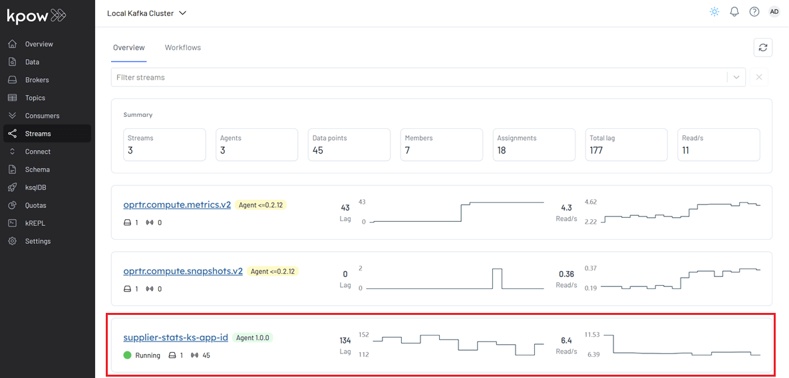
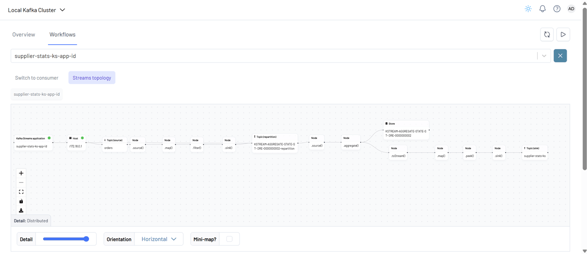
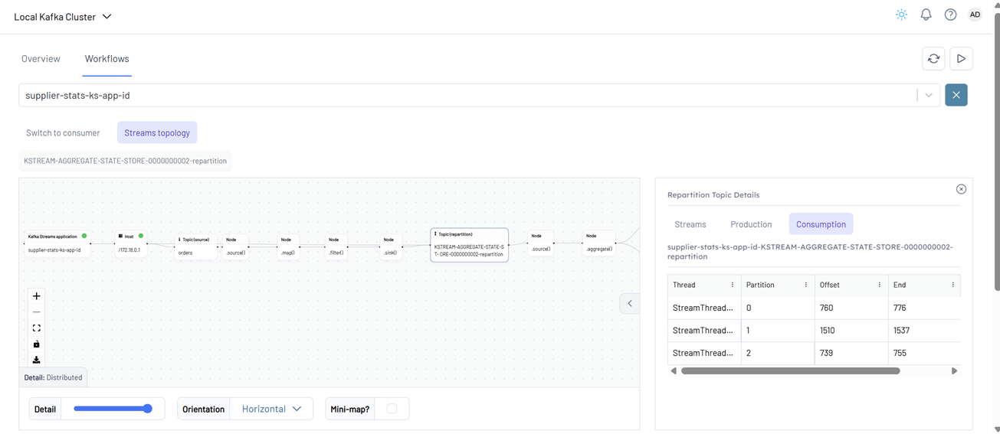
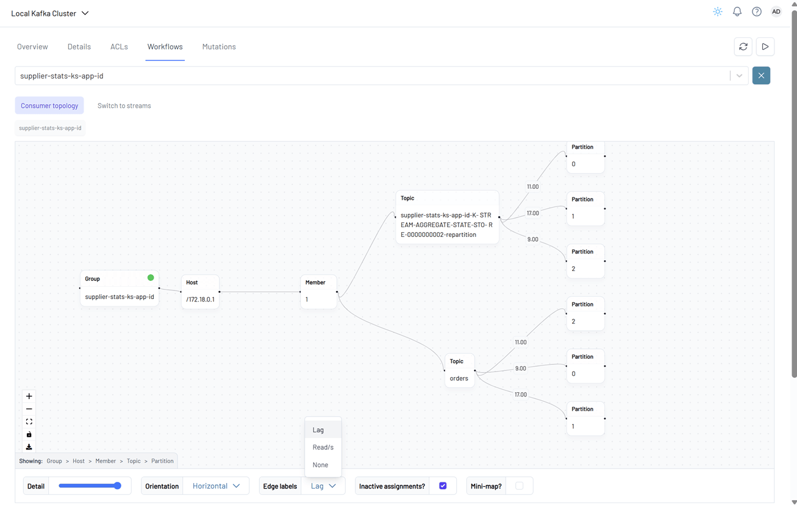
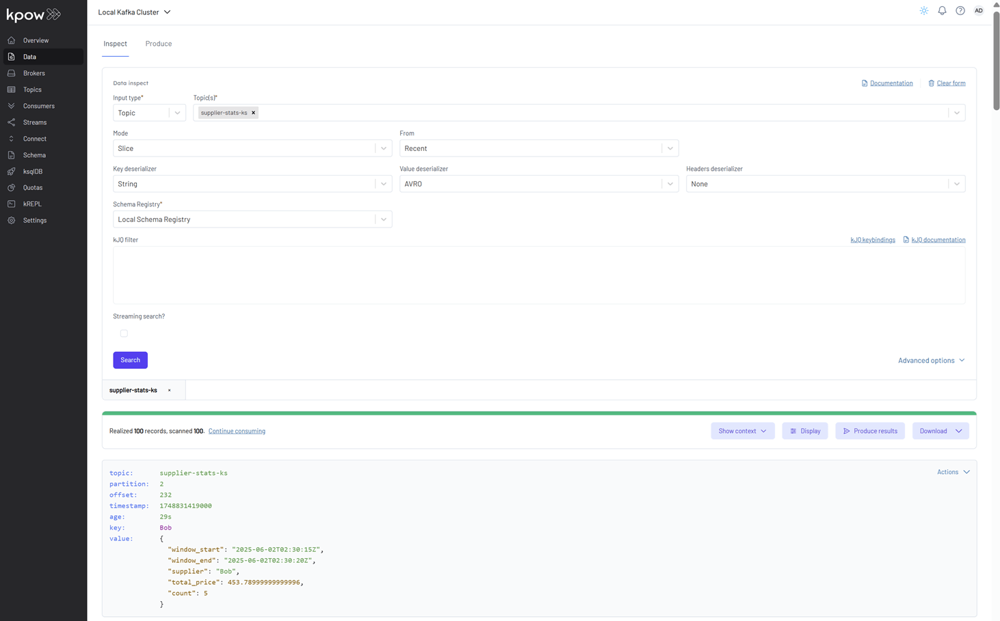

## Lab 3: Kafka Streams - Supplier Stats with Live Topology View via Kpow Streams Agent

Build a Kafka Streams application that processes `orders` from Kafka, computes supplier statistics in real time, and writes to a new topic. Use the [Kpow Streams Agent](https://github.com/factorhouse/kpow-streams-agent) to inspect the live processing topology.

## How to start

### Clone project repository

```bash
git clone https://github.com/factorhouse/examples.git
cd examples
```

### Start Kafka environment

We can get our Kafka environment including **Kpow** up and running using [Factor House Local](https://github.com/factorhouse/factorhouse-local). This setup uses the **Kpow Enterprise edition**, as we'll use the [Kpow Streams Agent](https://github.com/factorhouse/kpow-streams-agent) - an enterprise-only feature. **Before you begin, ensure you have a valid Kpow license.** For guidance on requesting and configuring a license, see [this section](https://github.com/factorhouse/factorhouse-local?tab=readme-ov-file#update-kpow-and-flex-licenses) of the project _README_.

```bash
## Clone the Factor House Local Repository
git clone https://github.com/factorhouse/factorhouse-local.git

## Download Kafka/Flink Connectors and Spark Iceberg Dependencies
./factorhouse-local/resources/setup-env.sh

## Uncomment the sections to enable the edition and license.
# Edition (choose one):
# unset KPOW_SUFFIX         # Enterprise
# export KPOW_SUFFIX="-ce"  # Community
# License:
# export KPOW_LICENSE=<path-to-license-file>

docker compose -p kpow -f ./factorhouse-local/compose-kpow.yml up -d
```

### Deploy source connector

We will create a source connector that generates fake order records to a Kafka topic (`orders`). See the [Kafka Connect via Kpow UI and API](../fh-local-kafka-connect-orders/) lab for details about how to create the connector.

Once deployed, we can check the connector and its tasks in Kpow.


### Running Kafka Streams application

To build and run the application locally, ensure that **JDK 17** and a recent version of Gradle (e.g., **7.6+** or **8.x**) are installed.

We can launch the Kafka Streams application in two ways, catering to different stages of development and deployment:

1. **Using Gradle (Development Mode)**
   Ideal for local development and testing, this approach allows for rapid iterations without packaging the application into a full JAR.
2. **Using the Shadow JAR (Deployment Mode)**
   After building a "fat" JAR (also known as a shadow JAR) that bundles all dependencies, the application can be executed as a standalone binary. This method is typically used for staging or production deployments.

```
cd fh-local-labs/lab-03

👉 With Gradle (Dev Mode)
./gradlew run

👉 Build Shadow (Fat) JAR:
./gradlew shadowJar

# Resulting JAR:
# build/libs/fh-local-kafka-streams-stats-1.0.jar

👉 Run the Fat JAR:
java -jar build/libs/fh-local-kafka-streams-stats-1.0.jar
```

We demonstrate how to start the applications in development mode using Gradle. Once the application is running, it appears in the **Streams** menu.



In the **Workflows** tab, both the **Kafka Streams topology** and the **consumer topology** are displayed.

A **Kafka Streams topology** is the logical plan that defines how a Kafka Streams application processes data. It represents the flow of data through various processing steps, including:

- Reading from input Kafka topics
- Transforming or enriching the data
- Grouping and aggregating records
- Branching or filtering
- Writing the results to output Kafka topics



Clicking on a node or topic reveals detailed information about that entity in a side panel on the right.



The **consumer topology** is also visualized. The edge labels in this view can show **Lag**, **Read/s**, or **None**, depending on the selected metric.



We can also verify that the sink connector registers the `supplier-stats-ks-value` schema in Kpow (`localhost:3000`).


Finally, we can inspect the messages in the `supplier-stats-ks` topic. For proper Avro decoding in Kpow, set the **Key Deserializer** to _String_, the **Value Deserializer** to _AVRO_, and select _Local Schema Registry_. Then, click the _Search_ button to view the records.



### Shutdown environment

Stop and remove the Docker containers.

> If you're not already in the project root directory, navigate there first.
> Then, stop and remove the Docker containers by running:

```bash
# Stops the containers and unsets environment variables
docker compose -p kpow -f ./factorhouse-local/compose-kpow.yml down

unset KPOW_SUFFIX KPOW_LICENSE
```
