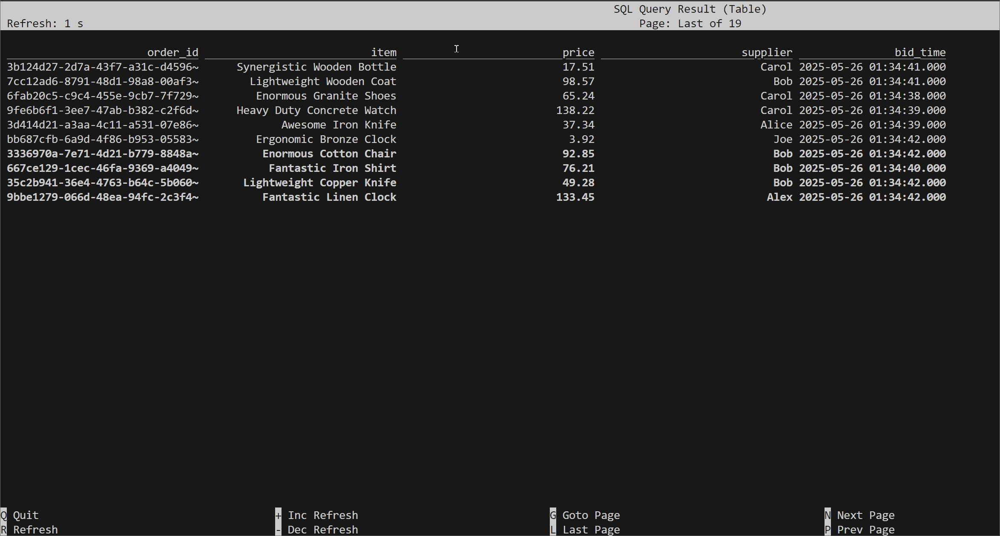
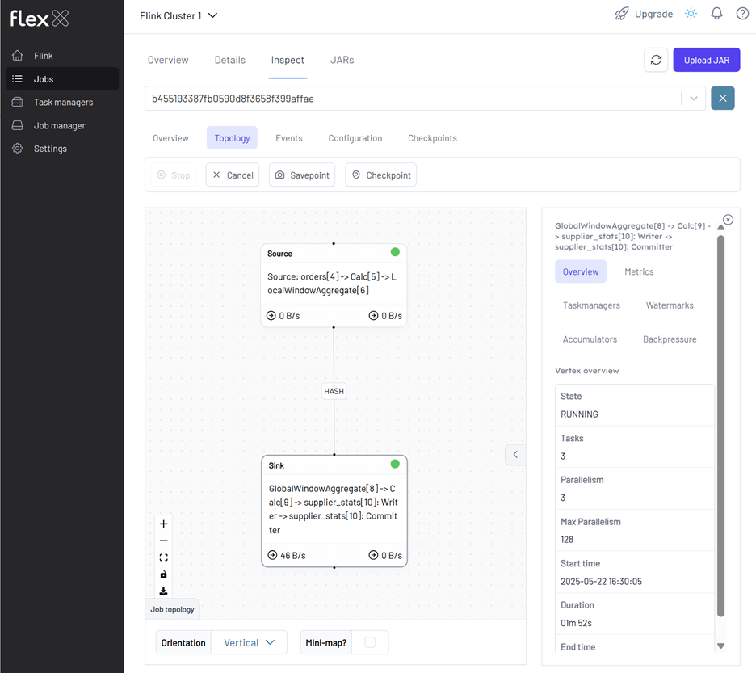
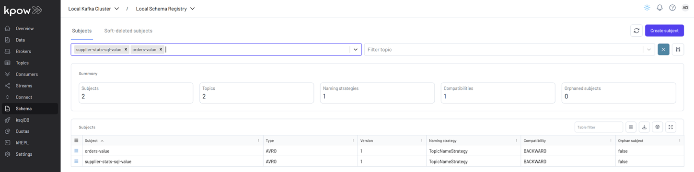
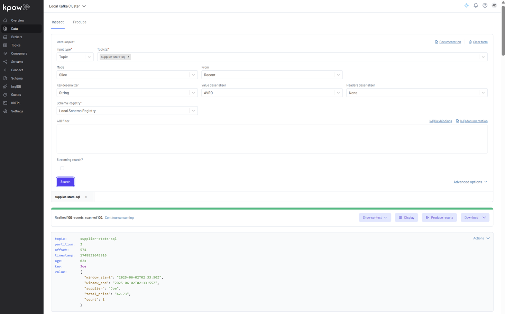

## Lab 4: Flink SQL - Aggregating Supplier Stats from Kafka Topic

Use Flink SQL to read Avro-encoded orders from Kafka, perform tumbling window aggregations to compute supplier-level metrics, and write results back to Kafka. This lab demonstrates real-time analytics using declarative SQL and Kafka integration.

## How to start

### Clone project repository

```bash
git clone https://github.com/factorhouse/examples.git
cd examples
```

### Start Kafka and Flink environments

We'll use [Factor House Local](https://github.com/factorhouse/factorhouse-local) to quickly spin up Kafka and Flink environments that include **Kpow** and **Flex**. We can use either the Community or Enterprise editions of Kpow/Flex. **To begin, ensure valid licenses are available.** For details on how to request and configure a license, refer to [this section](https://github.com/factorhouse/factorhouse-local?tab=readme-ov-file#update-kpow-and-flex-licenses) of the project _README_.

```bash
## Clone the Factor House Local Repository
git clone https://github.com/factorhouse/factorhouse-local.git

## Download Kafka/Flink Connectors and Spark Iceberg Dependencies
./factorhouse-local/resources/setup-env.sh

## Uncomment the sections to enable the edition and license.
# Edition (choose one):
# unset KPOW_SUFFIX         # Enterprise
# unset FLEX_SUFFIX         # Enterprise
# export KPOW_SUFFIX="-ce"  # Community
# export FLEX_SUFFIX="-ce"  # Community
# Licenses:
# export KPOW_LICENSE=<path-to-license-file>
# export FLEX_LICENSE=<path-to-license-file>

docker compose -p kpow -f ./factorhouse-local/compose-kpow.yml up -d \
  && docker compose -p flex -f ./factorhouse-local/compose-flex.yml up -d
```

### Deploy source connector

We will create a source connector that generates fake order records to a Kafka topic (`orders`). See the [Kafka Connect via Kpow UI and API](../lab-02/) lab for details about how to create the connector.

Once deployed, we can check the connector and its tasks in Kpow.


### Create pipeline

This example runs in the Flink SQL client, which can be started as shown below.

```bash
docker exec -it jobmanager ./bin/sql-client.sh
```

#### Load dependent JARs

We begin by loading the necessary JAR files for the Apache Kafka SQL connector and Confluent Avro format support.

```sql
ADD JAR 'file:///tmp/connector/flink-sql-connector-kafka-3.3.0-1.20.jar';
```

```sql
ADD JAR 'file:///tmp/connector/flink-sql-avro-confluent-registry-1.20.1.jar';
```

```sql
show jars;
-- +-------------------------------------------------------------+
-- |                                                        jars |
-- +-------------------------------------------------------------+
-- |     /tmp/connector/flink-sql-connector-kafka-3.3.0-1.20.jar |
-- | /tmp/connector/flink-sql-avro-confluent-registry-1.20.1.jar |
-- +-------------------------------------------------------------+
-- 2 rows in set
```

#### Create source table

The source table is defined using the **Kafka SQL connector**, enabling Flink to consume **Avro-encoded messages** from the `orders` Kafka topic. To support time-based processing and windowed aggregations, an event-time watermark is introduced on `bid_time` using `WATERMARK FOR bid_time AS bid_time - INTERVAL '5' SECOND`. This watermark allows Flink to track event time progress and handle out-of-order events, which is required for time-based operations such as windowed aggregations or joins.

This setup allows Flink to perform event-time processing over incoming Kafka messages, with schema management handled automatically by the Avro format and Schema Registry.

```sql
CREATE TABLE orders (
  order_id     STRING,
  item         STRING,
  price        STRING,
  supplier     STRING,
  bid_time     TIMESTAMP(3),
  WATERMARK FOR bid_time AS bid_time - INTERVAL '5' SECOND
) WITH (
  'connector' = 'kafka',
  'topic' = 'orders',
  'properties.bootstrap.servers' = 'kafka-1:19092',
  'format' = 'avro-confluent',
  'avro-confluent.schema-registry.url' = 'http://schema:8081',
  'avro-confluent.basic-auth.credentials-source' = 'USER_INFO',
  'avro-confluent.basic-auth.user-info' = 'admin:admin',
  'avro-confluent.schema-registry.subject' = 'orders-value',
  'scan.startup.mode' = 'earliest-offset'
);
```

Run the following query to view the source table:

```sql
select * from orders;
```



#### Create sink table

A sink table (`supplier_stats`) is defined to collect per-supplier statistics computed over **tumbling event-time windows of 5 seconds**. The table stores:

- The start and end time of each window (as formatted UTC strings),
- The supplier name,
- The total price of all bids within the window, and
- The total number of bids received.

This aggregation is performed using Flink's `TUMBLE` function, which groups events into fixed-size, non-overlapping time windows based on the `bid_time` field from the source table. The results of the aggregation query are inserted into the sink table.

The sink is backed by a Kafka topic (`orders-supplier-stats`) and uses _Confluent Avro_ for both the value serialization. The key is set to the `supplier` field and uses a `fixed` partitioner, ensuring that all records for the same supplier are written to the same partition.

There are some important considerations.

- **Parallelism**: The default parallelism is explicitly set to 3 using `SET 'parallelism.default' = '3'`. This value should not exceed the number of partitions in the Kafka topic; otherwise, some parallel tasks will not be able to write data, and no messages will be produced. If in doubt, it's safer to match the parallelism to the number of partitions.
- **Topic creation**: If the Kafka topic `orders-supplier-stats` does not exist and Kafka is configured with `auto.create.topics.enable=true`, it will be automatically created with default settings. These typically include **3 partitions and a replication factor of 1 or 3**, depending on your broker configuration.
- **Timestamp formatting**: The `window_start` and `window_end` fields are formatted using the `DATE_FORMAT(..., 'yyyy-MM-dd''T''HH:mm:ss''Z''')` pattern to produce ISO 8601-style UTC timestamps (ending with `'Z'`).

This setup allows for real-time supplier metrics to be calculated and streamed out to Kafka, where they can be consumed by other services or analytics platforms.

```sql
SET 'parallelism.default' = '3';
```

```sql
CREATE TABLE supplier_stats (
  window_start STRING,
  window_end   STRING,
  supplier     STRING,
  total_price  DECIMAL(10, 2),
  `count`      BIGINT
) WITH (
  'connector' = 'kafka',
  'topic' = 'supplier-stats-sql',
  'properties.bootstrap.servers' = 'kafka-1:19092',
  'format' = 'avro-confluent',
  'avro-confluent.schema-registry.url' = 'http://schema:8081',
  'avro-confluent.basic-auth.credentials-source' = 'USER_INFO',
  'avro-confluent.basic-auth.user-info' = 'admin:admin',
  'avro-confluent.schema-registry.subject' = 'supplier-stats-sql-value',
  'key.format' = 'raw',
  'key.fields' = 'supplier',
  'value.format' = 'avro-confluent',
  'sink.partitioner' = 'fixed',
  'sink.parallelism' = '3'
);
```

```sql
INSERT INTO supplier_stats
SELECT
  DATE_FORMAT(window_start, 'yyyy-MM-dd''T''HH:mm:ss''Z''') AS window_start,
  DATE_FORMAT(window_end,   'yyyy-MM-dd''T''HH:mm:ss''Z''') AS window_end,
  supplier,
  SUM(CAST(price AS DECIMAL(10, 2))) AS total_price,
  count(*) AS `count`
FROM TABLE(
  TUMBLE(TABLE orders, DESCRIPTOR(bid_time), INTERVAL '5' SECOND))
GROUP BY window_start, window_end, supplier;
```

We can monitor the Flink job via the Flink UI (http://localhost:8082) or Flex (http://localhost:3001). The screenshot below shows the job's logical plan as visualized in Flex.



We can also verify that the sink connector registers the `supplier-stats-sql-value` schema in Kpow (http://localhost:3000).



To explore the supplier statistics, inspect the messages in the `supplier-stats-sql` Kafka topic. For proper Avro decoding in Kpow, set the **Key Deserializer** to _String_, the **Value Deserializer** to _AVRO_, and select _Local Schema Registry_. Then, click the _Search_ button to view the records.



## Shutdown environment

Finally, stop and remove the Docker containers.

> If you're not already in the project root directory, navigate there first.
> Then, stop and remove the Docker containers by running:

```bash
# Stops the containers and unsets environment variables
docker compose -p flex -f ./factorhouse-local/compose-flex.yml down \
  && docker compose -p kpow -f ./factorhouse-local/compose-kpow.yml down

unset KPOW_SUFFIX FLEX_SUFFIX KPOW_LICENSE FLEX_LICENSE
```
