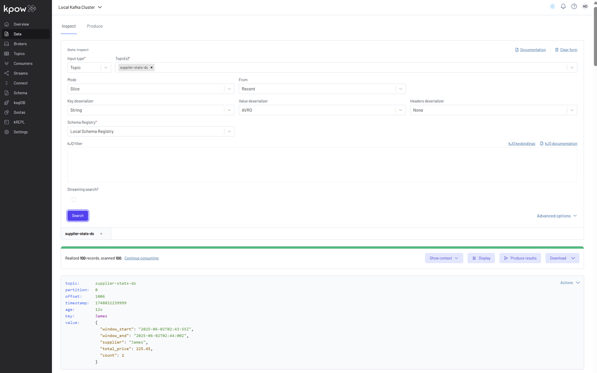

## Lab 5: Flink DataStream API - Real-Time Analytics from Orders to Supplier Stats

Implement a Flink DataStream job that reads orders from Kafka, performs event-time tumbling window aggregations, and publishes supplier statistics to a Kafka sink. Learn how to work with watermarks, Avro serialization, and event-time semantics in a production-style stream pipeline.

## How to start

### Clone project repository

```bash
git clone https://github.com/factorhouse/examples.git
cd examples
```

### Start Kafka and Flink environments

We'll use [Factor House Local](https://github.com/factorhouse/factorhouse-local) to quickly spin up Kafka and Flink environments that includes **Kpow** and **Flex**. We can use either the Community or Enterprise editions of Kpow/Flex. **To begin, ensure valid licenses are available.** For details on how to request and configure a license, refer to [this section](https://github.com/factorhouse/factorhouse-local?tab=readme-ov-file#update-kpow-and-flex-licenses) of the project _README_.

```bash
## Clone the Factor House Local Repository
git clone https://github.com/factorhouse/factorhouse-local.git

## Download Kafka/Flink Connectors and Spark Iceberg Dependencies
./factorhouse-local/resources/setup-env.sh

## Uncomment the sections to enable the edition and license.
# Edition (choose one):
# unset KPOW_SUFFIX         # Enterprise
# unset FLEX_SUFFIX         # Enterprise
# export KPOW_SUFFIX="-ce"  # Community
# export FLEX_SUFFIX="-ce"  # Community
# Licenses:
# export KPOW_LICENSE=<path-to-license-file>
# export FLEX_LICENSE=<path-to-license-file>

docker compose -p kpow -f ./factorhouse-local/compose-kpow.yml up -d \
  && docker compose -p flex -f ./factorhouse-local/compose-flex.yml up -d
```

### Deploy source connector

We will create a source connector that generates fake order records to a Kafka topic (`orders`). See the [Kafka Connect via Kpow UI and API](../fh-local-kafka-connect-orders/) lab for details about how to create the connector.

Once deployed, we can check the connector and its tasks in Kpow.


### Running Flink application

To build and run this Flink application locally, make sure your environment has the following prerequisites:

- **JDK 17**
- **Gradle 7.6+ or 8.x**

The application supports two primary execution modes, each suited to different stages of development:

#### 1. Run via Gradle (Development Mode)

This mode is ideal for local development and quick testing. It enables fast iteration by launching the application directly from the Gradle build system - no need to package it into a JAR.

```bash
cd fh-local-labs/lab-05
./gradlew run
```

We can see console output like the following:


#### 2. Deploy on a Flink Cluster (Deployment Mode)

For staging or production-like environments, we can package the application into a self-contained "fat" JAR that includes all dependencies.

##### Step 1: Build the Shadow JAR

```bash
cd fh-local-labs/lab-05
./gradlew shadowJar
```

This creates the following deployable artifact:

```
build/libs/fh-local-flink-ds-stats-1.0.jar
```

##### Step 2: Deploy to Flink via Docker

We should copy the JAR into the container and submit the job:

```bash
docker cp build/libs/fh-local-flink-ds-stats-1.0.jar \
  jobmanager:/tmp/fh-local-flink-ds-stats-1.0.jar

docker exec jobmanager /opt/flink/bin/flink run -d -p 3 \
  -c io.factorhouse.demo.MainKt /tmp/fh-local-flink-ds-stats-1.0.jar
```

Or we can also submit the JAR using the Flex UI available at `http://localhost:3001`:

1. **Upload the JAR** from the **Jobs** sidebar.


2. **Click the submit menu** next to the uploaded JAR.


3. **Fill out the submission form**, including:

   - Entry Class: `io.factorhouse.demo.MainKt`
   - Parallelism: e.g. `3`
   - Optional: Savepoint path, job arguments, etc.


### Monitoring the Job

We can monitor the Flink job via the Flink UI (`localhost:8081`) or Flex (`localhost:3001`). The screenshot below shows the job's logical plan as visualized in Flex.


### Verifying the Output in Kafka

We can also verify that the sink connector registers the `supplier-stats-ds-value` schema in Kpow (`localhost:3000`).


To explore the supplier statistics, inspect the messages in the `supplier-stats-ds` Kafka topic. For proper Avro decoding in Kpow, set the **Key Deserializer** to _String_, the **Value Deserializer** to _AVRO_, and select _Local Schema Registry_. Then, click the _Search_ button to view the records.



### Shutdown environment

Finally, stop and remove the Docker containers.

> If you're not already in the project root directory, navigate there first.
> Then, stop and remove the Docker containers by running:

```bash
# Stops the containers and unsets environment variables
docker compose -p flex -f ./factorhouse-local/compose-flex.yml down \
  && docker compose -p kpow -f ./factorhouse-local/compose-kpow.yml down

unset KPOW_SUFFIX FLEX_SUFFIX KPOW_LICENSE FLEX_LICENSE
```
