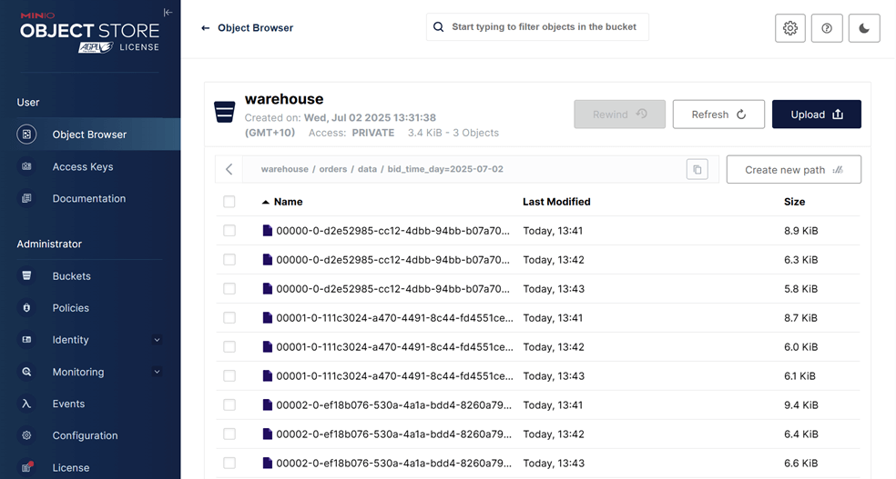

## Lab 7: Flink SQL - Ingesting Kafka Order Records into Iceberg Table

Build a streaming pipeline that reads Kafka order records with Flink SQL and writes to an Iceberg table on MinIO. The Iceberg sink table is created via Spark SQL to enable hidden partitioning.

## How to start

### Clone project repository

```bash
git clone https://github.com/factorhouse/examples.git
cd examples
```

### Start Kafka and Flink environments

We'll use [Factor House Local](https://github.com/factorhouse/factorhouse-local) to quickly spin up Kafka and Flink environments that includes **Kpow** and **Flex** as well as an analytics environment for Iceberg. We can use either the Community or Enterprise editions of Kpow/Flex. **To begin, ensure valid licenses are available.** For details on how to request and configure a license, refer to [this section](https://github.com/factorhouse/factorhouse-local?tab=readme-ov-file#update-kpow-and-flex-licenses) of the project _README_.

```bash
## Clone the Factor House Local Repository
git clone https://github.com/factorhouse/factorhouse-local.git

## Download Kafka/Flink Connectors and Spark Iceberg Dependencies
./factorhouse-local/resources/setup-env.sh

## Uncomment the sections to enable the edition and license.
# Edition (choose one):
# unset KPOW_SUFFIX         # Enterprise
# unset FLEX_SUFFIX         # Enterprise
# export KPOW_SUFFIX="-ce"  # Community
# export FLEX_SUFFIX="-ce"  # Community
# Licenses:
# export KPOW_LICENSE=<path-to-license-file>
# export FLEX_LICENSE=<path-to-license-file>

docker compose -p kpow -f ./factorhouse-local/compose-kpow.yml up -d \
  && docker compose -p flex -f ./factorhouse-local/compose-flex.yml up -d
```

### Persistent Catalogs

Two catalogs are pre-configured in both the Flink and Spark clusters:

- `demo_hv`: a Hive catalog backed by the Hive Metastore
- `demo_ib`: an Iceberg catalog also backed by the Hive Metastore

#### Flink

In Flink, the catalogs can be initialized automatically using an SQL script (`init-catalogs.sql`) on startup:

```sql
CREATE CATALOG demo_hv WITH (
  'type' = 'hive',
  'hive-conf-dir' = '/opt/flink/conf',
  'default-database' = 'default'
);

CREATE CATALOG demo_ib WITH (
  'type' = 'iceberg',
  'catalog-type' = 'hive',
  'uri' = 'thrift://hive-metastore:9083'
);
```

#### Spark

In Spark, catalog settings are defined in `spark-defaults.conf`:

```conf
# Enable Iceberg extensions
spark.sql.extensions                               org.apache.iceberg.spark.extensions.IcebergSparkSessionExtensions

# Hive catalog (demo_hv)
spark.sql.catalog.demo_hv                          org.apache.iceberg.spark.SparkCatalog
spark.sql.catalog.demo_hv.type                     hive
spark.sql.catalog.demo_hv.hive.metastore.uris      thrift://hive-metastore:9083
spark.sql.catalog.demo_hv.warehouse                s3a://warehouse/

# Iceberg catalog (demo_ib)
spark.sql.catalog.demo_ib                          org.apache.iceberg.spark.SparkCatalog
spark.sql.catalog.demo_ib.type                     hive
spark.sql.catalog.demo_ib.uri                      thrift://hive-metastore:9083
spark.sql.catalog.demo_ib.io-impl                  org.apache.iceberg.aws.s3.S3FileIO
spark.sql.catalog.demo_ib.s3.endpoint              http://minio:9000
spark.sql.catalog.demo_ib.s3.path-style-access     true
spark.sql.catalog.demo_ib.warehouse                s3a://warehouse/

# Optional: set default catalog
spark.sql.defaultCatalog                           spark_catalog
```

### Deploy source connector

We will create a source connector that generates fake order records to a Kafka topic (`orders`). See the [Kafka Connect via Kpow UI and API](../lab-02/) lab for details about how to create the connector.

Once deployed, we can check the connector and its tasks in Kpow.


### Create sink table

Flink SQL doesn't support [Iceberg's hidden partitioning](https://iceberg.apache.org/docs/nightly/partitioning/#icebergs-hidden-partitioning). Therefore, we will create the sink table using Spark SQL.

```bash
docker exec -it spark-iceberg /opt/spark/bin/spark-sql
```

```sql
-- // Only 'spark_catalog' appears although 'demo_hv' and 'demo_ib' exists
SHOW CATALOGS;
-- spark_catalog
```

```sql
-- // If 'demo_ib' gets showing if being used.
USE demo_ib;
```

```sql
SHOW CATALOGS;
-- demo_ib
-- spark_catalog
```

```sql
-- // Use the `default` database
USE `default`;
```

```sql
CREATE TABLE orders (
    order_id STRING,
    item STRING,
    price DECIMAL(10, 2),
    supplier STRING,
    bid_time TIMESTAMP
)
USING iceberg
PARTITIONED BY (DAY(bid_time))
TBLPROPERTIES (
    'format-version' = '2',
    'write.format.default' = 'parquet',
    'write.target-file-size-bytes' = '134217728',
    'write.parquet.compression-codec' = 'snappy',
    'write.metadata.delete-after-commit.enabled' = 'true',
    'write.metadata.previous-versions-max' = '3',
    'write.delete.mode' = 'copy-on-write',
    'write.update.mode' = 'copy-on-write'
);
```

After creation, the table will initially contain only metadata (no data). We can view it in the MinIO Console at http://localhost:9001.

- **Username:** `admin`
- **Password:** `password`


### Create pipeline

This example runs in the Flink SQL client, which can be started as shown below.

```bash
## Create `demo_hv` and `demo_ib` catalogs at startup
docker exec -it jobmanager ./bin/sql-client.sh --init /opt/flink/conf/init-catalogs.sql
```

#### Load dependent JARs

We begin by loading the necessary JAR files for the Apache Kafka SQL connector and Confluent Avro format support.

```sql
SHOW CATALOGS;
-- +-----------------+
-- |    catalog name |
-- +-----------------+
-- | default_catalog |
-- |         demo_hv |
-- |         demo_ib |
-- +-----------------+
-- 3 rows in set
```

```sql
ADD JAR 'file:///tmp/connector/flink-sql-connector-kafka-3.3.0-1.20.jar';
```

```sql
ADD JAR 'file:///tmp/connector/flink-sql-avro-confluent-registry-1.20.1.jar';
```

```sql
SHOW JARS;
-- +-------------------------------------------------------------+
-- |                                                        jars |
-- +-------------------------------------------------------------+
-- |     /tmp/connector/flink-sql-connector-kafka-3.3.0-1.20.jar |
-- | /tmp/connector/flink-sql-avro-confluent-registry-1.20.1.jar |
-- +-------------------------------------------------------------+
-- 2 rows in set
```

#### Create source table

The source table is defined using the **Kafka SQL connector**, enabling Flink to consume **Avro-encoded messages** from the `orders` Kafka topic. To support time-based processing and potential windowed aggregations, an event-time watermark is introduced on `bid_time` using `WATERMARK FOR bid_time AS bid_time - INTERVAL '5' SECOND`. This watermark allows Flink to track event time progress and handle out-of-order events, which is required for time-based operations such as windowed aggregations or joins.

> 💡 The watermark definition can be omitted in this lab because the goal is simply to write Kafka records to an object storage (_MinIO_) without performing time-base transformations. However, including it prepares the pipeline for future event-time logic.

```sql
-- // Create a temporary table for the Kafka source in the default catalog ('default_catalog').
CREATE TEMPORARY TABLE orders (
  order_id     STRING,
  item         STRING,
  price        STRING,
  supplier     STRING,
  bid_time     TIMESTAMP(3),
  WATERMARK FOR bid_time AS bid_time - INTERVAL '5' SECOND
) WITH (
  'connector' = 'kafka',
  'topic' = 'orders',
  'properties.bootstrap.servers' = 'kafka-1:19092',
  'format' = 'avro-confluent',
  'avro-confluent.schema-registry.url' = 'http://schema:8081',
  'avro-confluent.basic-auth.credentials-source' = 'USER_INFO',
  'avro-confluent.basic-auth.user-info' = 'admin:admin',
  'avro-confluent.schema-registry.subject' = 'orders-value',
  'scan.startup.mode' = 'earliest-offset'
);
```

Run the following query to view the _orders_ table:

```sql
SELECT * FROM orders;
```

#### Insert into sink table

A sink table, `orders_sink`, is defined to write processed order records to **object storage** (e.g., **MinIO**) in **Parquet format**. The data is **partitioned by bid date, hour, and minute** to enable efficient querying and organization.

The table uses the **Filesystem connector** with the `s3a://` scheme for writing to S3-compatible storage. Partition commit policies and rolling options are configured to optimize file size and latency.

```sql
SET 'parallelism.default' = '3';
```

```sql
SET 'execution.checkpointing.interval' = '60000';
```

```sql
-- // 'orders' table created by Spark SQL
SHOW TABLES IN demo_ib.`default`;
-- +------------+
-- | table name |
-- +------------+
-- |     orders |
-- +------------+
-- 1 row in set
```

```sql
INSERT INTO demo_ib.`default`.orders
SELECT
    order_id,
    item,
    CAST(price AS DECIMAL(10, 2)),
    supplier,
    bid_time
FROM orders;
```

We can monitor the Flink job via the Flink UI (`http://localhost:8082`) or Flex (`http://localhost:3001`). The screenshot below shows the job's logical plan as visualized in Flex.


In addition to monitoring the job, we can verify the output by inspecting the Parquet files written by the sink. These files are accessible via MinIO at `http://localhost:9001` using `admin` as the username and `password` as the password. As shown in the screenshot below, the records have been successfully written to the appropriate partitions in the `warehouse` bucket.



### Shutdown environment

Finally, stop and remove the Docker containers.

> If you're not already in the project root directory, navigate there first.
> Then, stop and remove the Docker containers by running:

```bash
# Stops the containers and unsets environment variables
docker compose -p flex -f ./factorhouse-local/compose-flex.yml down \
  && docker compose -p kpow -f ./factorhouse-local/compose-kpow.yml down

unset KPOW_SUFFIX FLEX_SUFFIX KPOW_LICENSE FLEX_LICENSE
```
