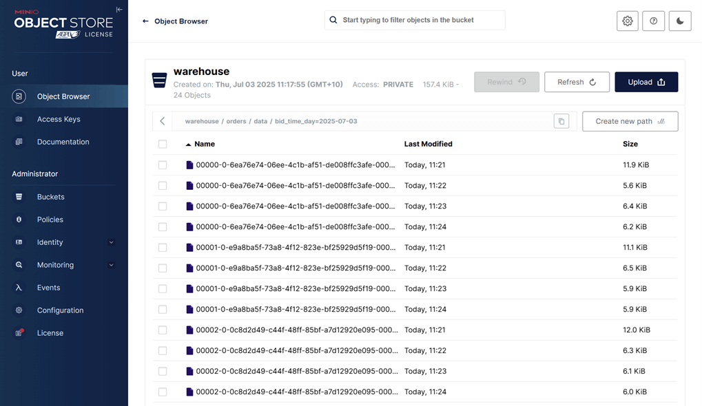

## Lab 8: Flink Table API - Loading Order Events from Kafka into Iceberg

Deploy a Kafka-to-Iceberg pipeline using Flink's Table API. This lab demonstrates how to configure the job, compile it as a shadow JAR, and deploy via CLI and Flex. Sink table is defined via Spark SQL due to Flink's partitioning limitations.

## How to start

### Clone project repository

```bash
git clone https://github.com/factorhouse/examples.git
cd examples
```

### Start Kafka and Flink environments

We'll use [Factor House Local](https://github.com/factorhouse/factorhouse-local) to quickly spin up Kafka and Flink environments that includes **Kpow** and **Flex** as well as an analytics environment for Iceberg. We can use either the Community or Enterprise editions of Kpow/Flex. **To begin, ensure valid licenses are available.** For details on how to request and configure a license, refer to [this section](https://github.com/factorhouse/factorhouse-local?tab=readme-ov-file#update-kpow-and-flex-licenses) of the project _README_.

```bash
## Clone the Factor House Local Repository
git clone https://github.com/factorhouse/factorhouse-local.git

## Download Kafka/Flink Connectors and Spark Iceberg Dependencies
./factorhouse-local/resources/setup-env.sh

## Uncomment the sections to enable the edition and license.
# Edition (choose one):
# unset KPOW_SUFFIX         # Enterprise
# unset FLEX_SUFFIX         # Enterprise
# export KPOW_SUFFIX="-ce"  # Community
# export FLEX_SUFFIX="-ce"  # Community
# Licenses:
# export KPOW_LICENSE=<path-to-license-file>
# export FLEX_LICENSE=<path-to-license-file>

docker compose -p kpow -f ./factorhouse-local/compose-kpow.yml up -d \
  && docker compose -p flex -f ./factorhouse-local/compose-flex.yml up -d
```

### Deploy source connector

We will create a source connector that generates fake order records to a Kafka topic (`orders`). See the [Kafka Connect via Kpow UI and API](../lab-02/) lab for details about how to create the connector.

Once deployed, we can check the connector and its tasks in Kpow.


### Running Flink application

This Flink streaming application reads Avro-encoded Kafka messages using the Table API and writes them to an Iceberg table registered with a Hive catalog. It does the following:

- Uses the Flink Table API to define a Kafka source table backed by the Confluent Schema Registry (with basic auth support).
- Configures checkpointing, parallelism, and fault tolerance for streaming execution.
- Registers an Iceberg catalog backed by Hive Metastore using SQL and sets it as the active catalog.
- **Creates the Iceberg table programmatically using the Java Iceberg API** to support **[hidden partitioning](https://www.tabular.io/apache-iceberg-cookbook/data-engineering-hidden-partitioning/) by `DAY(bid_time)`**, which is **not currently supported in Flink SQL DDL**.
- Defines the source schema with watermarking and consumes data from Kafka in Avro format.
- Casts fields as needed (e.g., `price` to `DECIMAL(10,2)`) and writes the resulting table into Iceberg using `executeInsert()`.
- Logs key events throughout the lifecycle, including job submission and failure handling.

To build the Flink application, make sure your environment has the following prerequisites:

- **JDK 17**
- **Gradle 7.6+ or 8.x**

Our project uses the `factorhouse/flink` image, which includes the necessary dependencies for Hadoop and Iceberg. To avoid an excessively large fat JAR, the image is optimized for cluster deployment only.

#### Step 1: Build the Shadow JAR

From the project directory:

```bash
cd fh-local-labs/lab-08
./gradlew shadowJar
```

This creates the following deployable artifact:

```
build/libs/fh-local-flink-table-iceberg-1.0.jar
```

#### Step 2: Deploy to Flink via Docker

Copy the JAR into the Flink JobManager container and submit the job:

```bash
docker cp build/libs/fh-local-flink-table-iceberg-1.0.jar \
  jobmanager:/tmp/fh-local-flink-table-iceberg-1.0.jar

docker exec jobmanager /opt/flink/bin/flink run -d -p 3 \
  -c io.factorhouse.demo.MainKt /tmp/fh-local-flink-table-iceberg-1.0.jar
```

Or we can also submit the JAR using the Flex UI available at `http://localhost:3001`:

1. **Upload the JAR** from the **Jobs** sidebar.


2. **Click the submit menu** next to the uploaded JAR.


3. **Fill out the submission form**, including:

   - Entry Class: `io.factorhouse.demo.MainKt`
   - Parallelism: e.g. `3`
   - Optional: Savepoint path, job arguments, etc.


### Monitoring the Job

We can monitor the Flink job via the Flink UI (`localhost:8081`) or Flex (`localhost:3001`). The screenshot below shows the job's logical plan as visualized in Flex.


In addition to monitoring the job, we can verify the output by inspecting the Parquet files written by the sink. These files are accessible via MinIO at `http://localhost:9001` using `admin` as the username and `password` as the password. As shown in the screenshot below, the records have been successfully written to the appropriate partitions in the `warehouse` bucket.



### Shutdown environment

Finally, stop and remove the Docker containers.

> If you're not already in the project root directory, navigate there first.
> Then, stop and remove the Docker containers by running:

```bash
# Stops the containers and unsets environment variables
docker compose -p flex -f ./factorhouse-local/compose-flex.yml down \
  && docker compose -p kpow -f ./factorhouse-local/compose-kpow.yml down

unset KPOW_SUFFIX FLEX_SUFFIX KPOW_LICENSE FLEX_LICENSE
```
