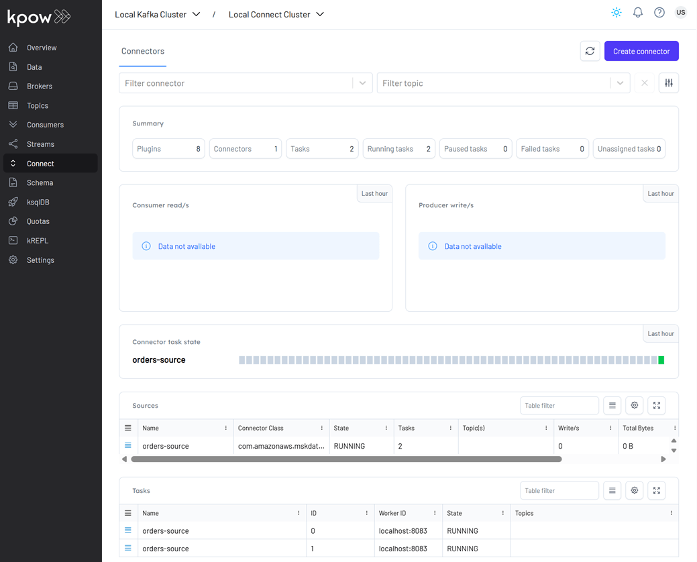
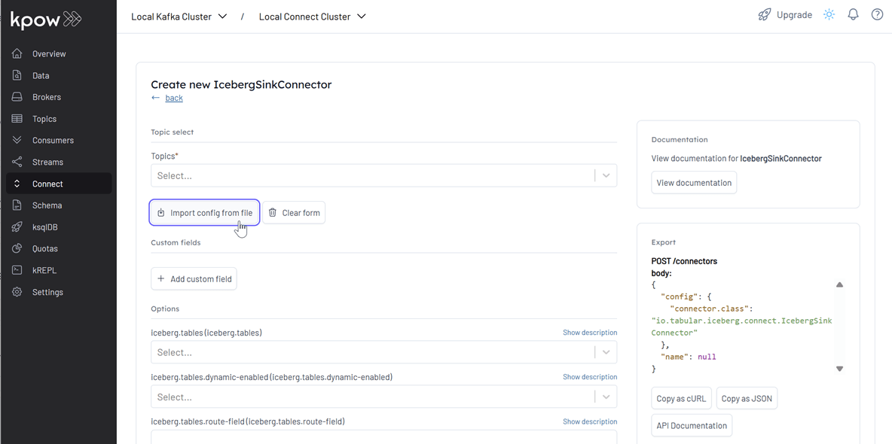
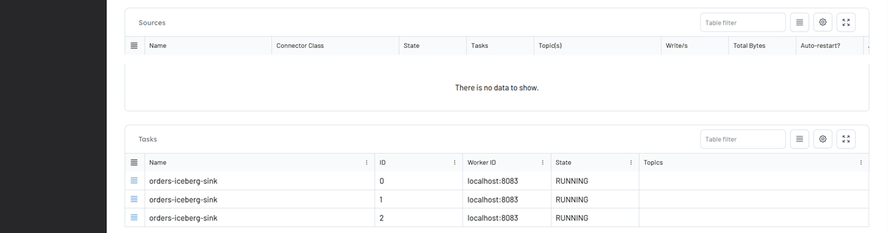
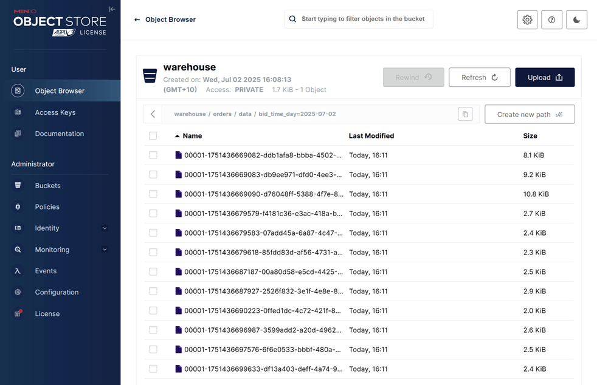

## Lab 9: Kafka Connect - Streaming Order Data from Kafka into Iceberg

Use Kafka Connect to stream Avro records from Kafka into an Iceberg table in MinIO. The lab covers connector deployment via Kpow and how to configure hidden partitioning using a Spark-defined table schema.

## How to start

### Clone project repository

```bash
git clone https://github.com/factorhouse/examples.git
cd examples
```

### Start Kafka and Flink environments

We'll use [Factor House Local](https://github.com/factorhouse/factorhouse-local) to quickly spin up a Kafka environments that includes **Kpow** as well as an analytics environment for Iceberg. We can use either the Community or Enterprise editions of Kpow. **To begin, ensure valid licenses are available.** For details on how to request and configure a license, refer to [this section](https://github.com/factorhouse/factorhouse-local?tab=readme-ov-file#update-kpow-and-flex-licenses) of the project _README_.

```bash
## Clone the Factor House Local Repository
git clone https://github.com/factorhouse/factorhouse-local.git

## Download Kafka/Flink Connectors and Spark Iceberg Dependencies
./factorhouse-local/resources/setup-env.sh

## Uncomment the sections to enable the edition and license.
# Edition (choose one):
# unset KPOW_SUFFIX         # Enterprise
# unset FLEX_SUFFIX         # Enterprise
# export KPOW_SUFFIX="-ce"  # Community
# export FLEX_SUFFIX="-ce"  # Community
# Licenses:
# export KPOW_LICENSE=<path-to-license-file>
# export FLEX_LICENSE=<path-to-license-file>

docker compose -p kpow -f ./factorhouse-local/compose-kpow.yml up -d \
  && docker compose -p flex -f ./factorhouse-local/compose-flex.yml up -d
```

### Persistent Catalogs

Two catalogs are pre-configured in both the Flink and Spark clusters:

- `demo_hv`: a Hive catalog backed by the Hive Metastore
- `demo_ib`: an Iceberg catalog also backed by the Hive Metastore

#### Flink

In Flink, the catalogs can be initialized automatically using an SQL script (`init-catalogs.sql`) on startup:

```sql
CREATE CATALOG demo_hv WITH (
  'type' = 'hive',
  'hive-conf-dir' = '/opt/flink/conf',
  'default-database' = 'default'
);

CREATE CATALOG demo_ib WITH (
  'type' = 'iceberg',
  'catalog-type' = 'hive',
  'uri' = 'thrift://hive-metastore:9083'
);
```

#### Spark

In Spark, catalog settings are defined in `spark-defaults.conf`:

```conf
# Enable Iceberg extensions
spark.sql.extensions                               org.apache.iceberg.spark.extensions.IcebergSparkSessionExtensions

# Hive catalog (demo_hv)
spark.sql.catalog.demo_hv                          org.apache.iceberg.spark.SparkCatalog
spark.sql.catalog.demo_hv.type                     hive
spark.sql.catalog.demo_hv.hive.metastore.uris      thrift://hive-metastore:9083
spark.sql.catalog.demo_hv.warehouse                s3a://warehouse/

# Iceberg catalog (demo_ib)
spark.sql.catalog.demo_ib                          org.apache.iceberg.spark.SparkCatalog
spark.sql.catalog.demo_ib.type                     hive
spark.sql.catalog.demo_ib.uri                      thrift://hive-metastore:9083
spark.sql.catalog.demo_ib.io-impl                  org.apache.iceberg.aws.s3.S3FileIO
spark.sql.catalog.demo_ib.s3.endpoint              http://minio:9000
spark.sql.catalog.demo_ib.s3.path-style-access     true
spark.sql.catalog.demo_ib.warehouse                s3a://warehouse/

# Optional: set default catalog
spark.sql.defaultCatalog                           spark_catalog
```

### Deploy source connector

We will create a source connector that generates fake order records to a Kafka topic (`orders`). See the [Kafka Connect via Kpow UI and API](../lab-02/) lab for details about how to create the connector.

Once deployed, we can check the connector and its tasks in Kpow.



### Create sink table

The Iceberg sink connector requires that the target table already exists. We'll use Spark SQL to create the sink table.

```bash
docker exec -it spark-iceberg /opt/spark/bin/spark-sql
```

```sql
-- // Only 'spark_catalog' appears although 'demo_hv' and 'demo_ib' exists
SHOW CATALOGS;
-- spark_catalog
```

```sql
-- // If 'demo_ib' gets showing if being used.
USE demo_ib;
```

```sql
SHOW CATALOGS;
-- demo_ib
-- spark_catalog
```

```sql
-- // Use the `default` database
USE `default`;
```

```sql
CREATE TABLE orders (
    order_id STRING,
    item STRING,
    price DECIMAL(10, 2),
    supplier STRING,
    bid_time TIMESTAMP
)
USING iceberg
PARTITIONED BY (DAY(bid_time))
TBLPROPERTIES (
    'format-version' = '2',
    'write.format.default' = 'parquet',
    'write.target-file-size-bytes' = '134217728',
    'write.parquet.compression-codec' = 'snappy',
    'write.metadata.delete-after-commit.enabled' = 'true',
    'write.metadata.previous-versions-max' = '3',
    'write.delete.mode' = 'copy-on-write',
    'write.update.mode' = 'copy-on-write'
);
```

After creation, the table will initially contain only metadata (no data). We can view it in the MinIO Console at http://localhost:9001.

- **Username:** `admin`
- **Password:** `password`


### Create sink connector

1. Open to the Kpow UI (http://localhost:3030) and go to the _Connect_ section.
2. Click _Create connector_ to get started.


3. Select the _IcebergSinkConnector_ connector


4. Import the source connector configuration file ([`./fh-local-labs/lab-09/orders-iceberg-sink.json`](./orders-iceberg-sink.json)) and hit _Create_.



5. After creation, we can monitor the connector and its tasks directly in Kpow.




We can also track connector performance by filtering its consumer group (`connect-orders-iceberg-sink`) in the **Consumers** section. This displays key metrics like group state, assigned members, read throughput, and lag:


Finally, inspect the Parquet files written by the connector via MinIO at `http://localhost:9001` using `admin` as the username and `password` as the password. As shown below, records are correctly partitioned and stored in the configured MinIO bucket (`warehouse`).



### Shutdown environment

Finally, stop and remove the Docker containers.

> If you're not already in the project root directory, navigate there first.
> Then, stop and remove the Docker containers by running:

```bash
# Stops the containers and unsets environment variables
docker compose -p flex -f ./factorhouse-local/compose-flex.yml down \
  && docker compose -p kpow -f ./factorhouse-local/compose-kpow.yml down

unset KPOW_SUFFIX FLEX_SUFFIX KPOW_LICENSE FLEX_LICENSE
```
