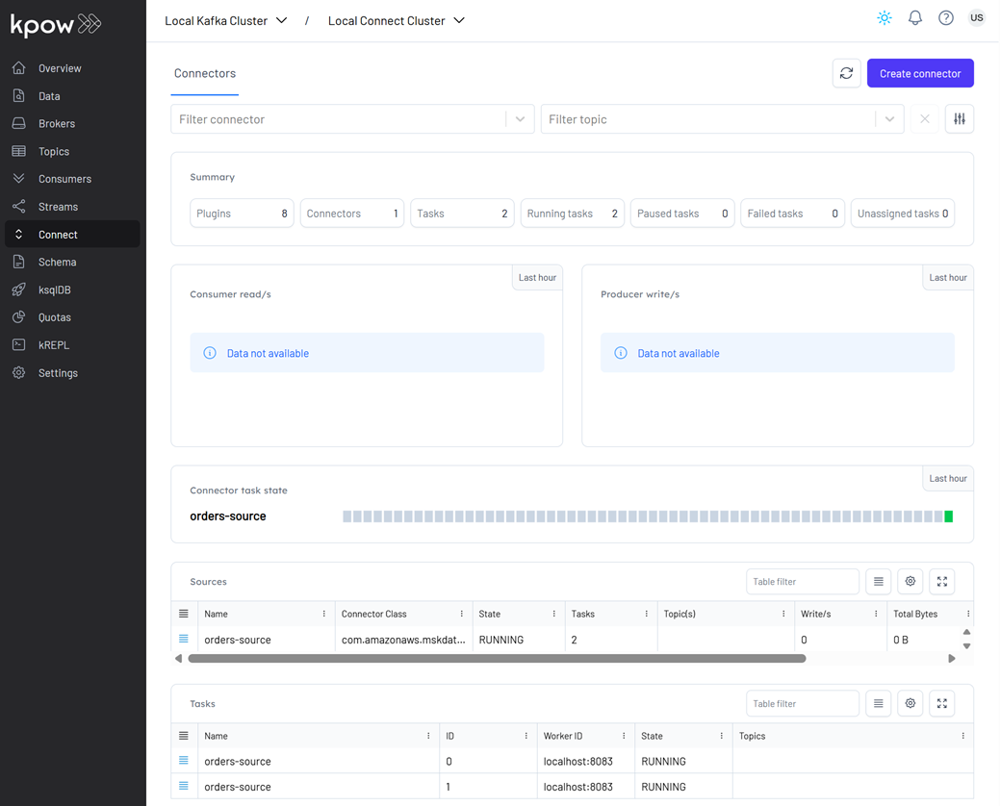
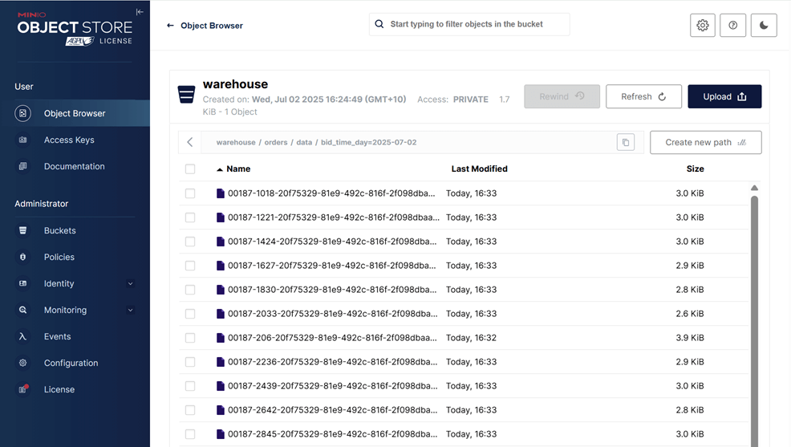
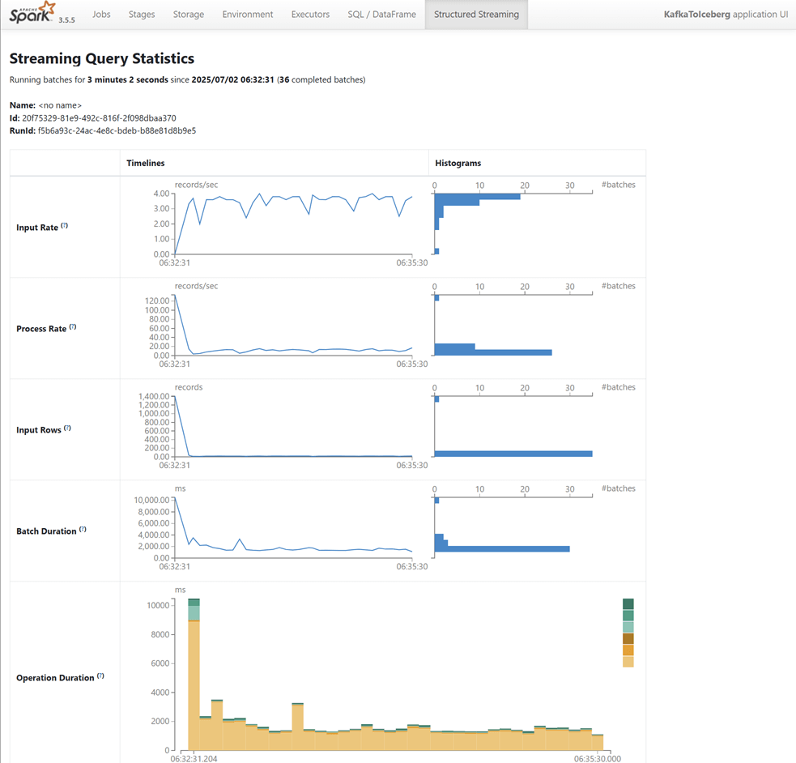

## Lab 10: Spark Structured Streaming - Delivering Kafka Order Records into Iceberg Table

Build a PySpark Structured Streaming job that ingests Kafka order data, deserializes Avro messages using [ABRiS](https://github.com/AbsaOSS/ABRiS), and writes the results to Iceberg. The job is packaged as a fat JAR and outputs partitioned Parquet files to MinIO.

## How to start

### Clone project repository

```bash
git clone https://github.com/factorhouse/examples.git
cd examples
```

### Start Kafka and Flink environments

We'll use [Factor House Local](https://github.com/factorhouse/factorhouse-local) to quickly spin up a Kafka environment that includes **Kpow** as well as an analytics environment for Iceberg. We can use either the Community or Enterprise editions of Kpow/Flex. **To begin, ensure valid licenses are available.** For details on how to request and configure a license, refer to [this section](https://github.com/factorhouse/factorhouse-local?tab=readme-ov-file#update-kpow-and-flex-licenses) of the project _README_.

```bash
## Clone the Factor House Local Repository
git clone https://github.com/factorhouse/factorhouse-local.git

## Download Kafka/Flink Connectors and Spark Iceberg Dependencies
./factorhouse-local/resources/setup-env.sh

## Uncomment the sections to enable the edition and license.
# Edition (choose one):
# unset KPOW_SUFFIX         # Enterprise
# unset FLEX_SUFFIX         # Enterprise
# export KPOW_SUFFIX="-ce"  # Community
# export FLEX_SUFFIX="-ce"  # Community
# Licenses:
# export KPOW_LICENSE=<path-to-license-file>
# export FLEX_LICENSE=<path-to-license-file>

docker compose -p kpow -f ./factorhouse-local/compose-kpow.yml up -d \
  && docker compose -p flex -f ./factorhouse-local/compose-flex.yml up -d
```

### Persistent Catalogs

Two catalogs are pre-configured in both the Flink and Spark clusters:

- `demo_hv`: a Hive catalog backed by the Hive Metastore
- `demo_ib`: an Iceberg catalog also backed by the Hive Metastore

#### Flink

In Flink, the catalogs can be initialized automatically using an SQL script (`init-catalogs.sql`) on startup:

```sql
CREATE CATALOG demo_hv WITH (
  'type' = 'hive',
  'hive-conf-dir' = '/opt/flink/conf',
  'default-database' = 'default'
);

CREATE CATALOG demo_ib WITH (
  'type' = 'iceberg',
  'catalog-type' = 'hive',
  'uri' = 'thrift://hive-metastore:9083'
);
```

#### Spark

In Spark, catalog settings are defined in `spark-defaults.conf`:

```conf
# Enable Iceberg extensions
spark.sql.extensions                               org.apache.iceberg.spark.extensions.IcebergSparkSessionExtensions

# Hive catalog (demo_hv)
spark.sql.catalog.demo_hv                          org.apache.iceberg.spark.SparkCatalog
spark.sql.catalog.demo_hv.type                     hive
spark.sql.catalog.demo_hv.hive.metastore.uris      thrift://hive-metastore:9083
spark.sql.catalog.demo_hv.warehouse                s3a://warehouse/

# Iceberg catalog (demo_ib)
spark.sql.catalog.demo_ib                          org.apache.iceberg.spark.SparkCatalog
spark.sql.catalog.demo_ib.type                     hive
spark.sql.catalog.demo_ib.uri                      thrift://hive-metastore:9083
spark.sql.catalog.demo_ib.io-impl                  org.apache.iceberg.aws.s3.S3FileIO
spark.sql.catalog.demo_ib.s3.endpoint              http://minio:9000
spark.sql.catalog.demo_ib.s3.path-style-access     true
spark.sql.catalog.demo_ib.warehouse                s3a://warehouse/

# Optional: set default catalog
spark.sql.defaultCatalog                           spark_catalog
```

### Deploy source connector

We will create a source connector that generates fake order records to a Kafka topic (`orders`). See the [Kafka Connect via Kpow UI and API](../lab-02/) lab for details about how to create the connector.

Once deployed, we can check the connector and its tasks in Kpow.



### Deploy PySpark application

This [PySpark streaming application](./kafka_to_iceberg.py) reads Avro-encoded Kafka messages, deserializes them using ABRiS, and writes the structured data into an Iceberg table. It does the following:

- Configures ABRiS to fetch schemas from Confluent Schema Registry using topic-based strategy.
- Defines helper functions to build ABRiS config and apply Avro deserialization to PySpark columns.
- Reads Kafka messages as a stream and extracts fields like `order_id`, `item`, `price`, `supplier`, and `bid_time`.
- Creates the Iceberg table if it doesn’t exist, partitioned by `DAY(bid_time)` and optimized with write properties.
- Writes streaming data to Iceberg in append mode with checkpointing and 5-second processing triggers.
- Logs key events and supports graceful shutdown on termination or failure.

While the `spark-iceberg` container includes the necessary Iceberg dependencies, additional dependencies are required to read from the Kafka topic (`orders`) and to deserialize Avro messages using schemas registered in the Schema Registry. Although the `spark-submit` command supports adding dependencies via the `--packages` flag, it may not include all required libraries reliably.

To address this, we create an Uber (fat) JAR that bundles all dependencies. This JAR will later be referenced using the `--jars` flag during submission. You can build the JAR using the `./gradlew build` command as shown below. If Gradle is not installed, refer to [this page](https://gradle.org/install/) for installation instructions.

```bash
cd fh-local-labs/lab-10
./gradlew build
```

Upon successful build, the JAR file `fh-local-spark-orders-iceberg-1.0.jar` will be located in the `build/libs` directory. This JAR, along with the main PySpark application (`kafka_to_iceberg.py`), will be used to run the job.

```
kafka_to_iceberg.py # <- PySpark app
build/libs/
└── fh-local-spark-orders-iceberg-1.0.jar # <- uber Jar
```

Next, copy the PySpark script and the Uber JAR into the running `spark-iceberg` container using the `docker cp` command:

```bash
# cd fh-local-labs/lab-10
docker cp kafka_to_iceberg.py \
  spark-iceberg:/tmp/kafka_to_iceberg.py
docker cp build/libs/fh-local-spark-orders-iceberg-1.0.jar \
  spark-iceberg:/tmp/fh-local-spark-orders-iceberg-1.0.jar
```

Once copied, submit the application using the following `spark-submit` command:

```bash
docker exec -it spark-iceberg \
  /opt/spark/bin/spark-submit \
    --master local[*] \
    --jars /tmp/fh-local-spark-orders-iceberg-1.0.jar \
    /tmp/kafka_to_iceberg.py
```

We can verify the output by inspecting the Parquet files written by the sink. These files are accessible via MinIO at http://localhost:9001 using `admin` as the username and `password` as the password. As shown in the screenshot below, the records have been successfully written to the appropriate partitions in the `warehouse` bucket.



Additionally, you can monitor the job in real time using the Spark Web UI at http://localhost:4040 while the application is running, or review completed jobs later via the Spark History Server at http://localhost:18080.



## Shutdown environment

Finally, stop and remove the Docker containers.

> If you're not already in the project root directory, navigate there first.
> Then, stop and remove the Docker containers by running:

```bash
# Stops the containers and unsets environment variables
docker compose -p flex -f ./factorhouse-local/compose-flex.yml down \
  && docker compose -p kpow -f ./factorhouse-local/compose-kpow.yml down

unset KPOW_SUFFIX FLEX_SUFFIX KPOW_LICENSE FLEX_LICENSE
```
