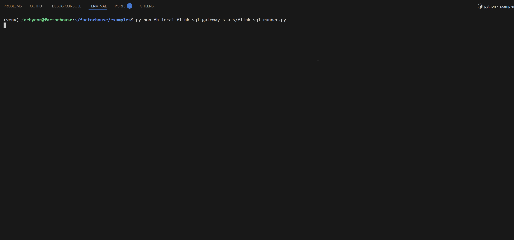
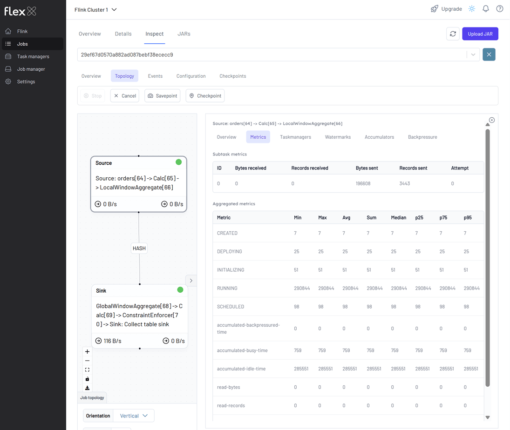

## Lab 11: Flink SQL Gateway - Serving Real-Time Supplier Stats via REST API

Run a Flink SQL streaming pipeline via the Flink SQL Gateway and access real-time query results through its REST API. This lab illustrates how to fetch and display live supplier statistics from a Kafka source using a Python client.

## How to start

### Clone project repository

```bash
git clone https://github.com/factorhouse/examples.git
cd examples
```

### Start Kafka and Flink environments

We'll use [Factor House Local](https://github.com/factorhouse/factorhouse-local) to quickly spin up Kafka and Flink environments that includes **Kpow** and **Flex**. We can use either the Community or Enterprise editions of Kpow/Flex. **To begin, ensure valid licenses are available.** For details on how to request and configure a license, refer to [this section](https://github.com/factorhouse/factorhouse-local?tab=readme-ov-file#update-kpow-and-flex-licenses) of the project _README_.

Flink SQL Gateway does not support dynamic JAR loading, so required JARs (Kafka + Avro) must be preloaded by updating `CUSTOM_JARS_DIRS` in `compose-flex-community.yml`.

**Before:**

```yaml
x-common-environment: &flink_common_env_vars
  AWS_REGION: us-east-1
  HADOOP_CONF_DIR: /opt/hadoop/etc/hadoop
  CUSTOM_JARS_DIRS: "/tmp/hadoop;/tmp/hive;/tmp/iceberg;/tmp/parquet"
```

**After:**

```yaml
x-common-environment: &flink_common_env_vars
  AWS_REGION: us-east-1
  HADOOP_CONF_DIR: /opt/hadoop/etc/hadoop
  CUSTOM_JARS_DIRS: "/tmp/hadoop;/tmp/hive;/tmp/iceberg;/tmp/parquet;/tmp/connector"
```

This ensures the following JARs are loaded additionally into the Flink JobManager, TaskManagers, and SQL Gateway:

- `/tmp/connector/flink-sql-connector-kafka-3.3.0-1.20.jar`
- `/tmp/connector/flink-sql-avro-confluent-registry-1.20.1.jar`

**Start services:**

```bash
## Clone the Factor House Local Repository
git clone https://github.com/factorhouse/factorhouse-local.git

## Download Kafka/Flink Connectors and Spark Iceberg Dependencies
./factorhouse-local/resources/setup-env.sh

## Uncomment the sections to enable the edition and license.
# Edition (choose one):
# unset KPOW_SUFFIX         # Enterprise
# unset FLEX_SUFFIX         # Enterprise
# export KPOW_SUFFIX="-ce"  # Community
# export FLEX_SUFFIX="-ce"  # Community
# Licenses:
# export KPOW_LICENSE=<path-to-license-file>
# export FLEX_LICENSE=<path-to-license-file>

docker compose -p kpow -f ./factorhouse-local/compose-kpow.yml up -d \
  && docker compose -p flex -f ./factorhouse-local/compose-flex.yml up -d
```

### Deploy source connector

We will create a source connector that generates fake order records to a Kafka topic (`orders`). See the [Kafka Connect via Kpow UI and API](../lab-02/) lab for details about how to create the connector.

Once deployed, we can check the connector and its tasks in Kpow.


### Flink SQL Runner

We use a custom Python client (`flink_sql_runner.py`) to interact with the **Flink SQL Gateway REST API**.

The script performs:

1. **Session creation**
2. **Kafka table registration** (with Avro & Schema Registry)
3. **Tumbling window aggregation query**
4. **Real-time result fetching**
5. **Cleanup** on exit or `Ctrl+C`

The source table is defined using the **Kafka SQL connector**, enabling Flink to consume **Avro-encoded messages** from the `orders` Kafka topic. To support time-based processing and windowed aggregations, an event-time watermark is introduced on `bid_time` using `WATERMARK FOR bid_time AS bid_time - INTERVAL '5' SECOND`. This watermark allows Flink to track event time progress and handle out-of-order events, which is required for time-based operations such as windowed aggregations or joins.

📌 **Watermarking** is applied on the `bid_time` column to enable proper event-time windowing.

#### Source Table DDL

```sql
CREATE TABLE orders (
  order_id     STRING,
  item         STRING,
  price        STRING,
  supplier     STRING,
  bid_time     TIMESTAMP(3),
  WATERMARK FOR bid_time AS bid_time - INTERVAL '5' SECOND
) WITH (
  'connector' = 'kafka',
  'topic' = 'orders',
  'properties.bootstrap.servers' = 'kafka-1:19092',
  'format' = 'avro-confluent',
  'avro-confluent.schema-registry.url' = 'http://schema:8081',
  'avro-confluent.basic-auth.credentials-source' = 'USER_INFO',
  'avro-confluent.basic-auth.user-info' = 'admin:admin',
  'avro-confluent.schema-registry.subject' = 'orders-value',
  'scan.startup.mode' = 'earliest-offset'
);
```

#### Aggregation Query

This aggregates data per `supplier` in **fixed 5-second windows**, computing:

- Window start/end (UTC)
- Total price
- Bid count

```sql
INSERT INTO supplier_stats
SELECT
  DATE_FORMAT(window_start, 'yyyy-MM-dd''T''HH:mm:ss''Z''') AS window_start,
  DATE_FORMAT(window_end,   'yyyy-MM-dd''T''HH:mm:ss''Z''') AS window_end,
  supplier,
  SUM(CAST(price AS DECIMAL(10, 2))) AS total_price,
  count(*) AS `count`
FROM TABLE(
  TUMBLE(TABLE orders, DESCRIPTOR(bid_time), INTERVAL '5' SECOND))
GROUP BY window_start, window_end, supplier;
```

### Execute Flink SQL Runner

From the project root:

```bash
# Create and activate a virtual environment
python -m venv venv
source venv/bin/activate

# Install required Python packages
pip install -r fh-local-labs/lab-11/requirements.txt

# Run the Flink SQL runner application
python fh-local-labs/lab-11/flink_sql_runner.py
```

We'll see streaming results in the terminal:



We can monitor the Flink job via the Flink UI (http://localhost:8082) or Flex (http://localhost:3001). The screenshot below shows the job's logical plan as visualized in Flex.



### Shutdown environment

Finally, stop and remove the Docker containers.

> If you're not already in the project root directory, navigate there first.
> Then, stop and remove the Docker containers by running:

```bash
# Stops the containers and unsets environment variables
docker compose -p flex -f ./factorhouse-local/compose-flex.yml down \
  && docker compose -p kpow -f ./factorhouse-local/compose-kpow.yml down

unset KPOW_SUFFIX FLEX_SUFFIX KPOW_LICENSE FLEX_LICENSE
```
