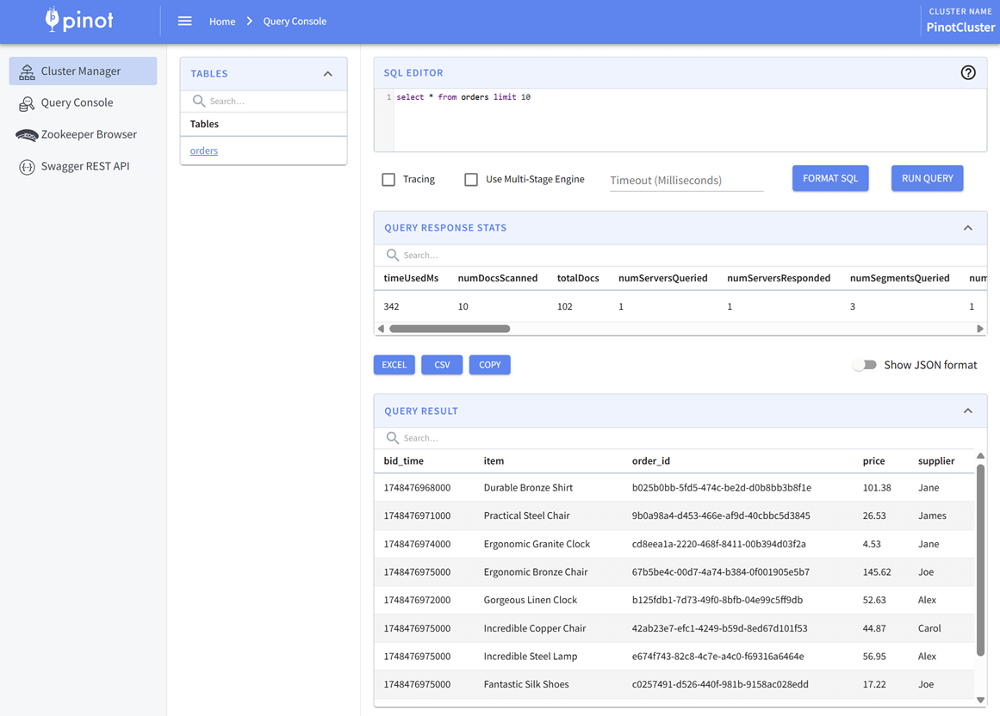
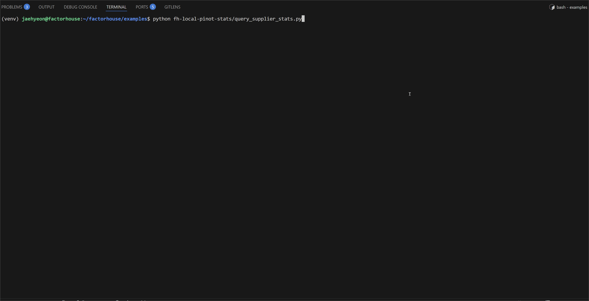

## Lab 12: Apache Pinot - Real-Time Analytics of Supplier Stats from Kafka

Stream Kafka orders into Apache Pinot and run real-time analytics with its multi-stage query engine. This lab includes a simulated tumbling window aggregation and demonstrates querying supplier stats through a Python client.

## How to start

### Clone project repository

```bash
git clone https://github.com/factorhouse/examples.git
cd examples
```

### Start Kafka and Pinot environments

We'll use [Factor House Local](https://github.com/factorhouse/factorhouse-local) to quickly spin up Kafka and Pinot environments that includes **Kpow**. We can use either the Community or Enterprise editions of Kpow/Flex. **To begin, ensure valid licenses are available.** For details on how to request and configure a license, refer to [this section](https://github.com/factorhouse/factorhouse-local?tab=readme-ov-file#update-kpow-and-flex-licenses) of the project _README_.

```bash
## Clone the Factor House Local Repository
git clone https://github.com/factorhouse/factorhouse-local.git

## Download Kafka/Flink Connectors and Spark Iceberg Dependencies
./factorhouse-local/resources/setup-env.sh

## Uncomment the sections to enable the edition and license.
# Edition (choose one):
# unset KPOW_SUFFIX         # Enterprise
# export KPOW_SUFFIX="-ce"  # Community
# License:
# export KPOW_LICENSE=<path-to-license-file>

docker compose -p kpow -f ./factorhouse-local/compose-kpow.yml up -d \
  && docker compose -p pinot -f ./factorhouse-local/compose-pinot.yml up -d
```

### Deploy source connector

We will create a source connector that generates fake order records to a Kafka topic (`orders`). See the [Kafka Connect via Kpow UI and API](../lab-02/) lab for details about how to create the connector.

Once deployed, we can check the connector and its tasks in Kpow.


### Deploy Workload: Register Pinot Table and Query

From the project root:

```bash
# Create and activate a virtual environment
python -m venv venv
source venv/bin/activate

# Install required Python packages
pip install -r fh-local-labs/lab-12/requirements.txt
```

We will register a Pinot schema and a real-time table - both named `orders` - to ingest data from the Kafka `orders` topic.

```bash
python fh-local-labs/lab-12/register_pinot_configs.py --action upload
```

You should see:

```bash
# Schema upload status: 200
# Schema response: {"unrecognizedProperties":{},"status":"orders successfully added"}
# Table upload status: 200
# Table response: {"unrecognizedProperties":{},"status":"Table orders_REALTIME successfully added"}
```

We can now query the `orders` table from the **Pinot Query Console** at `http://localhost:19000`.



To query supplier statistics, we'll use Pinot's [multi-stage query engine (v2)](https://docs.pinot.apache.org/reference/multi-stage-engine) to aggregate records over a fixed 5-second time window. Since Pinot doesn't support native tumble windows, we simulate them using `FLOOR(bid_time / 5000)` logic:

```sql
SELECT
    window_start,
    window_end,
    supplier,
    total_price,
    count
FROM (
    SELECT
        *
        , ROW_NUMBER() OVER (PARTITION BY supplier ORDER BY window_start DESC) AS row_num
    FROM (
        SELECT
            FLOOR(bid_time / 5000) * 5000 AS window_start,
            FLOOR(bid_time / 5000) * 5000 + 5000 AS window_end,
            supplier,
            ROUND(SUM(CAST(price AS DOUBLE)), 2) AS total_price,
            COUNT(*) AS count
        FROM orders
        WHERE bid_time >= (NOW() - 50000)
        GROUP BY FLOOR(bid_time / 5000), supplier
        ORDER BY window_start DESC, supplier
    )
)
WHERE row_num = 1
```

We can run the query via Python:

```bash
python fh-local-labs/lab-12/query_supplier_stats.py
```

We'll see output like:



### Shutdown environment

Finally, stop and remove the Docker containers.

> If you're not already in the project root directory, navigate there first.
> Then, stop and remove the Docker containers by running:

```bash
# Stops the containers and unsets environment variables
docker compose -p pinot -f ./factorhouse-local/compose-pinot.yml down \
  && docker compose -p kpow -f ./factorhouse-local/compose-kpow.yml down

unset KPOW_SUFFIX KPOW_LICENSE
```
