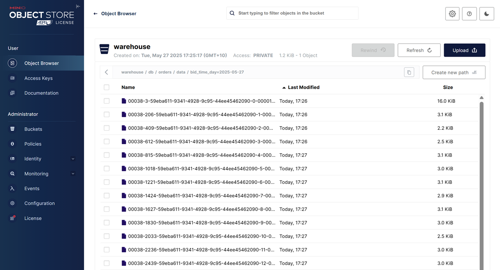
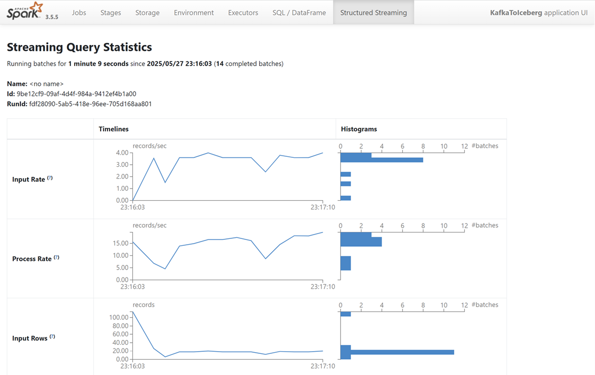

## Flink SQL for Orders Sink in Parquet

This lab shows how to ingest Avro-encoded order records from a Kafka topic into a Flink SQL source table, and write them to an Iceberg table stored in object storage (MinIO) using the Iceberg connector. Since Flink SQL does not support defining Iceberg's hidden partitioning, the sink table is created using Spark SQL instead.

## How to start

### Clone project repository

```bash
git clone https://github.com/factorhouse/examples.git
cd examples
```

### Start Kafka, Flink and analytics environments

We'll use [Factor House Local](https://github.com/factorhouse/factorhouse-local) to quickly spin up a Kafka environment that includes **Kpow** as well as an analytics environment for Iceberg. We can use either the Community or Enterprise editions of Kpow/Flex. **To begin, ensure valid licenses are available.** For details on how to request and configure a license, refer to [this section](https://github.com/factorhouse/factorhouse-local?tab=readme-ov-file#update-kpow-and-flex-licenses) of the project _README_.

```bash
git clone https://github.com/factorhouse/factorhouse-local.git

docker compose -p kpow -f ./factorhouse-local/compose-kpow-community.yml up -d \
  && docker compose -p analytics -f ./factorhouse-local/compose-analytics.yml up -d
```

### Deploy source connector

We will create a source connector that generates fake order records to a Kafka topic (`orders`). See the [Kafka Connect via Kpow UI and API](../fh-local-kafka-connect-orders/) lab for details about how to create the connector.

Once deployed, we can check the connector and its tasks in Kpow.


### Deploy PySpark application

While the `spark-iceberg` container includes the necessary Iceberg dependencies, additional dependencies are required to read from the Kafka topic (`orders`) and to deserialize Avro messages using schemas registered in the Schema Registry. Although the `spark-submit` command supports adding dependencies via the `--packages` flag, it may not include all required libraries reliably.

To address this, we create an Uber (fat) JAR that bundles all dependencies. This JAR will later be referenced using the `--jars` flag during submission. You can build the JAR using the `./gradlew build` command as shown below. If Gradle is not installed, refer to [this page](https://gradle.org/install/) for installation instructions.

```bash
cd fh-local-spark-orders-iceberg
./gradlew build
```

Upon successful build, the JAR file `fh-local-spark-orders-iceberg-1.0.jar` will be located in the `build/libs` directory. This JAR, along with the main PySpark application (`kafka_to_iceberg.py`), will be used to run the job.

```
kafka_to_iceberg.py # <- PySpark app
build/libs/
├── fh-local-spark-orders-iceberg-1.0-SNAPSHOT.jar
└── fh-local-spark-orders-iceberg-1.0.jar # <- uber Jar
```

Next, copy the PySpark script and the Uber JAR into the running `spark-iceberg` container using the `docker cp` command:

```bash
cd ..
docker cp fh-local-spark-orders-iceberg/kafka_to_iceberg.py \
  spark-iceberg:/tmp/kafka_to_iceberg.py
docker cp fh-local-spark-orders-iceberg/build/libs/fh-local-spark-orders-iceberg-1.0.jar \
  spark-iceberg:/tmp/fh-local-spark-orders-iceberg-1.0.jar
```

Once copied, submit the application using the following `spark-submit` command:

```bash
docker exec -it spark-iceberg \
  /opt/spark/bin/spark-submit \
    --master local[*] \
    --jars /tmp/fh-local-spark-orders-iceberg-1.0.jar \
    /tmp/kafka_to_iceberg.py
```

We can verify the output by inspecting the Parquet files written by the sink. These files are accessible via MinIO at `http://localhost:9001` using `admin` as the username and `password` as the password. As shown in the screenshot below, the records have been successfully written to the appropriate partitions in the `warehouse` bucket.



Additionally, you can monitor the job in real time using the Spark Web UI at `http://localhost:4040` while the application is running, or review completed jobs later via the Spark History Server at `http://localhost:18080`.



### Shutdown environment

Finally, stop and remove the Docker containers.

```bash
docker compose -p analytics -f ./factorhouse-local/compose-analytics.yml down \
  && docker compose -p kpow -f ./factorhouse-local/compose-kpow-community.yml down
```
