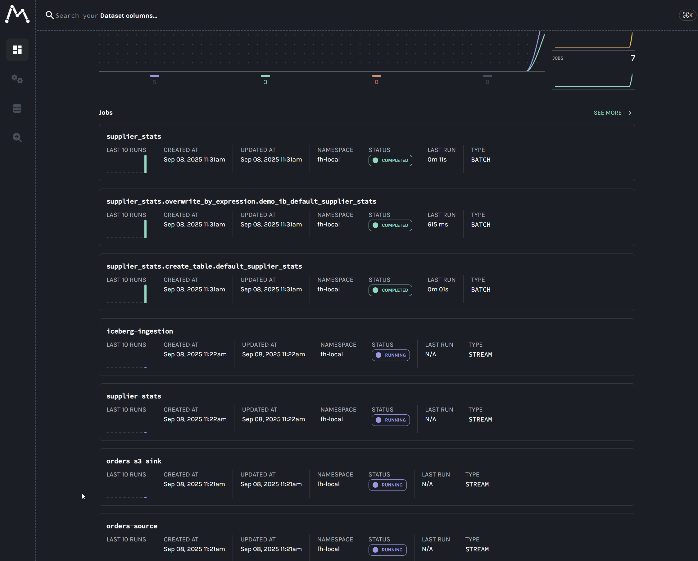

# End-to-End Data Lineage from Kafka to Flink and Spark

This guide provides a complete, end-to-end tutorial for capturing data lineage across a modern data stack: **Kafka, Flink, Spark, and Apache Iceberg**. By the end of this lab, we will have a fully functional environment that tracks data from a single Kafka topic as it fans out across multiple, parallel pipelines: a **Kafka S3 sink connector** for raw data archival; a real-time **Flink DataStream job** for live analytics; and a **Flink Table API job** that ingests data into an Apache Iceberg table. Finally, a **batch Spark job** consumes from the Iceberg table to generate downstream summaries. The entire multi-path lineage graph, including column-level details, will be visualized in [Marquez](https://marquezproject.github.io/marquez/).

The core of this solution is the careful configuration of OpenLineage integrations for each component. We will begin by establishing lineage from Kafka Connect using the `OpenLineageLifecycleSmt`, as discussed in the [previous lab](./lab1_kafka-connect.md). The guide then extends the lineage graph by exploring two distinct Flink integration patterns: a simple listener-based approach and a more robust manual orchestration method. Finally, we demonstrate how to configure Spark to seamlessly consume the Flink job's output, completing a comprehensive and practical blueprint for achieving reliable, end-to-end data lineage in a production-style environment.

## Set up the environment

### Clone the project

```bash
git clone https://github.com/factorhouse/examples.git
cd examples
```

### Start all environments

This project uses [Factor House Local](https://github.com/factorhouse/factorhouse-local) to spin up the Kafka and Flink environments.

Before starting, make sure you have valid licenses for Kpow and Flex. See the [license setup guide](https://github.com/factorhouse/factorhouse-local?tab=readme-ov-file#update-kpow-and-flex-licenses) for instructions.

**⚠️ Note**

- To [integrate OpenLineage with **Flink 1.x**](https://openlineage.io/docs/integrations/flink/flink1), each Flink job must run in its own **application cluster**. Since this lab deploys **two Flink jobs**, we need to connect **two separate Flink clusters to Flex**. Note that the **community edition** of Flex does not support multiple Flink clusters simultaneously, so the **enterprise edition** is required. You may request a trial license, or alternatively rely on the **Flink Web UI** instead of Flex.
- Factor House Local normally deploys a single **Flink session cluster**, but this cannot be used to run the jobs in this lab. As a result, the analytics environment is split across multiple stacks:
  - A **stripped-down analytics environment** (excluding Flink and Flex).
  - Separate Docker Compose setups for the Flink jobs and for Flex.
- To keep things organized, all new Docker Compose environments for this lab are stored under:
  `./projects/data-lineage-labs`. These include:
  - `compose-stripped.yml`
  - `compose-flink-1.yml`
  - `compose-flink-2.yml`
  - `compose-flex.yml`

We can set up the initial infrastructure as follows.

```bash
# Clone Factor House Local
git clone https://github.com/factorhouse/factorhouse-local.git

# Download necessary connectors and dependencies
./factorhouse-local/resources/setup-env.sh

# Configure edition and licenses
# Community:
# export KPOW_SUFFIX="-ce"
# export FLEX_SUFFIX="-ce"
# Or for Enterprise:
# unset KPOW_SUFFIX
# unset FLEX_SUFFIX
# Licenses:
# export KPOW_LICENSE=<path>
# export FLEX_LICENSE=<path>

# Start Kafka and Flink environments
docker compose -p kpow -f ./factorhouse-local/compose-kpow.yml up -d \
  && docker compose -p obsv -f ./factorhouse-local/compose-obsv.yml up -d \
  && docker compose -p stripped -f ./projects/data-lineage-labs/compose-stripped.yml up -d
```

## Kafka Connect

As discussed in [A Practical Guide to Data Lineage on Kafka Connect with OpenLineage](./01_kafka-connect.md), lineage tracking is enabled by integrating with OpenLineage using the **`OpenLineageLifecycleSmt`** Single Message Transform (SMT). The SMT is included in _Factor House Local_.

We will deploy the following two Kafka connectors:

- [**Source Connector**](./connectors/orders-source.json): Ingests mock order data into the `orders` topic using the _Amazon MSK Data Generator_.
- [**S3 Sink Connector**](./connectors/orders-s3-sink.json): Reads records from the `orders` topic and writes them to an object storage bucket (MinIO).

Kpow provides a user-friendly UI for deploying Kafka connectors, accessible at [http:/localhost:3000](http:/localhost:3000).


## Flink jobs

This project includes two Flink applications, each demonstrating a different method for integrating with OpenLineage to capture data lineage.

1.  **Real-time supplier stats:** A DataStream API job that shows the out-of-the-box (but limited) `OpenLineageFlinkJobListener` integration.
2.  **Kafka to Iceberg ingestion:** A Table API job that demonstrates a robust, manual orchestration pattern using the core OpenLineage Java client for complete lifecycle tracking.

To build and run the application locally, ensure that **JDK 11** is installed.

### Real-time supplier stats (DataStream API)

This application uses Flink's DataStream API to perform real-time aggregations on a Kafka stream. Specifically, it consumes a stream of `orders` events, keys the data by supplier, and calculates the total price and count of orders within tumbling time windows. It leverages event-time processing based on timestamps within the data to ensure accurate handling of out-of-order events. The resulting aggregated statistics are written to a `supplier-stats` Kafka topic, demonstrating a common real-time analytics pattern used for live monitoring and dashboarding.

#### OpenLineage integration

- **Integration method:**
  - **Programmatic listener registration:** This job uses the **`OpenLineageFlinkJobListener`** (`v1.15.0`) provided by the `openlineage-flink` library. The listener is created using its `.builder()` and registered directly with the `StreamExecutionEnvironment` in the application code.
  - **Automatic discovery:** The listener's internal "visitors" are responsible for automatically inspecting the Flink job graph to discover the input (`KafkaSource`) and output (`FlinkKafkaProducer`) datasets.
- **Key workarounds and limitations:**
  - **Older library version required:** It must use `openlineage-flink:1.15.0`. Newer versions have a [faulty version-check](https://github.com/OpenLineage/OpenLineage/issues/4007) that crashes the application when used with modern Kafka connectors.
  - **Deprecated Flink sink required:** It must use the deprecated `FlinkKafkaProducer` instead of the modern `KafkaSink`. This is a necessary workaround because the listener's visitor in this version cannot correctly inspect the modern sink to discover the output dataset.
  - **CRITICAL LIMITATION - final status is not reported:** When the job is canceled via the Flink UI or the cluster is destroyed, the final `ABORT` status is **not** sent to Marquez. The job remains stuck in the `RUNNING` state. This is due to a fundamental lifecycle mismatch in Flink's Application Mode, where the process hosting the listener is terminated too abruptly for it to send the final event. Details on how to manually change the job status to `ABORT` are provided below.

```bash
RUNID=<openlineage-run-id> && \
EVENT_TIME=$(date -u +"%Y-%m-%dT%H:%M:%S.%3NZ") && \
jq -n --arg runId "$RUNID" --arg eventTime "$EVENT_TIME" \
  '{
     "eventType": "ABORT",
     "eventTime": $eventTime,
     "run": {
       "runId": $runId
     },
     "job": {
       "namespace": "fh-local",
       "name": "supplier-stats",
       "facets": {
         "jobType": {
           "_producer": "https://github.com/OpenLineage/OpenLineage/tree/main/integration/manual",
           "_schemaURL": "https://openlineage.io/spec/1-0-2/facets/JobTypeJobFacet.json",
           "processingType": "STREAMING",
           "integration": "FLINK",
    		   "jobType": "DATASTREAM"
         }
       }
     },
     "producer": "https://github.com/OpenLineage/OpenLineage/tree/main/integration/manual",
     "schemaURL": "https://openlineage.io/spec/1-0-5/OpenLineage.json"
   }' | \
curl -X POST -H "Content-Type: application/json" -d @- http://localhost:5000/api/v1/lineage
```

#### Build the application

Navigate to the project directory and use the Gradle wrapper to build the self-contained fat JAR.

```bash
# Move to the application folder
cd projects/data-lineage-labs/flink-supplier-stats

# Build the app
./gradlew clean build
```

This command compiles the code and packages it with all necessary dependencies into `projects/data-lineage-labs/build/libs/flink-supplier-stats-1.0.jar`.

#### Deploy the Flink job

This job is deployed to an Application Cluster using the `compose-flink-1.yml` file, where the fat JAR is mounted as a volume.

<details>

<summary><b>Flink cluster configuration</b></summary>

#### compose-flink-1.yml

```yaml
x-common-flink-config: &flink_image_pull_policy_config
  image: fh-flink-1.20.1
  build:
    context: ../../factorhouse-local/resources/flink/
    dockerfile: Dockerfile
  pull_policy: never

x-common-environment: &flink_common_env_vars
  ...
  ## Flink job configurations
  BOOTSTRAP: kafka-1:19092
  INPUT_TOPIC: orders
  OUTPUT_TOPIC: supplier-stats
  REGISTRY_URL: http://schema:8081
  OPENLINEAGE_NAMESPACE: fh-local
  OPENLINEAGE_JOBNAME: supplier-stats

x-common-flink-volumes: &flink_common_volumes
  ...
  ## Dedicated flink configuration
  - ./resources/flink-conf-1.yaml:/opt/flink/conf/flink-conf.yaml:ro
  ...
  ## Add application JAR
  - ./resources/openlineage.yml:/opt/flink/.openlineage/openlineage.yml:ro
  - ./flink-supplier-stats/build/libs/flink-supplier-stats-1.0.jar:/opt/flink/usrlib/flink-supplier-stats-1.0.jar

services:
  jobmanager-1:
    <<: *flink_image_pull_policy_config
    container_name: jobmanager-1
    ## Run as a standalone job
    command: >
      standalone-job
      --job-classname io.factorhouse.demo.MainKt
      --jarfile /opt/flink/usrlib/flink-supplier-stats-1.0.jar
    ports:
      - "18081:8081"
    networks:
      - factorhouse
    environment:
      <<: *flink_common_env_vars
    volumes: *flink_common_volumes
    healthcheck:
      test: ["CMD", "curl", "-f", "http://localhost:8081/config"]
      interval: 5s
      timeout: 5s
      retries: 5

  taskmanager-11:
    <<: *flink_image_pull_policy_config
    container_name: taskmanager-11
    command: taskmanager
    networks:
      - factorhouse
    environment:
      <<: *flink_common_env_vars
    volumes: *flink_common_volumes
    depends_on:
      jobmanager-1:
        condition: service_healthy
...
```

#### OpenLineage transport config

```yaml
transport:
  type: http
  url: http://marquez-api:5000
```

</details>

<br/>

```bash
# Move to the main examples folder
cd ../../..

# Deploy the Flink job
docker compose -p flink-1 -f ./projects/data-lineage-labs/compose-flink-1.yml up -d
```

### Kafka to Iceberg ingestion (Table API)

This application uses Flink's Table API to ingest data from a Kafka topic into an Apache Iceberg table, providing a robust example of a streaming ETL pipeline. The job defines a source table that connects to the `orders` Kafka topic, reading Avro records via the Schema Registry. It then performs a lightweight transformation—casting the price field to a `DECIMAL` type—before inserting the data directly into an Iceberg table named `default.orders`. The application also demonstrates how to programmatically create and register an Iceberg catalog pointing to a Hive Metastore, making it a foundational pattern for building a modern data lakehouse.

#### OpenLineage integration

This job demonstrates a robust, manual integration pattern that provides complete and accurate lifecycle tracking for Flink Table API jobs.

- **Integration Method:**

  - **Manual orchestration:** The integration **bypasses the `OpenLineageFlinkJobListener` entirely** and uses the core `openlineage-java` client (`v1.37.0`) directly. The application's main method acts as an orchestrator, controlling _when_ to emit lineage events.
  - **Separation of concerns:** The detailed logic is delegated to dedicated helper class (`Integration.kt`), which handles constructing and emitting OpenLineage events, and is also responsible for dynamic metadata discovery.
  - **Explicit event emission:** The application uses a `try...catch...finally` block to guarantee the emission of the correct lifecycle events: a minimal `START` event before submission, a rich `RUNNING` event after submission, and a final `ABORT` or `FAIL` event based on the job's terminal state.

- **Advantages & trade-offs:**
  - **Increased code complexity:** This approach requires more explicit code in the application to manage the lineage lifecycle, making it less of a "plug-and-play" solution than a listener.
  - **Complete lifecycle tracking:** This manual method provides a fully robust solution. It correctly discovers all datasets and, most importantly, **guarantees that the final `ABORT` or `FAIL` status is sent** when the job is canceled or fails, providing a complete and accurate record of the job's lifecycle.

#### Build the application

Navigate to the project directory and use the Gradle wrapper to build the self-contained fat JAR.

```bash
# Move to the project folder
cd projects/data-lineage-labs/flink-iceberg-ingestion

# Build the app
./gradlew clean build
```

This creates the application JAR at `projects/data-lineage-labs/build/libs/flink-iceberg-ingestion-1.0.jar`.

#### Deploy the Flink job

Like the previous job, it is deployed to an Application Cluster using the `compose-flink-2.yml` file, with the fat JAR mounted as a volume.

<details>

<summary><b>Flink cluster configuration</b></summary>

#### compose-flink-2.yml

```yaml
x-common-flink-config: &flink_image_pull_policy_config
  image: fh-flink-1.20.1
  build:
    context: ../../factorhouse-local/resources/flink/
    dockerfile: Dockerfile
  pull_policy: never

x-common-environment: &flink_common_env_vars
  ...
  ## Flink job configurations
  BOOTSTRAP: kafka-1:19092
  INPUT_TOPIC: orders
  REGISTRY_URL: http://schema:8081
  ICEBERG_CATALOG_NAME: demo_ib
  HMS_ENDPOINT: thrift://hive-metastore:9083
  OPENLINEAGE_NAMESPACE: fh-local
  OPENLINEAGE_JOBNAME: iceberg-ingestion
  OPENLINEAGE_URL: http://marquez-api:5000
  # OpenLineage Spark integration sees the physical name rather than the logical name
  OPENLINEAGE_DATASET_NAMESPACE: s3://warehouse
  OPENLINEAGE_DATASET_NAME: orders

x-common-flink-volumes: &flink_common_volumes
  ...
  ## Dedicated flink configuration
  - ./resources/flink-conf-2.yaml:/opt/flink/conf/flink-conf.yaml:ro
  ...
  ## Add application JAR
  - ./flink-iceberg-ingestion/build/libs/flink-iceberg-ingestion-1.0.jar:/opt/flink/usrlib/flink-iceberg-ingestion-1.0.jar

services:
  jobmanager-2:
    <<: *flink_image_pull_policy_config
    container_name: jobmanager-2
    ## Run as a standalone job
    command: >
      standalone-job
      --job-classname io.factorhouse.demo.MainKt
      --jarfile /opt/flink/usrlib/flink-iceberg-ingestion-1.0.jar
    ports:
      - "18082:8081"
    networks:
      - factorhouse
    environment:
      <<: *flink_common_env_vars
    volumes: *flink_common_volumes
    healthcheck:
      test: ["CMD", "curl", "-f", "http://localhost:8081/config"]
      interval: 5s
      timeout: 5s
      retries: 5

  taskmanager-21:
    <<: *flink_image_pull_policy_config
    container_name: taskmanager-21
    command: taskmanager
    networks:
      - factorhouse
    environment:
      <<: *flink_common_env_vars
    volumes: *flink_common_volumes
    depends_on:
      jobmanager-2:
        condition: service_healthy
...
```

</details>

<br/>

```bash
# Move to the main examples folder
cd ../../..

# Deploy the Flink job
docker compose -p flink-2 -f ./projects/data-lineage-labs/compose-flink-2.yml up -d
```

### Monitor Flink jobs on Flex

Once the Flink jobs are deployed, we can monitor them in Flex at [http://localhost:3001](http://localhost:3001) by first starting Flex with:

```bash
docker compose -p flex -f ./projects/data-lineage-labs/compose-flex.yml up -d
```

The jobs can be found in their respective Flink environments: **Supplier Stats** and **Iceberg Ingestion**.

> ⚠️ If you don't have the required license, you can instead view each job individually at [http://localhost:18081](http://localhost:18081) and [http://localhost:18082](http://localhost:18082).


### Batch supplier stats (Spark)

This PySpark application is a batch processing job that reads the latest day's data from the partitioned `orders` Iceberg table. It performs a batch aggregation on this subset of data to calculate hourly statistics for each supplier, including the total order price and the total count of orders. The script first ensures the target `supplier_stats` Iceberg table exists and then performs a complete overwrite of its contents with the newly computed statistics. This represents a classic and optimized batch ETL pattern for generating daily summary tables.

First, copy the PySpark script and the JAR into the running `spark-iceberg` container using the `docker cp` command:

```bash
# Copy the PySpark script and dependency JAR
docker cp projects/data-lineage-labs/spark-supplier-stats/supplier_stats.py \
  spark-iceberg:/tmp/supplier_stats.py
```

Once copied, submit the application using the following `spark-submit` command:

```bash
docker exec -it spark-iceberg \
  /opt/spark/bin/spark-submit \
    --master local[*] \
    --conf "spark.driver.extraJavaOptions=--add-opens=java.base/java.security=ALL-UNNAMED" \
    --conf "spark.sql.iceberg.handle-timestamp-without-timezone=true" \
    --conf "spark.extraListeners=io.openlineage.spark.agent.OpenLineageSparkListener" \
    --conf "spark.openlineage.transport.type=http" \
    --conf "spark.openlineage.transport.url=http://marquez-api:5000" \
    --conf "spark.openlineage.namespace=fh-local" \
    /tmp/supplier_stats.py
```

#### OpenLineage integration

- **Integration method:**

  - **Java agent listener:** The integration uses the OpenLineage Java agent JAR, which is attached to the Spark session using the `--conf spark.extraListeners` property during submission.
  - **Automatic discovery:** The agent automatically inspects Spark's logical and physical query plans to discover input and output datasets from the SQL queries being executed.

- **Key characteristics and configuration:**
  - **Multiple jobs created:** The Spark agent generates a separate OpenLineage job for each distinct action in the script. Because the script contains a `CREATE TABLE` and an `INSERT OVERWRITE` statement, Marquez will display two distinct child jobs (e.g., `supplier_stats_app.create_table...` and `supplier_stats_app.overwrite_by_expression...`), nested under a parent application job. The `overwrite` job is the one that contains the meaningful data lineage from input to output.
  - **Physical namespace reporting:** The OpenLineage agent for Iceberg reports datasets using their **physical namespace** (`s3://warehouse`) by default. It also automatically adds the logical Hive Metastore name (`hive://...`) as a secondary `symlink`. For end-to-end lineage to work correctly with Flink (or Kafka), the upstream job **must be configured to report its output dataset using this same physical `s3://warehouse` namespace**. This exact match of dataset identifiers is the key to linking the two jobs in the graph.

We can monitor the Spark job using the Spark History Server at [http://localhost:18080/](http://localhost:18080/).


## Viewing lineage on Marquez

After deploying the Kafka connectors and running the Flink/Spark applications, the complete lineage graph is available in the Marquez UI at [http://localhost:3003](http://localhost:3003). The graph visualizes the entire data flow, connecting the following jobs through their shared datasets:

- **`orders-source`**: Created by the Kafka source connector.
- **`orders-s3-sink`**: Created by the Kafka S3 sink connector.
- **`supplier-stats`**: The real-time analytics job created using the Flink DataStream API.
- **`iceberg-ingestion`**: The ingestion job created using the Flink Table API.
- **`supplier_stats_*`**: The Spark application that performs the batch aggregation. It contains child jobs for each action, with the `...overwrite_by_expression...` job showing the key data transformation.



## Shut down

Shut down all containers and unset any environment variables:

```bash
# Stop all containers
docker compose -p flex -f ./projects/data-lineage-labs/compose-flex.yml down \
  && docker compose -p flink-2 -f ./projects/data-lineage-labs/compose-flink-2.yml down \
  && docker compose -p flink-1 -f ./projects/data-lineage-labs/compose-flink-1.yml down \
  && docker compose -p stripped -f ./projects/data-lineage-labs/compose-stripped.yml down \
  && docker compose -p obsv -f ./factorhouse-local/compose-obsv.yml down \
  && docker compose -p kpow -f ./factorhouse-local/compose-kpow.yml down

# Clear environment variables
unset KPOW_SUFFIX FLEX_SUFFIX KPOW_LICENSE FLEX_LICENSE
```
