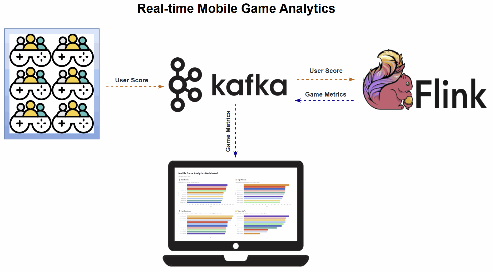

# Real-time mobile game analytics with with Kafka and Flink

This project demonstrates how to build a complete, real-time analytics pipeline for a mobile game using a modern data stack. The system simulates live gameplay data, processes it with Apache Flink SQL to calculate key performance metrics, and displays the results on an interactive dashboard.

The project is available in two architectural versions:

- **Version 1 (Kafka sinks):** Ideal for microservices architectures where the calculated metrics need to be consumed by multiple downstream applications. Flink writes results to dedicated Kafka topics.
- **Version 2 (Database sinks):** A simpler, more direct approach suitable for powering client-facing applications like dashboards. Flink writes results directly to PostgreSQL tables.

### The pipeline architecture

The pipeline is organized into three main stages:

1.  **Data generation:** A Python script simulates a continuous stream of user score events from live gameplay and publishes them to an Apache Kafka topic.
2.  **Real-time metrics processing:** Four Apache Flink SQL jobs consume the raw event stream from Kafka. Each job computes a different leaderboard metric—Top Teams, Top Players, Hot Streaks, and Team MVPs—and sinks the results.
3.  **Dashboard visualization:** A Streamlit web application visualizes the final metrics, offering instant insights into team and player performance.

<details>
<summary><b>Version 1 workflow (Kafka sinks)</b></summary>
<br/>

</details>

<br/>

<details open>
<summary><b>Version 2 workflow (Database sinks)</b></summary>
<br/>

</details>

### 💡 Architecture note: Version 2 is better optimized for dashboards

While Version 1 is ideal for event-driven architectures, reading directly from Kafka topics for a dashboard has key drawbacks:

- **Slow initial load:** The dashboard starts empty and must wait for Flink to produce new messages before it can display any data. It cannot query the current state.
- **Incomplete state:** It only shows metrics that have recently changed. A top player with a stable score will be missing from a newly loaded dashboard until their score is updated.
- **Complex client logic:** The dashboard code becomes stateful and complex, as it has to reconstruct the leaderboard's state in memory from a stream of events.

In short, Kafka provides a stream of changes, while a dashboard needs an immediate snapshot of the current state. The database in Version 2 provides this state instantly and completely with a simple query.

## Mobile game metrics

The pipeline computes four distinct leaderboards by continuously querying the live event stream with Flink SQL. Each metric is generated by a dedicated query with its own aggregation logic.

The foundation is a set of Flink tables defined in a Hive catalog. The source table, `user_scores`, reads directly from the Kafka event stream. Each Flink SQL query consumes this stream, performs its computation, and writes the output to a corresponding sink table. These sinks use the **Upsert Kafka Connector** for Version 1 and the **JDBC Connector** for Version 2, ensuring the leaderboards update continuously as new data arrives.

> 📄 **See the DDL scripts for complete table definitions:** [Version 1](./scripts_v1/00-qry-ddl.sql) and [Version 2](./scripts_v2/00-qry-ddl.sql).

### Top teams

This metric tracks the top 10 teams with the highest cumulative scores, giving a global snapshot of team performance.

A Flink SQL query groups the `user_scores` stream by `team_id`, calculates a running `SUM(score)`, and ranks the teams using `ROW_NUMBER()`. A state TTL of 60 minutes ensures that long-lived team data remains accurate.

> 📄 **See the top teams SQL:** [Version 1](./scripts_v1/01-top-teams.sql) and [Version 2](./scripts_v2/01-top-teams.sql).

### Top players

It highlights the top 10 individual players with the highest scores across the game.

The logic mirrors the Top Teams query: the stream is grouped by `user_id`, a cumulative `SUM(score)` is calculated, and players are ranked globally. A 60-minute TTL keeps player stats consistent over longer sessions.

> 📄 **See the top players SQL:** [Version 1](./scripts_v1/02-top-players.sql) and [Version 2](./scripts_v2/02-top-players.sql).

### Hot streaks

This metric surfaces the top 10 players currently on a "hot streak"-those whose short-term performance far exceeds their historical average.

The query uses sliding time windows to calculate two moving averages: a short-term average over 10 seconds and a long-term average over 60 seconds. The ratio between them (the "hotness ratio") captures a player's current scoring momentum. To ensure the leaderboard is dynamic and reflects who is hot _right now_, the query identifies the most recent hotness ratio for each user. A final `ROW_NUMBER()` function then ranks these **current** scores to produce a live leaderboard where a player's rank can rise and fall in near real-time.

> 📄 **See the hot streaks SQL:** [Version 1](./scripts_v1/03-hot-streaks.sql) and [Version 2](./scripts_v2/03-hot-streaks.sql).

### Team MVPs

This metric identifies the MVP for each team-the player contributing the largest share of their team's scor-and then ranks these MVPs to find the top 10 overall.

The query uses CTEs to first calculate total scores for each player and their respective team. These are joined to compute each player's contribution ratio. One `ROW_NUMBER()` function finds the top contributor per team, and a second ranks them globally.

> 📄 **See the team MVPs SQL:** [Version 1](./scripts_v1/04-team-mvps.sql) and [Version 2](./scripts_v2/04-team-mvps.sql).

## Set up the environment

### Clone the project

```bash
git clone https://github.com/factorhouse/examples.git
cd examples
```

### Start Kafka and Flink

This project uses [Factor House Local](https://github.com/factorhouse/factorhouse-local) to spin up the Kafka and Flink environments, including **Kpow** and **Flex** for monitoring.

Before starting, make sure you have valid licenses for Kpow and Flex. See the [license setup guide](https://github.com/factorhouse/factorhouse-local?tab=readme-ov-file#update-kpow-and-flex-licenses) for instructions.

```bash
# Clone Factor House Local
git clone https://github.com/factorhouse/factorhouse-local.git

# Download necessary connectors and dependencies
./factorhouse-local/resources/setup-env.sh

# Configure edition and licenses
# Community:
# export KPOW_SUFFIX="-ce"
# export FLEX_SUFFIX="-ce"
# Or for Enterprise:
# unset KPOW_SUFFIX
# unset FLEX_SUFFIX
# Licenses:
# export KPOW_LICENSE=<path>
# export FLEX_LICENSE=<path>

# Start Kafka and Flink environments
docker compose -p kpow -f ./factorhouse-local/compose-kpow.yml up -d \
  && docker compose -p flex -f ./factorhouse-local/compose-flex.yml up -d
```

## Launch the mobile game event injector

Start the service that generates simulated gameplay events and publishes them to the `user-score` Kafka topic:

```bash
docker compose -f projects/mobile-game-top-k-analytics/docker-compose.yml up -d
```

You can inspect the live stream in Kpow at [http://localhost:3000](http://localhost:3000).


## Deploy the Flink jobs

### 1. Create sink resources (topics or tables)

Set up a Python virtual environment and install dependencies:

```bash
python -m venv venv
source venv/bin/activate
# On Windows: .\venv\Scripts\activate
pip install -r projects/mobile-game-top-k-analytics/requirements.txt
```

Then run the python script (`manage_resources.py`), which creates Kafka topics for Version 1 and database table for Version 2:

```bash
# Set your desired version (1 or 2)
VERSION=2

# For V1, this creates Kafka topics. For V2, it creates PostgreSQL tables.
python projects/mobile-game-top-k-analytics/app_v${VERSION}/manage_resources.py --action create
```

You should see output confirming that the relevant resources are created.

### 2. Submit Flink SQL jobs

Copy the job scripts into the Flink JobManager container:

```bash
# Set your desired version (1 or 2)
VERSION=2

# Copy scripts to the container
docker exec jobmanager rm -rf /tmp/scripts_v${VERSION} \
  && docker cp ./projects/mobile-game-top-k-analytics/scripts_v${VERSION} jobmanager:/tmp/scripts_v${VERSION}

# Execute the run_all.sh script
docker exec -it jobmanager bash /tmp/scripts_v${VERSION}/run_all.sh
```

This registers the Flink jobs that process the `user-scores` stream and write leaderboard results to their respective sinks.

<details>

<summary><b>Monitor Flink jobs and output (V1 example)</b></summary>
<br/>

Monitor the metrics records in topics via Kpow ([localhost:3000](http://localhost:3000)) and the Flink jobs via Flex ([localhost:3001](http://localhost:3001)).


</details>

<br/>

<details open>

<summary><b>Monitor Flink jobs and output (V2 example)</b></summary>
<br/>

Monitor the metrics records in tables using a SQL client and the Flink jobs via Flex ([localhost:3001](http://localhost:3001)).


</details>

## Run the dashboard

The dashboard is a Streamlit app that visualizes the real-time leaderboard data. It's powered by two Python scripts:

- `generator.py` handles backend logic:
  - **Version 1**: It spins up an `AnalyticsOrchestrator`, which creates four concurrent `TopicConsumer` threads to read and update data from Kafka topics into Pandas DataFrames.
  - **Version 2**: It's greatly simplified. It no longer connects to Kafka and instead runs a continuous polling loop. Every few seconds, it directly queries the four result tables in the PostgreSQL database, which are being populated by the Flink SQL job. The data is loaded into Pandas DataFrames to refresh the Streamlit UI.
- `app.py` is the frontend: it sets up the UI and listens for changes from the backend, updating charts and tables when new data arrives.

To launch the dashboard:

```bash
# Set your desired version (1 or 2)
VERSION=2
streamlit run projects/mobile-game-top-k-analytics/app_v${VERSION}/app.py
```

Access the interactive dashboard at [http://localhost:8501](http://localhost:8501).

<details>

<summary><b>Mobile Game Analytics Dashboard (V1)</b></summary>
<br/>


</details>

<details open>

<summary><b>Mobile Game Analytics Dashboard (V2)</b></summary>
<br/>


</details>

## Shut Down

When you're done, shut down all containers and unset any environment variables:

```bash
# Stop the injector service
docker compose -f projects/mobile-game-top-k-analytics/docker-compose.yml down

# Stop Factor House Local containers
docker compose -p flex -f ./factorhouse-local/compose-flex.yml down \
  && docker compose -p kpow -f ./factorhouse-local/compose-kpow.yml down

# Clear environment variables
unset KPOW_SUFFIX FLEX_SUFFIX KPOW_LICENSE FLEX_LICENSE
```
