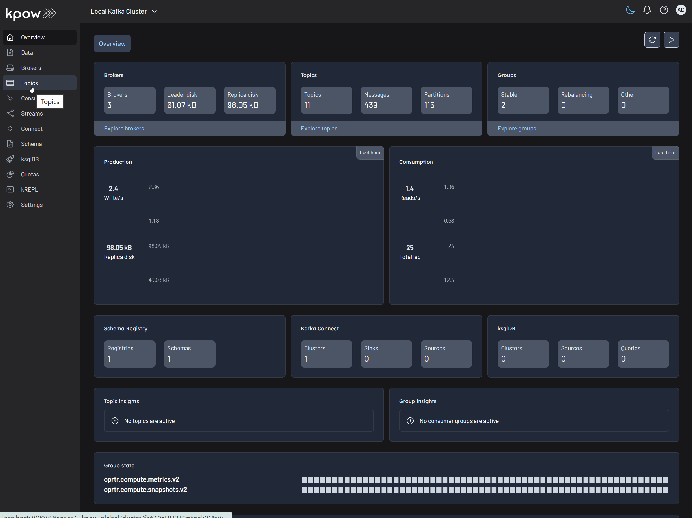

# Mobile Game Top-K Analytics

This project walks through how to build a complete real-time analytics pipeline for a mobile game using a modern data stack. It simulates live gameplay data, processes it in real time to calculate performance metrics, and displays the results on an interactive dashboard.

The pipeline is organized into three main stages:

1. **Data Generation**
   A Python script generates a continuous stream of user score events to simulate live mobile gameplay. These events are published to an Apache Kafka topic.

2. **Metrics Processing**
   Four Apache Flink SQL jobs consume the raw event stream from Kafka in real time. Each job computes a different leaderboard metric—Top Teams, Top Players, Hot Streakers, and Team MVPs—and writes the results to dedicated Kafka output topics.

3. **Dashboard Visualization**
   A Streamlit web app reads from the Flink output topics and presents the metrics through a real-time dashboard, offering instant insights into team and player performance.


## Mobile Game Metrics

The pipeline computes four different leaderboard metrics by continuously querying the live event stream using Flink SQL. Each metric is generated by a dedicated query with its own aggregation logic.

To start, a DDL script sets up the required source and sink tables in the `game_analytics` database using a Hive catalog named `demo_hv`. The source table, `user_scores`, reads directly from a Kafka topic. Each Flink SQL query consumes this stream, performs its computation, and writes the output to a corresponding sink table—`top_teams`, `top_players`, `hot_streakers`, or `team_mvps`. These sink tables use the `upsert-kafka` connector, ensuring the leaderboards update continuously as new data arrives.

> 📄 See the [DDL script](./scripts/00-qry-ddl.sql) for complete table definitions.

### Top Teams

This metric tracks the top 10 teams with the highest cumulative scores. It gives a global snapshot of team performance at any point in time.

A Flink SQL query groups the `user_scores` stream by `team_id`, calculates the running `SUM(score)` for each team, and ranks them using the `ROW_NUMBER()` window function. The results are ordered by score in descending order, and only the top 10 are shown. A state TTL of 60 minutes ensures that long-lived team data remains accurate.

> 📄 See the [Top Teams SQL](./scripts/01-top-teams.sql) for details.

### Top Players

This leaderboard highlights the top 10 players with the highest individual scores across the game.

The logic mirrors that of Top Teams: group the stream by `user_id`, calculate the cumulative `SUM(score)`, and rank the players globally with `ROW_NUMBER()`. A 60-minute TTL keeps player stats consistent over longer play sessions.

> 📄 See the [Top Players SQL](./scripts/02-top-players.sql) for details.

### Hot Streakers

This metric surfaces the top 10 players currently on a "hot streak"—those whose short-term performance far exceeds their historical average.

The query uses sliding time windows to calculate two averages: a short-term average over 10 seconds and a long-term average over 60 seconds. The ratio between them (the "hotness ratio") captures scoring momentum. The `MAX()` of this ratio is tracked for each player, and `ROW_NUMBER()` ranks them accordingly. Since this metric only needs recent data, a shorter state TTL of 5 minutes is used.

> 📄 See the [Hot Streakers SQL](./scripts/03-hot-streakers.sql) for details.

### Team MVPs

This metric identifies the MVP for each team—the player who has contributed the largest share of their team's total score—and then ranks these MVPs across all teams to find the top 10 overall.

The SQL uses CTEs to calculate total scores per player and per team. These are joined to compute each player's contribution ratio. The first `ROW_NUMBER()` picks the top contributor per team; the second ranks them globally by impact.

> 📄 See the [Team MVPs SQL](./scripts/04-team-mvps.sql) for details.

Together, these leaderboards provide a rich, real-time view into game dynamics, spotlighting top teams, standout individuals, and rising stars.

## Set Up the Environment

### Clone the Project

```bash
git clone https://github.com/factorhouse/examples.git
cd examples
```

### Start Kafka and Flink

This project uses [Factor House Local](https://github.com/factorhouse/factorhouse-local) to spin up the Kafka and Flink environments, including **Kpow** and **Flex** for monitoring.

Before starting, make sure you have valid licenses for Kpow and Flex. See the [license setup guide](https://github.com/factorhouse/factorhouse-local?tab=readme-ov-file#update-kpow-and-flex-licenses) for instructions.

```bash
# Clone Factor House Local
git clone https://github.com/factorhouse/factorhouse-local.git

# Download necessary connectors and dependencies
./factorhouse-local/resources/setup-env.sh

# Configure edition and licenses
# Community:
# export KPOW_SUFFIX="-ce"
# export FLEX_SUFFIX="-ce"
# Or for Enterprise:
# unset KPOW_SUFFIX
# unset FLEX_SUFFIX
# Licenses:
# export KPOW_LICENSE=<path>
# export FLEX_LICENSE=<path>

# Start Kafka and Flink environments
docker compose -p kpow -f ./factorhouse-local/compose-kpow.yml up -d \
  && docker compose -p flex -f ./factorhouse-local/compose-flex.yml up -d
```

## Launch the Mobile Game Event Injector

Start the service that generates simulated gameplay events and publishes them to the `user-score` Kafka topic:

```bash
docker compose -f projects/mobile-game-top-k-analytics/docker-compose.yml up -d
```

You can inspect the live stream in Kpow at [http://localhost:3000](http://localhost:3000).



## Deploy the Flink Jobs

### 1. Create Kafka Topics

Set up a Python virtual environment and install dependencies:

```bash
python -m venv venv
source venv/bin/activate
# On Windows: .\venv\Scripts\activate
pip install -r projects/mobile-game-top-k-analytics/requirements.txt
```

Then run the topic creation script:

```bash
python projects/mobile-game-top-k-analytics/manage_topics.py --action create
```

You should see output confirming that the topics were created.

### 2. Submit Flink SQL Jobs

Copy the job scripts into the Flink JobManager container:

```bash
docker exec jobmanager rm -rf /tmp/scripts \
  && docker cp ./projects/mobile-game-top-k-analytics/scripts jobmanager:/tmp/scripts
```

Then run the scripts:

```bash
docker exec -it jobmanager bash /tmp/scripts/run_all.sh
```

This registers the Flink jobs that process the `user-score` stream and write leaderboard results to Kafka.

Monitor the topics via Kpow ([localhost:3000](http://localhost:3000)) and the Flink jobs via Flex ([localhost:3001](http://localhost:3001)).


## Run the Dashboard

The dashboard is a Streamlit app that visualizes the real-time leaderboard data. It's powered by two Python scripts:

- `generator.py` handles backend logic: it spins up an `AnalyticsOrchestrator`, which creates four concurrent `TopicConsumer` threads to read and aggregate data from Kafka topics into Pandas DataFrames.
- `app.py` is the frontend: it sets up the UI and listens for changes from the backend, updating charts and tables when new data arrives.

To launch the dashboard:

```bash
streamlit run projects/mobile-game-top-k-analytics/app.py
```

Access it at [http://localhost:8501](http://localhost:8501).


## Shut Down

When you're done, shut down all containers and unset any environment variables:

```bash
# Stop the injector service
docker compose -f projects/mobile-game-top-k-analytics/docker-compose.yml down

# Stop Factor House Local containers
docker compose -p flex -f ./factorhouse-local/compose-flex.yml down \
  && docker compose -p kpow -f ./factorhouse-local/compose-kpow.yml down

# Clear environment variables
unset KPOW_SUFFIX FLEX_SUFFIX KPOW_LICENSE FLEX_LICENSE
```
