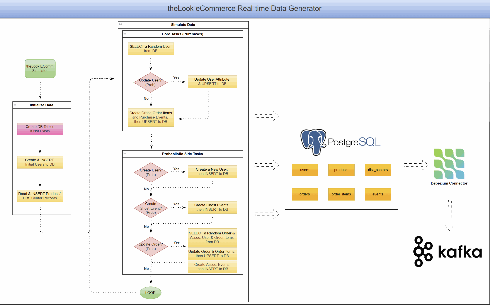

# CDC with Debezium on Real-Time theLook eCommerce Data

This project unlocks the power of the popular [theLook eCommerce dataset](https://console.cloud.google.com/marketplace/product/bigquery-public-data/thelook-ecommerce) for modern event-driven applications. It uses a re-engineered [real-time data generator](../../datagen/thelook-ecomm/) that transforms the original static dataset into a continuous stream of simulated user activity, writing directly to a PostgreSQL database.

This stream becomes an ideal source for building and testing Change Data Capture (CDC) pipelines using Debezium and Kafka—enabling developers and analysts to work with a familiar, realistic schema in a real-time context.



As a practical demonstration, this project includes deployment of a Debezium connector to stream database changes into Kafka topics.

## Set Up the Environment

### Clone the Project

```bash
git clone https://github.com/factorhouse/examples.git
cd examples
```

### Start Kafka and Flink

This project uses [Factor House Local](https://github.com/factorhouse/factorhouse-local) to spin up the Kafka and Flink environments, including **Kpow** and **Flex** for monitoring.

Before starting, make sure you have valid licenses for Kpow and Flex. See the [license setup guide](https://github.com/factorhouse/factorhouse-local?tab=readme-ov-file#update-kpow-and-flex-licenses) for instructions.

```bash
# Clone Factor House Local
git clone https://github.com/factorhouse/factorhouse-local.git

# Download necessary connectors and dependencies
./factorhouse-local/resources/setup-env.sh

# Configure edition and licenses
# Community:
# export KPOW_SUFFIX="-ce"
# export FLEX_SUFFIX="-ce"
# Or for Enterprise:
# unset KPOW_SUFFIX
# unset FLEX_SUFFIX
# Licenses:
# export KPOW_LICENSE=<path>
# export FLEX_LICENSE=<path>

# Start Kafka and Flink environments
docker compose -p kpow -f ./factorhouse-local/compose-kpow.yml up -d \
  && docker compose -p flex -f ./factorhouse-local/compose-flex.yml up -d
```

## Launch the theLook eCommerce Data Generator

Start the containerized data generator to simulate real-time activity.

```bash
docker compose -f projects/thelook-ecomm-cdc/docker-compose.yml up -d
```

This will populate the following tables under the `demo` schema in the `fh_dev` PostgreSQL database:

- `users`
- `products`
- `dist_centers`
- `orders`
- `order_items`
- `events`
- `heartbeat` (used internally by Debezium)


## Deploy the Debezium Connector (`thelook-ecomm`)

The [**`debezium.json`**](./debezium.json) configuration defines a CDC pipeline using Debezium to stream changes from PostgreSQL into Kafka, capturing activity in the `demo` schema and serializing records in Avro format.

### Key Features

- **Connector**: PostgreSQL CDC using Debezium with the `pgoutput` plugin
- **Target Database**: Connects to `fh_dev` on `postgres:5432`
- **Monitored Tables**: All tables under the `demo` schema
- **Snapshot Mode**: `"initial"` - performs a full snapshot on first run, then streams all `INSERT`, `UPDATE`, and `DELETE` operations

### Serialization and Schema Management

- **Format**: Avro (`AvroConverter`)
- **Schema Registry**: Integrated with Confluent Schema Registry at `http://schema:8081`

### Kafka Topic Management

- **Naming Convention**: Topics follow the pattern `ecomm.schema_name.table_name`
- **Auto-Creation**: Enabled (`"topic.creation.enable": "true"`)
- **Cleanup Policy**: Set to `compact`, retaining the latest value for each key
- **Defaults**: 3 partitions, replication factor of 1 (suitable for development only)

> ⚠️ In production, increase replication factor to ensure fault tolerance.

### Heartbeat Table

The connector uses the `demo.heartbeat` table to emit regular heartbeat events:

- Triggers an `INSERT` or `UPDATE` every 10 seconds (`heartbeat.interval.ms`)
- Keeps the connector’s offset up to date and allows safe WAL file cleanup

### Deploy via Kpow

Visit [http://localhost:3000](http://localhost:3000) to deploy the Debezium connector using Kpow’s UI. Once deployed, the following Kafka topics will be created and populated:

- `ecomm.demo.users`
- `ecomm.demo.products`
- `ecomm.demo.dist_centers`
- `ecomm.demo.orders`
- `ecomm.demo.order_items`
- `ecomm.demo.events`


## Conclusion

This project offers a practical, end-to-end environment for working with Change Data Capture using real-time eCommerce data. With a live stream of events feeding into Kafka, you can now:

- 🔍 Build **real-time analytics** with tools like Flink or Apache Pinot
- 🧊 Ingest data into a **lakehouse** with Spark, Flink, or Kafka Connect
- ⚙️ Develop **event-driven microservices** that respond to user or order changes

By combining a realistic dataset with open-source tooling, this project makes it easy to experiment, prototype, and build production-ready CDC pipelines.
